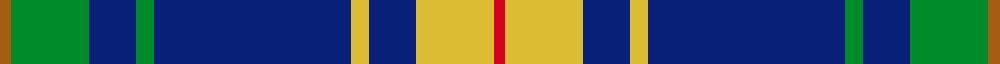

*Single family clan, so not under clans.*

**Trove of Scotland:** [search “Burt”](https://www.trove.scot/search?page_type=Designations+Decisions&q=Burt&viewmode=grid)

## Tartans

<table class="sett-table">
<thead><tr><th>Tartan</th><th>Date</th><th>Setts</th><th>Variants</th><th>ΔTartan</th></tr></thead>
<tbody>
<tr><td><a href="/tartans/b/bu/burt/">Burt</a> ★</td><td>2004</td><td>1</td><td>1</td><td>—</td></tr>
<tr><td colspan="5" class="sett-swatch"></td></tr>
<tr><td><a href="/tartans/b/bu/burt-2/">Burt</a></td><td>~2008</td><td>1</td><td>1</td><td>3.83</td></tr>
<tr><td colspan="5" class="sett-swatch"></td></tr>
<tr><td><a href="/tartans/b/bu/burt-3/">Burt</a></td><td>1959</td><td>1</td><td>1</td><td>11.05</td></tr>
<tr><td colspan="5" class="sett-swatch"></td></tr>
</tbody>
</table>
