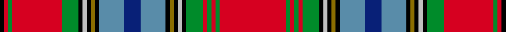

*Single family clan, so not under clans.*

**Trove of Scotland:** [search “Lurgyvallan”](https://www.trove.scot/search?page_type=Designations+Decisions&q=Lurgyvallan&viewmode=grid)

## Tartans

<table class="sett-table">
<thead><tr><th>Tartan</th><th>Date</th><th>Setts</th><th>Variants</th><th>ΔTartan</th></tr></thead>
<tbody>
<tr><td><a href="/tartans/m/ma/macan-of-lurgyvallan-2/">MacAn of Lurgyvallan</a> ★</td><td>1831</td><td>1</td><td>1</td><td>—</td></tr>
<tr><td colspan="5" class="sett-swatch"></td></tr>
<tr><td><a href="/tartans/m/ma/macan-of-lurgyvallan-3/">Macan, of Lurgyvallan</a></td><td>—</td><td>1</td><td>1</td><td>1.55</td></tr>
<tr><td colspan="5" class="sett-swatch"></td></tr>
<tr><td><a href="/tartans/m/ma/macan-of-lurgyvallan/">MacAn of Lurgyvallan</a></td><td>1831</td><td>2</td><td>2</td><td>12.78</td></tr>
<tr><td colspan="5" class="sett-swatch"></td></tr>
</tbody>
</table>
