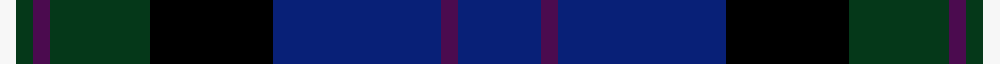

A family of [Clan Moray](/clan/moray/).

**Trove of Scotland:** [search “Moray”](https://www.trove.scot/search?page_type=Designations+Decisions&q=Moray&viewmode=grid)

## Tartans

<table class="sett-table">
<thead><tr><th>Tartan</th><th>Date</th><th>Setts</th><th>Variants</th><th>ΔTartan</th></tr></thead>
<tbody>
<tr><td><a href="/tartans/m/mo/moray/">Moray</a> ★</td><td>1820</td><td>1</td><td>1</td><td>—</td></tr>
<tr><td colspan="5" class="sett-swatch"></td></tr>
<tr><td><a href="/tartans/m/mo/moray-2/">Moray</a></td><td>2009</td><td>1</td><td>1</td><td>11.65</td></tr>
<tr><td colspan="5" class="sett-swatch"></td></tr>
</tbody>
</table>
