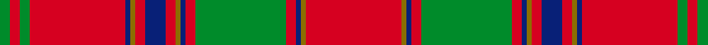

A family of [Clan Munro](/clan/munro/).

**Trove of Scotland:** [search “Munro”](https://www.trove.scot/search?page_type=Designations+Decisions&q=Munro&viewmode=grid)

## Tartans

<table class="sett-table">
<thead><tr><th>Tartan</th><th>Date</th><th>Setts</th><th>Variants</th><th>ΔTartan</th></tr></thead>
<tbody>
<tr><td><a href="/tartans/m/mu/munro-3/">Munro</a> ★</td><td>1746</td><td>1</td><td>1</td><td>—</td></tr>
<tr><td colspan="5" class="sett-swatch"></td></tr>
<tr><td><a href="/tartans/m/mu/munro/">Munro</a></td><td>1810</td><td>6</td><td>7</td><td>6.31</td></tr>
<tr><td colspan="5" class="sett-swatch"></td></tr>
<tr><td><a href="/tartans/m/mu/munro-2/">Munro</a></td><td>1831</td><td>2</td><td>2</td><td>6.57</td></tr>
<tr><td colspan="5" class="sett-swatch"></td></tr>
</tbody>
</table>
