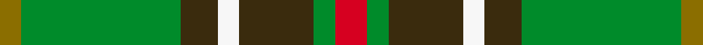
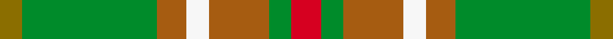

*Single family clan, so not under clans.*

**Trove of Scotland:** [search “Newfoundland”](https://www.trove.scot/search?page_type=Designations+Decisions&q=Newfoundland&viewmode=grid)

## Tartans

<table class="sett-table">
<thead><tr><th>Tartan</th><th>Date</th><th>Setts</th><th>Variants</th><th>ΔTartan</th></tr></thead>
<tbody>
<tr><td><a href="/tartans/n/ne/newfoundland-3/">Newfoundland</a> ★</td><td>1966</td><td>2</td><td>2</td><td>—</td></tr>
<tr><td colspan="5" class="sett-swatch"></td></tr>
<tr><td><a href="/tartans/n/ne/newfoundland-2/">Newfoundland</a></td><td>1955</td><td>2</td><td>2</td><td>11.26</td></tr>
<tr><td colspan="5" class="sett-swatch"></td></tr>
<tr><td><a href="/tartans/n/ne/newfoundland/">Newfoundland</a></td><td>1955</td><td>2</td><td>2</td><td>11.80</td></tr>
<tr><td colspan="5" class="sett-swatch"></td></tr>
</tbody>
</table>
