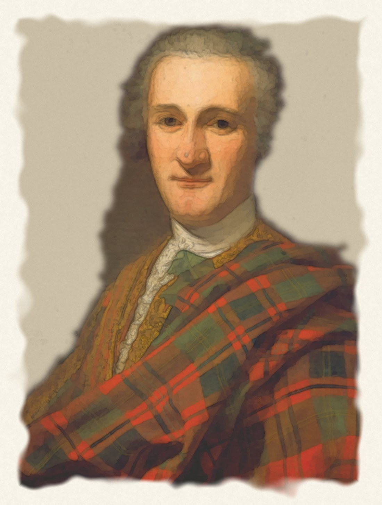

*Domenico Duprà (1689 - 1770) · 1739 · National Galleries of Scotland.*

Tartan plaid draped over the left shoulder and across the lower body and right forearm.

<em><a href="https://www.nationalgalleries.org/art-and-artists/3475">4th Duke of Perth, by Duprà, 1739, NGS</a></em>

## Recovered sett

A proposed reading, recovered by hand from the painted cloth (see [the method](/sources/paintings/)).

`DB/32 R14 DB8 R14 G34 Y2 G10 Y2 G34 R64 DB10 R8 Y2 R/10`

<svg viewBox="0 0 560 44" role="img" style="max-width:560px;height:auto;display:block" xmlns="http://www.w3.org/2000/svg"><g><rect x="0" y="0" width="40" height="30" fill="#0e060c"/><rect x="40" y="0" width="17" height="30" fill="#a63012"/><rect x="57" y="0" width="10" height="30" fill="#0e060c"/><rect x="67" y="0" width="18" height="30" fill="#a63012"/><rect x="85" y="0" width="43" height="30" fill="#3e3e21"/><rect x="128" y="0" width="2" height="30" fill="#b98b3b"/><rect x="130" y="0" width="13" height="30" fill="#3e3e21"/><rect x="143" y="0" width="2" height="30" fill="#b98b3b"/><rect x="145" y="0" width="43" height="30" fill="#3e3e21"/><rect x="188" y="0" width="80" height="30" fill="#a63012"/><rect x="268" y="0" width="13" height="30" fill="#0e060c"/><rect x="281" y="0" width="10" height="30" fill="#a63012"/><rect x="291" y="0" width="2" height="30" fill="#b98b3b"/><rect x="293" y="0" width="13" height="30" fill="#a63012"/><rect x="306" y="0" width="2" height="30" fill="#b98b3b"/><rect x="308" y="0" width="10" height="30" fill="#a63012"/><rect x="318" y="0" width="13" height="30" fill="#0e060c"/><rect x="331" y="0" width="80" height="30" fill="#a63012"/><rect x="411" y="0" width="43" height="30" fill="#3e3e21"/><rect x="454" y="0" width="3" height="30" fill="#b98b3b"/><rect x="457" y="0" width="12" height="30" fill="#3e3e21"/><rect x="469" y="0" width="3" height="30" fill="#b98b3b"/><rect x="472" y="0" width="42" height="30" fill="#3e3e21"/><rect x="514" y="0" width="18" height="30" fill="#a63012"/><rect x="532" y="0" width="10" height="30" fill="#0e060c"/><rect x="542" y="0" width="18" height="30" fill="#a63012"/><rect x="0" y="0" width="560" height="30" fill="none" stroke="#e0e0e0"/></g></svg>

Reference: `k16r7k4r7dg17ly1dg5ly1dg17r32k5r4ly1r5~x2~k0601000-r1906038-dg1402111-ly2704072` — [open in the TTD editor](/ttd/edit/#slug=k16r7k4r7dg17ly1dg5ly1dg17r32k5r4ly1r5~x2~k0601000-r1906038-dg1402111-ly2704072).

## The register's recovery

This painting has been read before: the Scottish Register of Tartans holds [Unnamed C18th #4 (Duke of Perth)](https://www.tartanregister.gov.uk/tartanDetails?ref=4417) (STA 460, SRT 4417), an independent recovery of the same painted cloth.

`B60 R28 B4 R28 G40 W2 G4 W2 G40 R88 B8 R20 A2 R8 A2 R20 B8 R88 G40 W2 G4 W2 G40 R28 B4 R28`

<svg viewBox="0 0 560 44" role="img" style="max-width:560px;height:auto;display:block" xmlns="http://www.w3.org/2000/svg"><g><rect x="0" y="0" width="56" height="30" fill="#2c2c80"/><rect x="56" y="0" width="26" height="30" fill="#c80000"/><rect x="82" y="0" width="3" height="30" fill="#2c2c80"/><rect x="85" y="0" width="27" height="30" fill="#c80000"/><rect x="112" y="0" width="37" height="30" fill="#006818"/><rect x="149" y="0" width="2" height="30" fill="#e0e0e0"/><rect x="151" y="0" width="3" height="30" fill="#006818"/><rect x="154" y="0" width="2" height="30" fill="#e0e0e0"/><rect x="156" y="0" width="38" height="30" fill="#006818"/><rect x="194" y="0" width="82" height="30" fill="#c80000"/><rect x="276" y="0" width="7" height="30" fill="#2c2c80"/><rect x="283" y="0" width="19" height="30" fill="#c80000"/><rect x="302" y="0" width="2" height="30" fill="#5c8ca8"/><rect x="304" y="0" width="7" height="30" fill="#c80000"/><rect x="311" y="0" width="2" height="30" fill="#5c8ca8"/><rect x="313" y="0" width="19" height="30" fill="#c80000"/><rect x="332" y="0" width="7" height="30" fill="#2c2c80"/><rect x="339" y="0" width="82" height="30" fill="#c80000"/><rect x="421" y="0" width="38" height="30" fill="#006818"/><rect x="459" y="0" width="2" height="30" fill="#e0e0e0"/><rect x="461" y="0" width="3" height="30" fill="#006818"/><rect x="464" y="0" width="2" height="30" fill="#e0e0e0"/><rect x="466" y="0" width="38" height="30" fill="#006818"/><rect x="504" y="0" width="26" height="30" fill="#c80000"/><rect x="530" y="0" width="3" height="30" fill="#2c2c80"/><rect x="533" y="0" width="27" height="30" fill="#c80000"/><rect x="0" y="0" width="560" height="30" fill="none" stroke="#e0e0e0"/></g></svg>

Reference: [`db30r14db2r14g20w1g2w1g20r44db4r10lb1r4~x2`](/variants/s14/db30r14db2r14g20w1g2w1g20r44db4r10lb1r4~x2/) — the register's record is itself in the corpus.

> From a painting by Dominique Dupra which hangs in the National Portrait Gallery in Edinburgh. The white stripe could be yellow.
>
> — the register's registration notes

## Nearest tartans

The recovered sett searched against every corpus variant by ΔTartan — candidate sources for the painted cloth, beyond the curated match below.

ΔTartan

Threads

Variant

Sett

—

446

<a href="/variants/s14/k16r7k4r7dg17ly1dg5ly1dg17r32k5r4ly1r5~x2~k0601000-r1906038-dg1402111-ly2704072/">John Drummond, 4th titular Duke of Perth, 1714 - 1747. Jacobite</a>

<a href="/ttd/edit/#slug=dg12r11dp12k1dp1k1r32dg8dp8dg8dp8r32k1dp1k1dp12r11dg12~x2&amp;base=k16r7k4r7dg17ly1dg5ly1dg17r32k5r4ly1r5~x2~k0601000-r1906038-dg1402111-ly2704072" title="compare in the TTD">3.79</a>

640

<a href="/variants/s18/dg12r11dp12k1dp1k1r32dg8dp8dg8dp8r32k1dp1k1dp12r11dg12~x2/">Fiddes - 1790 (Clan)</a>

<a href="/ttd/edit/#slug=dr48k10dt12k2dr3k2dt12k10dr2ly3~x2&amp;base=k16r7k4r7dg17ly1dg5ly1dg17r32k5r4ly1r5~x2~k0601000-r1906038-dg1402111-ly2704072" title="compare in the TTD">3.91</a>

314

<a href="/variants/s10/dr48k10dt12k2dr3k2dt12k10dr2ly3~x2/">Wcwm 1684</a>

<a href="/ttd/edit/#slug=lb5k1r30dp15r8dg30r8dp2~x2~dg1806142&amp;base=k16r7k4r7dg17ly1dg5ly1dg17r32k5r4ly1r5~x2~k0601000-r1906038-dg1402111-ly2704072" title="compare in the TTD">3.91</a>

382

<a href="/variants/s8/lb5k1r30dp15r8dg30r8dp2~x2~dg1806142/">Shaw of Tordarroch Red (Dress)</a>

<a href="/ttd/edit/#slug=r4n2r24k1n8r2n1r2n4r2n1r2n16ly2n1ly4~x2&amp;base=k16r7k4r7dg17ly1dg5ly1dg17r32k5r4ly1r5~x2~k0601000-r1906038-dg1402111-ly2704072" title="compare in the TTD">3.96</a>

288

<a href="/variants/s16/r4n2r24k1n8r2n1r2n4r2n1r2n16ly2n1ly4~x2/">Brian Boru 1014 (Commemorative)</a>

<a href="/ttd/edit/#slug=r31db2r3db2r3dg12r3db2r3db2r31dy4dg19dy36dg19dy4~x2&amp;base=k16r7k4r7dg17ly1dg5ly1dg17r32k5r4ly1r5~x2~k0601000-r1906038-dg1402111-ly2704072" title="compare in the TTD">3.96</a>

634

<a href="/variants/s16/r31db2r3db2r3dg12r3db2r3db2r31dy4dg19dy36dg19dy4~x2/">O'Brian #1 (Fashion)</a>

<a href="/ttd/edit/#slug=dr6k4dr8dp16dr6lb2dr2dp2dr2lb2dr6dp18g6dp2g1~x2&amp;base=k16r7k4r7dg17ly1dg5ly1dg17r32k5r4ly1r5~x2~k0601000-r1906038-dg1402111-ly2704072" title="compare in the TTD">4.13</a>

318

<a href="/variants/s15/dr6k4dr8dp16dr6lb2dr2dp2dr2lb2dr6dp18g6dp2g1~x2/">McCall (Caithness)</a>

<a href="/ttd/edit/#slug=o50k1dr14lb1dg14dr14lb1dr2~x4&amp;base=k16r7k4r7dg17ly1dg5ly1dg17r32k5r4ly1r5~x2~k0601000-r1906038-dg1402111-ly2704072" title="compare in the TTD">4.15</a>

568

<a href="/variants/s8/o50k1dr14lb1dg14dr14lb1dr2~x4/">McBrayer Htg (Personal)</a>

<a href="/ttd/edit/#slug=g12r11dp12k1dp1k1r32dp8g8dp8g8r32k1dp1k1dp12r11g12~x2&amp;base=k16r7k4r7dg17ly1dg5ly1dg17r32k5r4ly1r5~x2~k0601000-r1906038-dg1402111-ly2704072" title="compare in the TTD">4.17</a>

640

<a href="/variants/s18/g12r11dp12k1dp1k1r32dp8g8dp8g8r32k1dp1k1dp12r11g12~x2/">Fiddes #3</a>

The neighbour map places the recovered sett (red) among its nearest corpus variants (42% of the ΔTartan feature space's variance):

<svg viewBox="0 0 640 380" role="img" style="max-width:100%;height:auto;border:1px solid #e0e0e0;border-radius:4px;display:block" xmlns="http://www.w3.org/2000/svg"><image href="/nn/cloud.v1.png" width="640" height="380"/><a href="/variants/s18/dg12r11dp12k1dp1k1r32dg8dp8dg8dp8r32k1dp1k1dp12r11dg12~x2/"><circle cx="294.7" cy="99.5" r="4" fill="#3465a4"><title>Fiddes - 1790 (Clan)</title></circle></a><a href="/variants/s10/dr48k10dt12k2dr3k2dt12k10dr2ly3~x2/"><circle cx="344.0" cy="130.4" r="4" fill="#3465a4"><title>Wcwm 1684</title></circle></a><a href="/variants/s8/lb5k1r30dp15r8dg30r8dp2~x2~dg1806142/"><circle cx="260.7" cy="112.3" r="4" fill="#3465a4"><title>Shaw of Tordarroch Red (Dress)</title></circle></a><a href="/variants/s16/r4n2r24k1n8r2n1r2n4r2n1r2n16ly2n1ly4~x2/"><circle cx="359.2" cy="110.3" r="4" fill="#3465a4"><title>Brian Boru 1014 (Commemorative)</title></circle></a><a href="/variants/s16/r31db2r3db2r3dg12r3db2r3db2r31dy4dg19dy36dg19dy4~x2/"><circle cx="284.7" cy="143.8" r="4" fill="#3465a4"><title>O'Brian #1 (Fashion)</title></circle></a><a href="/variants/s15/dr6k4dr8dp16dr6lb2dr2dp2dr2lb2dr6dp18g6dp2g1~x2/"><circle cx="279.0" cy="139.7" r="4" fill="#3465a4"><title>McCall (Caithness)</title></circle></a><a href="/variants/s8/o50k1dr14lb1dg14dr14lb1dr2~x4/"><circle cx="376.7" cy="100.2" r="4" fill="#3465a4"><title>McBrayer Htg (Personal)</title></circle></a><a href="/variants/s18/g12r11dp12k1dp1k1r32dp8g8dp8g8r32k1dp1k1dp12r11g12~x2/"><circle cx="280.8" cy="97.3" r="4" fill="#3465a4"><title>Fiddes #3</title></circle></a><circle cx="314.4" cy="126.2" r="5" fill="#c00000"/><text x="320" y="376" text-anchor="middle" font-size="11" fill="#999">ground</text><text x="11" y="190" text-anchor="middle" font-size="11" fill="#999" transform="rotate(-90 11 190)">complexity</text></svg>

## Matched tartan

The closest corpus tartan (a curated match): [Drummond of Perth](/tartans/p/pe/perthshire-or-drummond-of-perth/) — SRT 910.

Matched thread count: `R/72 W2 B6 Y2 G32 R16 B6 A4 W/2`

**This reading:**

<svg viewBox="0 0 560 44" role="img" style="max-width:560px;height:auto;display:block" xmlns="http://www.w3.org/2000/svg"><g><rect x="0" y="0" width="40" height="30" fill="#0e060c"/><rect x="40" y="0" width="17" height="30" fill="#a63012"/><rect x="57" y="0" width="10" height="30" fill="#0e060c"/><rect x="67" y="0" width="18" height="30" fill="#a63012"/><rect x="85" y="0" width="43" height="30" fill="#3e3e21"/><rect x="128" y="0" width="2" height="30" fill="#b98b3b"/><rect x="130" y="0" width="13" height="30" fill="#3e3e21"/><rect x="143" y="0" width="2" height="30" fill="#b98b3b"/><rect x="145" y="0" width="43" height="30" fill="#3e3e21"/><rect x="188" y="0" width="80" height="30" fill="#a63012"/><rect x="268" y="0" width="13" height="30" fill="#0e060c"/><rect x="281" y="0" width="10" height="30" fill="#a63012"/><rect x="291" y="0" width="2" height="30" fill="#b98b3b"/><rect x="293" y="0" width="13" height="30" fill="#a63012"/><rect x="306" y="0" width="2" height="30" fill="#b98b3b"/><rect x="308" y="0" width="10" height="30" fill="#a63012"/><rect x="318" y="0" width="13" height="30" fill="#0e060c"/><rect x="331" y="0" width="80" height="30" fill="#a63012"/><rect x="411" y="0" width="43" height="30" fill="#3e3e21"/><rect x="454" y="0" width="3" height="30" fill="#b98b3b"/><rect x="457" y="0" width="12" height="30" fill="#3e3e21"/><rect x="469" y="0" width="3" height="30" fill="#b98b3b"/><rect x="472" y="0" width="42" height="30" fill="#3e3e21"/><rect x="514" y="0" width="18" height="30" fill="#a63012"/><rect x="532" y="0" width="10" height="30" fill="#0e060c"/><rect x="542" y="0" width="18" height="30" fill="#a63012"/><rect x="0" y="0" width="560" height="30" fill="none" stroke="#e0e0e0"/></g></svg>

**The register's (STA 460):**

<svg viewBox="0 0 560 44" role="img" style="max-width:560px;height:auto;display:block" xmlns="http://www.w3.org/2000/svg"><g><rect x="0" y="0" width="56" height="30" fill="#2c2c80"/><rect x="56" y="0" width="26" height="30" fill="#c80000"/><rect x="82" y="0" width="3" height="30" fill="#2c2c80"/><rect x="85" y="0" width="27" height="30" fill="#c80000"/><rect x="112" y="0" width="37" height="30" fill="#006818"/><rect x="149" y="0" width="2" height="30" fill="#e0e0e0"/><rect x="151" y="0" width="3" height="30" fill="#006818"/><rect x="154" y="0" width="2" height="30" fill="#e0e0e0"/><rect x="156" y="0" width="38" height="30" fill="#006818"/><rect x="194" y="0" width="82" height="30" fill="#c80000"/><rect x="276" y="0" width="7" height="30" fill="#2c2c80"/><rect x="283" y="0" width="19" height="30" fill="#c80000"/><rect x="302" y="0" width="2" height="30" fill="#5c8ca8"/><rect x="304" y="0" width="7" height="30" fill="#c80000"/><rect x="311" y="0" width="2" height="30" fill="#5c8ca8"/><rect x="313" y="0" width="19" height="30" fill="#c80000"/><rect x="332" y="0" width="7" height="30" fill="#2c2c80"/><rect x="339" y="0" width="82" height="30" fill="#c80000"/><rect x="421" y="0" width="38" height="30" fill="#006818"/><rect x="459" y="0" width="2" height="30" fill="#e0e0e0"/><rect x="461" y="0" width="3" height="30" fill="#006818"/><rect x="464" y="0" width="2" height="30" fill="#e0e0e0"/><rect x="466" y="0" width="38" height="30" fill="#006818"/><rect x="504" y="0" width="26" height="30" fill="#c80000"/><rect x="530" y="0" width="3" height="30" fill="#2c2c80"/><rect x="533" y="0" width="27" height="30" fill="#c80000"/><rect x="0" y="0" width="560" height="30" fill="none" stroke="#e0e0e0"/></g></svg>

Read by hand from the painted plaid, de-varnished through the lace whites, the recovered sett matches **Drummond of Perth**, independently of the sitter's name. Domenico Duprà painted it in 1739, which would make it a candidate earliest dated witness to the sett, predating Logan (1831). The Scottish Register of Tartans preserves an independent reading taken from this same canvas — *Unnamed C18th #4 (Duke of Perth)*, STA 460 — and the two agree element for element on the sett's whole skeleton: a dark pivot, twin fourteen-thread reds about a dark line, a green ground split by twin thin lines, a broad red ground with its dark guard, and one more thin line before the red pivot. Where the register saw white — conceding it “could be yellow” — we read yellow, and its azure line we read as yellow again; beyond that the two part only on counts, as any two eyes on varnished folds will.

---

*National Galleries of Scotland (PG 1597). Purchased 1953. Photo: Antonia Reeve.*
