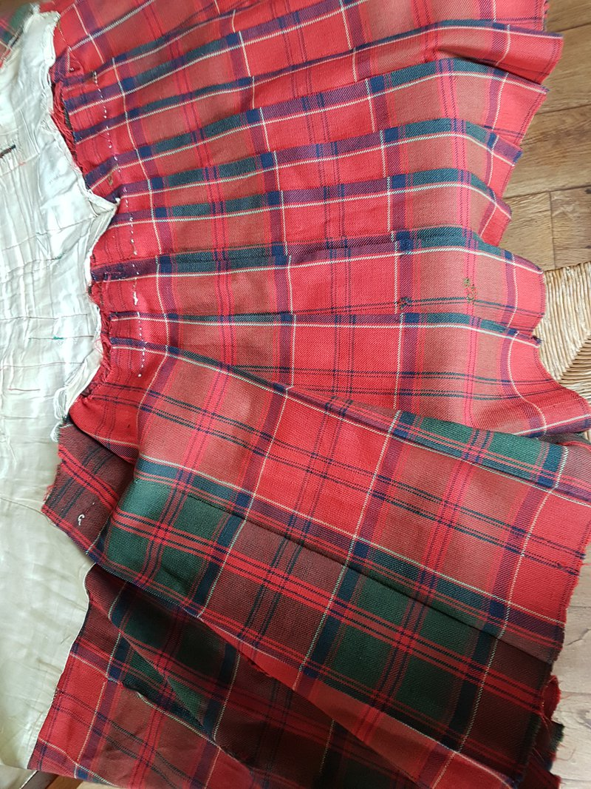
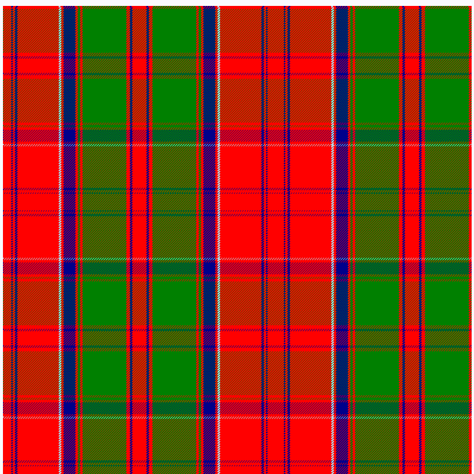

Drummonds of Megginch Tartan

Originally written May 16, 2018

There has long been confusion about the tartan for the Drummonds of Megginch. This is due the tartan being very similar to the New Grant tartan that was recorded by Wilson in the 1819 weaving pattern book.

Drummonds of Megginch Tartan different from Wilson Grant pattern.

The earliest example I currently have of the tartans that the Drummonds of Megginch is a kilt dating from 1849 which I wore from about 1975 to 2000. The picture is of the inside which has faded less the outer. I can be confident of the date as there is a picture of JMD (James Murray Drummond) wearing this with a sporran which I also have. The sporran was made in 1849 in Edinbugh and can be dated from the silver makers mark.

There is probably an older tartan shawl which is thought to date from around 1820 but the precise history is uncertain.

My old Kilt:

which uses the following sett:

R14 DB2 R4 DB4 R70 LB4 R4 DB20 R4 G4 R4 G74 R6 DB4 R12

(The colours of this are not yet quite matched)

This is very similar to Drummond 1819 Clan as listed in the Scottish Tartans Authority, the Wilson Pattern book describes it as New Bruce. In the setts of the Tartans by DC Stewart p53 it is referred to as Grant although he notes others eg Logan have recorded it as a Drummond tartan:

R12 B2 R4 B4 R64 LB2 R4 B16 R4 G4 R4 G48 R4 B4 R12

(The Scottish Tartan Authority vary it as Dark Purple rather than a Dark Blue). Looking at the light blue squares makes the length of the small square 85% of the large square.

R12 DP2 R4 DP4 R64 LB4 R4 DP16 R4 G4 R4 G48 R4 DP4 R12

In fact when I got married I got a new kilt made and woven by DC Dagleish and they have used another set of thread counts which gives the ratio of the light blue square to be 68.6% this is close to the 64% in the original kilt.

My New Kilt 1997

The thread counts are:

R12 DB2 R4 DB4 R62 LB4 R4 DB20 R4 G4 R4 G64 R6 DB4 R14

There are also some childs kits from Victorian era which have a different threadcounts and reduced large areas in order to give the same effect. The ratio of the light blue lines is 65.1%.

The thread counts are:

R12 DB2 R4 DB4 R28 LB4 R4 DB8 R4 G4 R4 G24 R6 DB4 R12

Victorian Childs Kits

Further work

It is clear that these tartans are all related but in fact they are all different. There is a clear difference between the Wilsons Drummond / Grant / New Bruce pattern and the Drummond of Megginch. This is seen in the relationship of the length of the sides of the small azure square and the large one. The Wilson pattern has it about 85% of the large one and the Drummond of Megginch tartan it is about 65%. This difference is created primarily by change the number of threads of the large Red and Green patterns. Drummond of Megginch has a larger green area.

The pattern can probably be further abstracted by ordering the sizes of the thread counts and then creating a pattern based on that:

eg R-4 DB-1 R-2 DB-2 R-6 LB-2 R-2 DB-5 R-2 G-2 R-2 G-6 R-3 DB-2 R-4

## Summary setts table of thread counts

| Name            | Sum | R i | DB ii | R iii | DB iv | R v | LB vi | R vii | DB viii | R ix | G x | R xi | G xii | R xiii | DB xiv | R xv |
| --------------- | --- | --- | ----- | ----- | ----- | --- | ----- | ----- | ------- | ---- | --- | ---- | ----- | ------ | ------ | ---- |
| 1819 New Grant  |     | 12  | DP2   | 4     | DP4   | 64  | A2    | 4     | DP16    | 4    | 4   | 4    | 48    | 4      | DP4    | 12   |
| 1820 Plaid      |     | 26  | 2     | 6     | 6     | 126 | 6     | 6     | 38      | 6    | 6   | 6    | 130   | 10     | 6      | 18   |
| 1820 scaled     |     | 13  | 1.3   | 4     | 4     | 84  | 4     | 4     | 25.3    | 4    | 4   | 4    | 86.7  | 6.7    | 4      | 12   |
| 1849 Kilt       |     | 14  | 2     | 4     | 4     | 70  | B4    | 4     | 20      | 4    | 4   | 4    | 74    | 6      | 4      | 12   |
| 1997 New Kilt   |     | 12  | 2     | 4     | 4     | 62  | B4    | 4     | 20      | 4    | 4   | 4    | 64    | 6      | 4      | 14   |
| 1890 Child kilt |     | 12  | 2     | 4     | 4     | 28  | B4    | 4     | 8       | 4    | 4   | 4    | 24    | 6      | 4      | 12   |

Colour Legend

| Abreviation | Colour Name       | Sample |
| ----------- | ----------------- | ------ |
| R           | Red               |        |
| DB          | Dark Blue         |        |
| DP          | Dark Purple         |        |
| LB          | Light Blue, Azure |        |
| G           | Green             |        |

## Relative size table

This is different a sett as you divide by the smallest repeat to get the pattern

In order for this to work you need 12 and 14 to be in the same thickness bracket so that all the Tartans have the same descriptor. 20% variation if sufficent for that. This is a lossy process but allows different weaving patterns to be classifed as the same design.
Conclusion

The Drummond of Megginch tartan pattern from the Megginch Castle collection is distinct from the Wilson Grant / New Bruce pattern and has been for at least 180 years. The differences have been quantified in terms of the relationship of the sizes of the Azure pattern.

### Epilogue

Thanks to Field Precision Services for a very handy Windows ruler which you can calibrate eg to threadcounts. After calibration on a picture you can then read off thread counts on the onscreen ruler. As of 2022 it now no longer seems extant.
