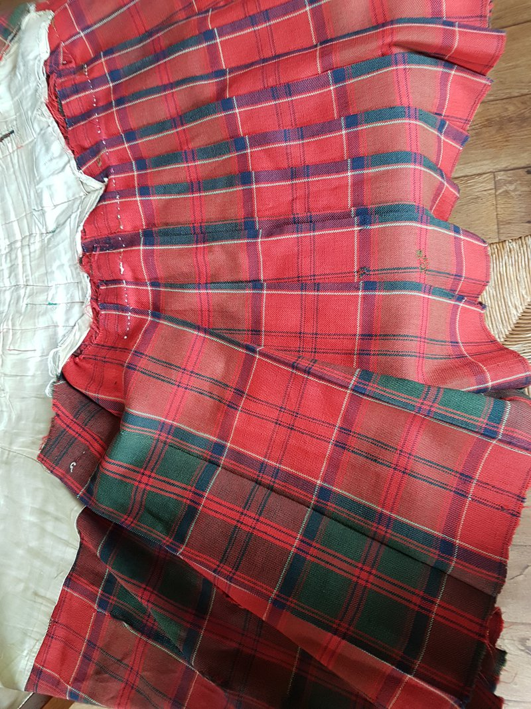

Old Kilt

The earliest example I currently have of the tartans that the Drummonds of Megginch is a kilt dating from 1849 which I wore from about 1975 to 2000. The picture is of the inside which has faded less the outer. I can be confident of the date as there is a picture of JMD (James Murray Drummond) wearing this 
with a sporran which I also have. The sporran was made in 1849 in Edinbugh and can be dated from the silver makers mark. 

The outside of the kilt is quite faded compared to the colours on the inside.

My old Kilt:

## Thread counts

R/14 DB2 R4 DB4 R70 LB4 R4 DB20 R4 G4 R4 G74 R6 DB4 R/12