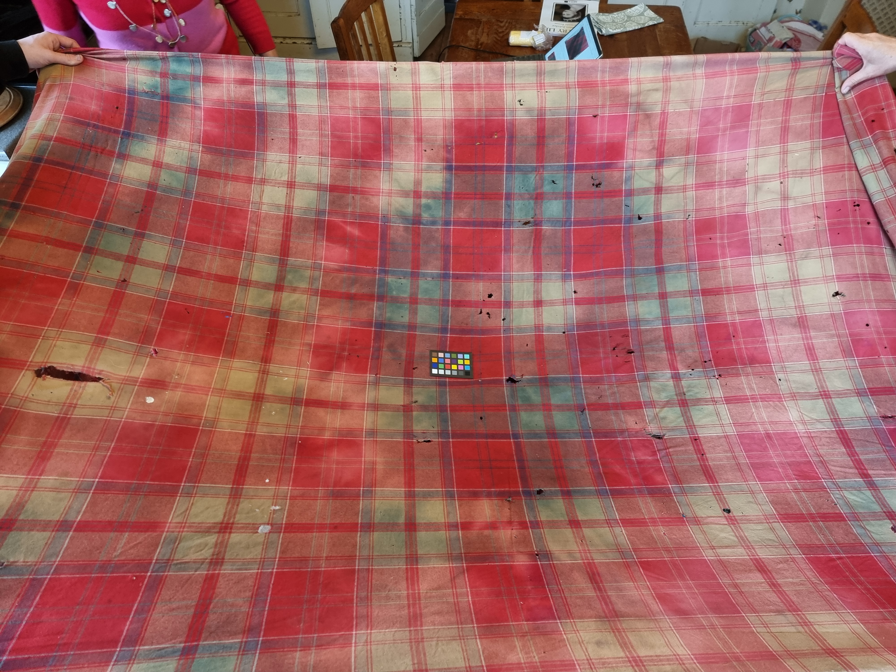
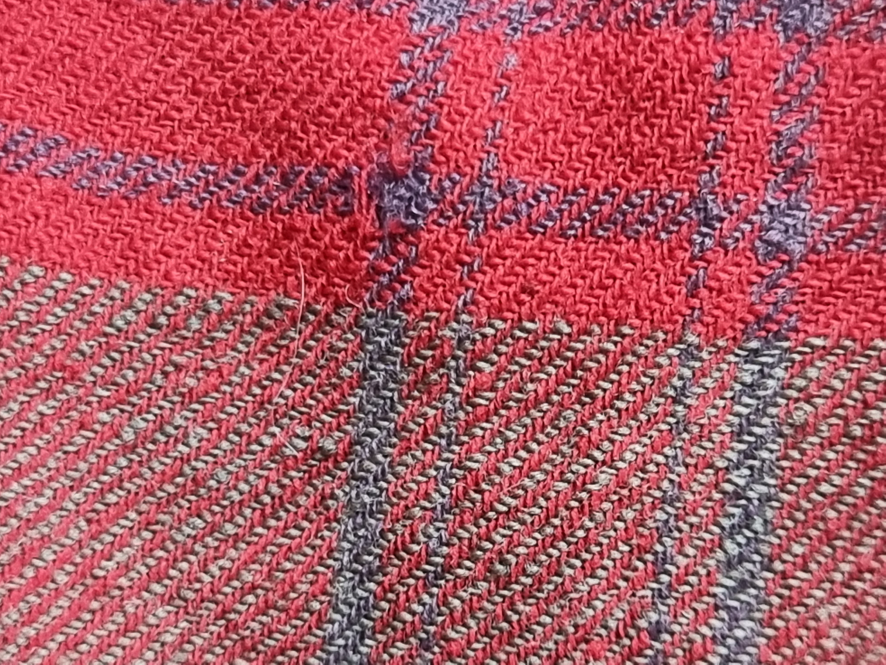

Old Plaid

## Detail of Tartan

This was one of the est unfaded squares.

Then there is the fine detail:

This for part of the tartan gives a thread count of:

| Name        | Sum | R/i | DB ii | R iii | DB iv | R v | LB vi | R vii | DB viii | R ix | G x | R xi | G xii | R xiii | DB xiv | R/xv |
| ----------- | --- | --- | ----- | ----- | ----- | --- | ----- | ----- | ------- | ---- | --- | ---- | ----- | ------ | ------ | ---- |
| 1849 Kilt   |     | 14  | 2     | 4     | 4     | 70  | 4     | 4     | 20      | 4    | 4   | 4    | 74    | 6      | 4      | 12   |
| 1820 Plaid  |     | 26  | 2     | 6     | 6     | 126 | 6     | 6     | 38      | 6    | 6   | 6    | 130   | 10     | 6      | 18   |
| 1820 scaled |     | 13  | 1.3   | 4     | 4     | 84  | 4     | 4     | 25.3    | 4    | 4   | 4    | 86.7  | 6.7    | 4      | 12   |

The 1820 plaid is the original pattern scale by about 50% and then rounded.
