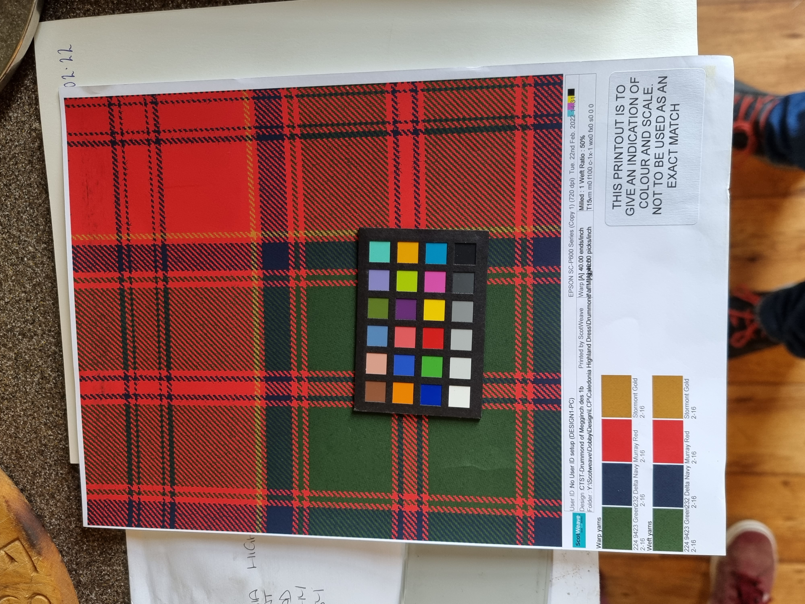

Colours are the for the moment in sRGB perceptual space.

The proposal is this one: [2023 Kilt][] (There may be some tweaking but will be updated here.)

This is a list of the kilts and proposals:

- [1820 Plaid][]  See also the post around this [1820 post][]
- [1849 Kilt][]  See also the post around this [1849 post][]  Note the colours on this need a little correction.
- 1890 Child's kilt
- 1967 Carpet
- [1997 Kilt][]  Note the colours have been done on this although the light blue may need work.
- [2022 Proposal][] Initial proposal with Lexa and Bertie's colouring back to the 1849 colouring
- [2023 Kilt][]  As the 2022 proposal This reverts to the thread count of the 1849 kilt rather than 1997 with the colours of the 1997.

[1820 Plaid]:/variants/s15/r26db2r6db6r126lb6r6db38r6dg6r6dg130r19db6r18~r2109032-db0906265-lb3203246-dg1405139/
[1820 post]:/posts/drummondsofmeggincholdplaid/
[1849 Kilt]:/variants/s15/r7db1r2db2r35lb2r2db10r2dg2r2dg37r3db2r6~x2~r2109032-db0906265-lb3203246-dg1405139/
[1849 post]:/posts/drummondsofmeggincholdkilt/
[1997 Kilt]:/variants/s15/r7dt2r3dg32r2dg2r2dt10r2lb2r31dt2r2dt1r6~x2~r1906028-dt1201300-dg1602166-lb3203246/
[2022 Proposal]:/setts/r7db1r2db2r35lb2r2db10r2dg2r2dg37r3db2r6/
[2023 Kilt]:/variants/s15/o7db1o2db2o35lb2o2db10o2g2o2g37o3db2o6~x2~o2207025-db1404259-lb3302249-g2105139/

The following is a picture of the proposed new tartan sample.

| Name          | Sum | R/i | DB ii | R iii | DB iv | R v | LB vi | R vii | DB viii | R ix | G x | R xi | G xii | R xiii | DB xiv | R/xv |
| ------------- | --- | --- | ----- | ----- | ----- | --- | ----- | ----- | ------- | ---- | --- | ---- | ----- | ------ | ------ | ---- |
| 1849 Kilt     |     | 14  | 2     | 4     | 4     | 70  | 4     | 4     | 20      | 4    | 4   | 4    | 74    | 6      | 4      | 12   |
| 1997 New Kilt |     | 18  | 2     | 4     | 4     | 64  | 4     | 4     | 20      | 4    | 4   | 4    | 62    | 4      | 4      | 10   |

This is being redone as suggested by Bertie and Lexa and using colours:
Pantone 180 (red) Pantone 654 (dark blue) Pantone 543 (Light blue) Pantone  364 (Green)

R#BE3A34 DB#003A70 LB#A4C8E1 G#4A7729

