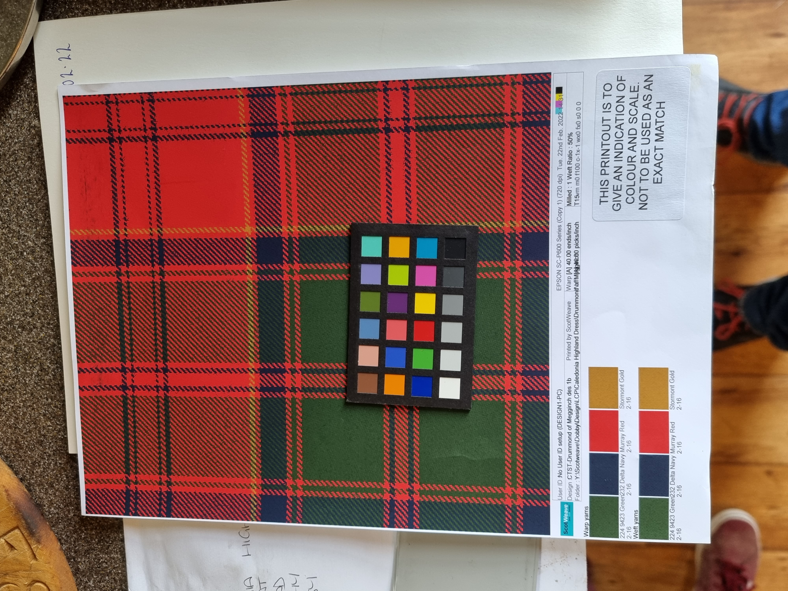

Colours are the for the moment in sRGB perceptual space.

The proposal is this one: [2023 Kilt][] (There may be some tweaking but will be updated here.)

This is a list of the kilts and proposals:

- [1820 Plaid][]  See also the post around this [1820 post][]
- [1849 Kilt][]  See also the post around this [1849 post][]  Note the colours on this need a little correction.
- 1890 Childs kilt
- 1967 Carpet
- [1997 Kilt][]  Note the colours have been done on this although the light blue may need work.
- [2022 Proposal][] Initial proposal with Lexa and Berties colouring back to the 1849 colouring
- [2023 Kilt][]  As the 2022 proposal This reverts to the thread count of the 1849 kilt rather than 1997 with the colours of the 1997.

[1820 Plaid]:http://tartandictionary.org/variants/r/26/db2/r6/db6/r126/lb6/r6/db38/r6/g6/r6/g130/r19/db6/r/r/26/db2/r6/db6/r126/lb6/r6/db38/r6/g6/r6/g130/r19/db6/r/18-db000064-g004c00-lb98c8e8-rc80000/
[1820 post]:https://tartandictionary.org/posts/drummondsofmeggincholdplaid/
[1849 Kilt]:https://tartandictionary.org/variants/r/14/db2/r4/db4/r70/lb4/r4/db20/r4/g4/r4/g74/r6/db4/r/r/14/db2/r4/db4/r70/lb4/r4/db20/r4/g4/r4/g74/r6/db4/r/12-db000064-g004c00-lb98c8e8-rc80000/
[1849 post]:https://tartandictionary.org/posts/drummondsofmeggincholdkilt/
[1997 Kilt]:https://tartandictionary.org/variants/r/12/db2/r4/db4/r62/lb4/r4/db20/r4/g4/r4/g64/r6/db4/r/r/12/db2/r4/db4/r62/lb4/r4/db20/r4/g4/r4/g64/r6/db4/r/14-db282c39-g304f45-lb98c8e8-r983029/
[2022 Proposal]:https://tartandictionary.org/variants/r/14/db2/r4/db4/r70/lb4/r4/db20/r4/g4/r4/g74/r6/db4/r/r/14/db2/r4/db4/r70/lb4/r4/db20/r4/g4/r4/g74/r6/db4/r/12-db003a70-g4a7729-lba4c8e1-rbe3a34/
[2023 Kilt]:https://tartandictionary.org/variants/r/14/db2/r4/db4/r70/lb4/r4/db20/r4/g4/r4/g74/r6/db4/r/r/14/db2/r4/db4/r70/lb4/r4/db20/r4/g4/r4/g74/r6/db4/r/12-db282c39-g304f45-lb98c8e8-r983029/

The following is a picture of the proposed new tartan sample.

| Name          | Sum | R/i | DB ii | R iii | DB iv | R v | LB vi | R vii | DB viii | R ix | G x | R xi | G xii | R xiii | DB xiv | R/xv |
| ------------- | --- | --- | ----- | ----- | ----- | --- | ----- | ----- | ------- | ---- | --- | ---- | ----- | ------ | ------ | ---- |
| 1849 Kilt     |     | 14  | 2     | 4     | 4     | 70  | 4     | 4     | 20      | 4    | 4   | 4    | 74    | 6      | 4      | 12   |
| 1997 New Kilt |     | 18  | 2     | 4     | 4     | 64  | 4     | 4     | 20      | 4    | 4   | 4    | 62    | 4      | 4      | 10   |

This is being redone as suggested by Bertie and Lexa and using colours:
Pantone 180 (red) Pantone 654 (dark blue) Pantone 543 (Light blue) Pantone  364 (Green)

R#BE3A34 DB#003A70 LB#A4C8E1 G#4A7729

