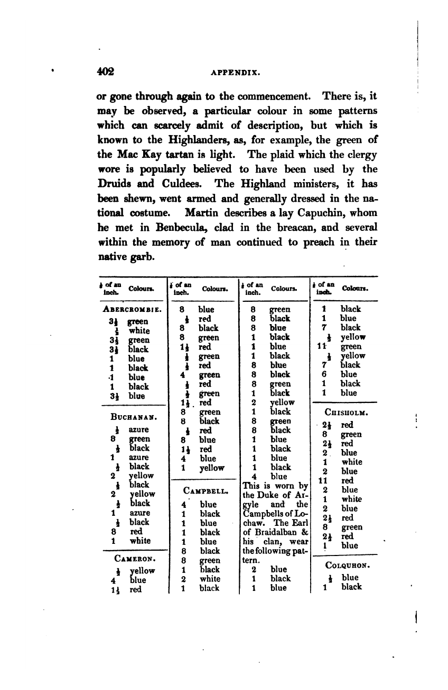
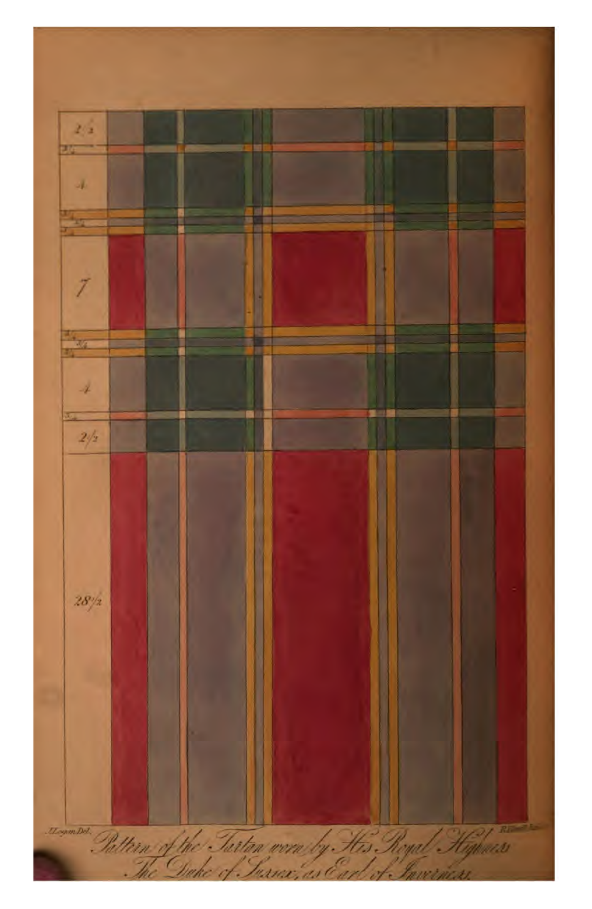

In 1831 James Logan published *The Scotish Gaël; or, Celtic Manners, as Preserved Among the
Highlanders* — two volumes of antiquarian sweep covering arms, dress, music and language. Tucked
into the appendix of volume II is something genuinely new: a **Table of Clan Tartans**, the first
time the setts of tartans had ever been published. Fifty-four patterns, each recorded stripe by
stripe.[^book]



## A scale in eighths of an inch

Logan did not count threads. He measured cloth — "commencing at the edge of the cloth, the depth
of the colours is stated throughout a square, on which the scale must be reversed … to the
commencement". Each stripe is given as a depth in **eighths of an inch of cloth**, and the table
was "perfected" with the assistance of Captain Mac Kenzie of Gruinard. A web of tartan, he notes,
is two feet two inches wide, "at least within half an inch", so the scale holds regardless of the
size of the pattern.

How many threads an eighth of an inch holds is a property of the cloth, not of the table. At a
typical tartan weight — around 40 ends to the inch, 16 to the centimetre — an eighth is about
5 threads; coarser and finer weaves put it anywhere from 4 to 8. And Logan's own text shows the
cloth carrying structure below his table's quantum: "A favorite pattern of stuff for female
dresses, was crimson and black, in stripes of three or four threads in the woof, the warp being
all black" (vol. I p. 266) — thread-level detail an eighth-inch scale cannot express. His
eighths record the *proportions* of a sett faithfully; they do not, and cannot, record its
thread counts.

The table is honest about its limits. Logan inserted no fancy tartans, noted variations between
families of the same name, and admitted that some colours "can scarcely admit of description" —
the green of the Mac Kay tartan is light, and the reader is trusted to know. His colour
vocabulary is pure names: red, green, black, blue, white, yellow, azure, purple, crimson, grey,
orange, light and dark green — and two splendid obscurities, **corbeau** (Logan's raven-dark
colour, which the later authorities read as *a dark shade of green* — so the Dictionary maps it
to dark green) and **smalt** (cobalt-glass blue).

## Reading the table again

We transcribed the whole table from a scan of the 1831 first edition — by eye, page by page,
because no OCR survives contact with an 1831 fraction glyph — then cross-checked the colour
sequences and hand-verified the ambiguous readings. The eighths are the captured data. To render
them in modern threadcount notation we chose a **display calibration** of 8 threads to the
eighth-inch, anchored by one exact hit: the Scottish Register of Tartans' Abercrombie record
turns out to be Logan's Abercrombie at exactly ×8, stripe for stripe.[^extraction] The anchor
deserves a caveat — it may say more about the Register record's own convention than about the
density of 1831 cloth, and at a typical weave ×8 is probably on the high side.

Does the choice matter? Less than it looks. At any plausible density the conversion rounds — a
stripe of 1½ eighths at 5 threads to the eighth is 7½ threads, so 7 or 8, the weaver's call —
which means each of Logan's records is compatible with a whole *family* of thread-level setts.
But tartan identity does not live in absolute thread counts; it lives in the **proportions** of
the stripes, and those the eighths capture directly. The dictionary normalises every sett to a
canonical form with the overall scale factored out (the ~×N in a variant's notation), so the
threads-per-eighth factor is absorbed as a rendering scale and never touches identity. The one
reading a Logan sett will not bear is as an exact thread-level attestation — the book records
proportions in cloth, and the proportions are what survive.

With all 54 setts in standard notation we matched them against the dictionary's 15,500 variants,
comparing canonical full-repeat cycles so that differences of recording convention — half sett
versus full square, half-width versus full-width pivots — cannot hide a real match.

## What survived 195 years

- **7 setts match exactly** — among them Buchanan, where the Register's own "Buchanan (Logan)"
  record agrees with our transcription thread for thread, and Urquhart, whose Register entry
  "Urquhart (Logan)" says it was "recorded in the scales given by James Logan in his book".
- **10 more are close** (the same colour sequence, widths within a few percent) — including Hay,
  which the trade knows as "Hay or Leith"; Logan's own footnote already said *"this rich tartan
  is claimed by the Leiths."*
- **31 have corpus records that cite Logan by name but differ structurally** — the fingerprint of
  later re-interpretation. The Register's "Gunn (Logan)" uses 6 where Logan printed 7, and black
  where Logan printed blue. Sutherland's entry is the Black Watch lineage: the corpus note reads
  "this sett is based on Logan's 'Sutherland' tartan".
- **7 have no structural trace at all** — Cameron, Lamont, MacGillivray, MacPherson, MacQuarrie,
  Menzies, and the Duke of Sussex plate below. These are arguably the most valuable: 1831
  recordings that the modern corpus has lost or never absorbed.

## The Duke of Sussex plate

<figure style="max-width: 380px; margin: 0 auto;">

<figcaption>The hand-coloured plate facing p.&nbsp;401 — "Pattern of the Tartan worn by His
Royal Highness The Duke of Sussex", drawn by Logan himself.</figcaption>
</figure>

Facing the table sits a hand-coloured copper plate, drawn by Logan himself: a square of plaid
**at full size**, with an engraved scale down the margin — the pattern "peculiar to himself" worn
by Prince Augustus Frederick, Duke of Sussex. Logan explains that it is worn for **Inverness**,
from which the Duke held his earldom — so this is the Duke of Sussex's tartan *as Earl of
Inverness*.[^sussex]

Read from the plate's scale and painted squares, the half sett is:

```
R/28.5  G2.5  W3/4  G4  Y3/4  G3/4  Y3/4  R/7
```

— in threads (×8): `R/228 G20 W6 G32 Y6 G6 Y6 R/56`. A red ground in the grand manner, green
blocks, and a fine yellow-green-yellow group beside the narrower red pivot. The dictionary does
hold [a "Duke of Sussex" sett](/variants/s7/r18g1k5g1k1g1r9~x2/), but it is a
different, much simpler pattern — the plate's tartan has no counterpart in the modern record.

## The tartans

Every sett from the book, with Logan's eighths rendered to threads at the ×8 calibration, and a
link into the dictionary where a counterpart exists. "Corpus cites Logan" means the dictionary's record for
that name names Logan as a source but disagrees with the book — usually a later smoothing of his
counts.

| Tartan | p. | Logan's sett (threads, ×8) | In the dictionary |
|---|---|---|---|
| [Abercrombie]() | 402 | `G/28 W4 G28 K28 B8 K8 B8 K8 B/28` | [exact match]() |
| [Buchanan]() | 402 | `A/4 G64 K4 A8 K4 Y16 K4 Y16 K4 A8 K4 R64 W/8` | [exact match]() |
| [Cameron]() | 402 | `Y/4 B32 R12 B64 R4 K64 G64 R12 G4 R4 G32 R4 G4 R12 G64 K64 R4 B64 R12 B32 Y/8` | *no counterpart found* |
| [Campbell]() | 402 | `B/32 K8 B8 K8 B8 K64 G64 K8 W16 K8 G64 K64 B64 K8 B8 K8 B64 K64 G64 K8 Y16 K8 G64 K64 B8 K8 B8 K8 B/32` | [exact match]() |
| [Campbell of Breadalbane]() | 402 | `B/16 K8 B8 K8 B8 K56 Y4 G88 Y4 K56 B48 K8 B/8` | [close (90%)]() |
| [Chisholm]() | 402 | `R/20 G64 R20 B16 W8 B16 W8 B16 R88 B16 W8 B16 R20 G64 R20 B/8` | [corpus cites Logan, sett differs]() |
| [Colquhoun]() | 402 | `B/4 K8 B48 K72 W12 G56 R8 G56 W4 K72 B48 K8 B/8` | [close (91%)]() |
| [Cumming]() | 403 | `A/8 K8 A16 K40 O2 G40 R16 W2 R16 W2 R16 G40 O2 K40 A16 K8 A/16` | [corpus cites Logan, sett differs]() |
| [Dalzell]() | 403 | `R/48 W2 B4 R16 G104 R16 B4 W2 R16 B24 R16 W2 B4 R104 G8 C12 G/12` | [close (90%)]() |
| [Douglas]() | 403 | `W/2 B32 G32 A8 K8 A8 G32 B32 W/4` | [corpus cites Logan, sett differs]() |
| [Drummond]() | 403 | `W/2 A8 B12 R32 G64 Y2 B12 W2 R136 W2 B12 Y2 G64 R32 B12 A8 W/2` | [corpus cites Logan, sett differs]() |
| [Farquharson]() | 403 | `R/4 B16 K2 B2 K2 B2 K2 B2 K32 G32 Y8 G32 K32 B32 K4 R/8` | [corpus cites Logan, sett differs]() |
| [Ferguson]() | 403 | `G/4 B48 R4 K48 G48 K8 G48 K48 R4 B48 G/8` | [corpus cites Logan, sett differs]() |
| [Forbes]() | 403 | `B/8 K8 B48 K48 G48 K8 W8 K8 G48 K48 B48 K8 B/8` | [exact match]() |
| [Fraser]() | 403 | `B/20 R4 B4 R4 G40 R52 G8 R52 G40 B40 R4 B4 R4 B40 G40 R52 G8 R52 G40 R4 B4 R4 B/40` | [close (97%)]() |
| [Gordon]() | 403 | `B/4 K8 B44 K48 G48 Y8 G48 K48 Y8 G48 K48 B8 K8 B8 K8 B48 K8 B8 K8 B8 K48 G48 Y8 G48 K48 B44 K8 B/8` | [corpus cites Logan, sett differs]() |
| [Graham]() | 403 | `K/4 B48 K48 G4 A8 G64 A8 G4 K48 B48 K/8` | [close (92%)]() |
| [Grant]() | 403 | `R/8 B2 R4 B4 R144 A2 R4 B40 R8 G2 R8 G168 R2 B2 R20 B4 R2 G168 R8 G2 R8 B40 R2 A2 R144 B2 R2 B2 R/20` | [corpus cites Logan, sett differs]() |
| [Gunn]() | 404 | `G/2 B56 G4 K56 G56 R8 G56 K56 G2 B56 G/8` | [corpus cites Logan, sett differs]() |
| [Hay]() | 404 | `K/12 R8 Y8 K16 R132 P16 R6 Y6 R16 P120 R6 K120 W6 G120 R16 Y2 R2 G16 R132 K16 Y8 R8 K/24` | [close (96%)]() |
| [Lamont]() | 404 | `B/20 K12 B12 K12 B12 K48 G48 W12 G48 K48 B48 K12 B12 K12 B48 K48 G48 W12 G48 K48 B12 K12 B12 K12 B/36` | *no counterpart found* |
| [Logan]() | 404 | `R/10 B12 R6 B6 R6 B56 K44 G56 R4 K4 Y8 K4 R4 G56 K44 B56 R6 B6 R6 B12 R/20` | [corpus cites Logan, sett differs]() |
| [MacAlister]() | 404 | `R/32 LG4 DG24 R8 A8 R8 W4 R8 A8 R8 DG24 R4 W2 R48 A2 R4 DG88 R4 A4 R128 A4 R4 DG88 R4 A4 R44 W4 R4 B32 R4 W4 R20 DG24 LG4 R16 LG4 DG24 R6 W4 R4 B/20` | [close (96%)]() |
| [MacAulay]() | 404 | `K/4 R72 G28 R12 G40 W4 G40 R12 G40 W4 G40 R12 G28 R72 K/8` | [corpus cites Logan, sett differs]() |
| [MacDonald]() | 404 | `G/20 R4 G8 R12 G64 K64 R4 B64 R12 B6 R4 B40 R4 B6 R12 B64 R4 K64 G64 R12 G8 R4 G/40` | [corpus cites Logan, sett differs]() |
| [MacDougall]() | 405 | `R/24 G48 R8 B4 R144 C16 R144 B4 R8 G48 R48 G48 C24 R8 C24 B48 R16 G8 R16 G144 R8 C/8` | [corpus cites Logan, sett differs]() |
| [MacDuff]() | 405 | `R/32 A24 K32 G52 R28 K8 R28 K8 R28 G52 K32 R28 G52 K32 A24 R/64` | [corpus cites Logan, sett differs]() |
| [MacFarlane]() | 405 | `R/84 K4 G48 W8 R12 K4 R12 W8 G8 P48 K16 R12 W16 G12 W16 R12 K16 P48 G8 W8 R12 K4 R12 W8 G48 K4 R/168` | [corpus cites Logan, sett differs]() |
| [MacGillivray]() | 405 | `B/4 R16 A2 R16 G72 R8 B56 R4 A2 R144 B2 A2 R16 A2 R16 A2 B4 R144 A4 R4 B56 R8 G72 R16 A2 R16 B/4` | *no counterpart found* |
| [MacGregor]() | 405 | `R/96 G48 R20 G24 K2 W8 K2 G24 R20 G48 R/192` | [corpus cites Logan, sett differs]() |
| [MacIntosh]() | 405 | `R/96 B48 R20 G84 R32 B4 R32 G84 R20 B48 R/192` | [corpus cites Logan, sett differs]() |
| [MacKay]() | 405 | `G/2 AK56 G8 K56 G56 K12 G56 K12 G56 K56 G8 AK56 G/12` | [corpus cites Logan, sett differs]() |
| [MacKenzie]() | 405 | `B/28 K12 B12 K12 B12 K56 G56 K12 W12 K12 G56 K56 B56 K12 R12 K12 B56 K56 R12 K12 B56 K56 G56 K12 W12 K12 G56 K56 B12 K12 B12 K12 B/56` | [corpus cites Logan, sett differs]() |
| [MacKinnon]() | 406 | `W/2 R12 G8 B8 R24 G64 R8 B16 G8 R64 G32 W8 R16 W8 R16 W8 G32 R64 G8 B16 R8 G64 R24 B8 G8 R12 W/8` | [corpus cites Logan, sett differs]() |
| [MacLachlan]() | 406 | `R/32 K8 R8 K8 R8 K64 B64 G12 B64 K64 R64 K8 R/8` | [exact match]() |
| [MacLean]() | 406 | `K/2 R12 A8 R88 G40 K8 W12 K8 Y4 K16 A28 K16 Y4 K8 W12 K8 G40 R88 A8 R12 K/8` | [corpus cites Logan, sett differs]() |
| [MacLeod]() | 406 | `Y/8 K4 B48 K48 G48 K4 R16 K4 G48 K48 B48 K4 Y/16` | [corpus cites Logan, sett differs]() |
| [MacNab]() | 406 | `G/8 C8 G48 C48 R48 C8 R48 C48 G8 C8 G8 C8 G48 C8 G8 C8 G8 C8 G8 C48 R48 C8 R48 C48 G48 C/8` | [corpus cites Logan, sett differs]() |
| [MacNaughton]() | 406 | `K/2 A4 R64 G64 K48 A36 R64 A4 K4 A4 R64 A36 K48 G64 R64 A4 K/4` | [corpus cites Logan, sett differs]() |
| [MacNeil]() | 406 | `W/8 B48 K48 G48 K20 Y4 K20 G48 K48 B48 W/4` | [corpus cites Logan, sett differs]() |
| [MacPherson]() | 406 | `R/2 K2 W2 R44 A16 K4 A4 K4 A16 K24 Y4 G32 R44 A8 R44 A8 R44 G32 Y4 K24 A16 K4 A4 K4 A16 R44 W4 K4 R/4` | *no counterpart found* |
| [MacQuarrie]() | 406 | `R/20 B96 R120 A2 R16 A2 R120 B96 R40 G128 R/56` | *no counterpart found* |
| [Menzies]() | 407 | `R/96 G72 W8 A24 R192 A24 W8 G/72` | *no counterpart found* |
| [Munro]() | 407 | `R/52 Y4 B4 R12 G104 R12 B4 Y4 R12 B24 R12 Y4 B4 R104 G12 R12 G12 R12 G12 R/104` | [close (91%)]() |
| [Murray]() | 407 | `B/8 K8 B48 K48 G48 R16 G48 K48 B8 K8 B8 K8 B48 K8 B8 K8 B8 K48 G48 R16 G48 K48 B48 K8 B/16` | [corpus cites Logan, sett differs]() |
| [Ogilvie]() | 407 | `R/8 W2 K4 Y4 P8 Y4 G12 Y4 K4 R4 K4 R4 K4 R4 K4 Y8 G16 Y8 K4 R16 W4 R16 K4 Y4 G16 W4 G16 Y4 P4 R8 K4 R28 W4 B4 W4 R28 W4 B4 R28 K4 R8 G4 Y8 G12 Y4 Y8 G12 Y4 G12 Y8 K24 W2 B8 W2 K24 R16 W2 R16 W2 R16 K4 Y4 G28 K8 G28 K8 G28 Y4 K4 R16 W2 R16 W4 R16 W4 R16 K4 Y4 G16 W4 G16 Y4 K4 R16 W4 R16 W4 R16 K4 Y8 G28 K8 G/12` | [corpus cites Logan, sett differs]() |
| [Robertson]() | 407 | `R/4 G8 R68 B8 R8 G68 R8 G68 R8 G8 R68 G8 R8 G8 R68 G8 R8 B68 R8 G68 R8 B8 R68 G8 R8 G8 R68 B8 R8 G68 R/4` | [corpus cites Logan, sett differs]() |
| [Rose]() | 407 | `R/4 B40 K40 G40 W4 K16 W4 G40 K40 B40 R/8` | [corpus cites Logan, sett differs]() |
| [Ross]() | 408 | `G/36 R8 G72 R72 G8 R16 G8 R72 B72 R8 B72 R72 B4 R4 B8 R4 B4 R/72` | [exact match]() |
| [Sinclair]() | 408 | `R/72 G80 K20 W4 A32 R/144` | [close (94%)]() |
| [Stewart]() | 408 | `W/4 R12 K8 R32 G64 K8 W8 K8 Y4 K40 A24 R128 A24 K40 Y4 K8 W8 K8 G64 R32 K8 R12 W/8` | [close (91%)]() |
| [Sutherland]() | 408 | `B/44 K8 B8 K8 B8 K64 G64 K8 G64 K64 B64 K8 B8 K8 B64 K64 G64 K8 G64 K64 B8 K8 B8 K8 B/88` | [corpus cites Logan, sett differs]() |
| [Urquhart]() | 408 | `G/32 K8 G8 K8 G8 K64 B64 R8 B64 K64 G64 K8 G/8` | [exact match]() |
| [Clergy]() | 408 | `W/2 K20 W4 N16 W4 K40 N20 K8 N20 K40 W4 K104 W2 N16 W4 K20 W/4` | [corpus cites Logan, sett differs]() |
| [Duke of Sussex (Earl of Inverness)]() | 401 | `R/228 G20 W6 G32 Y6 G6 Y6 R/56` | *no counterpart found* |

The Clergy tartan closes the table under its Gaelic name, *Breacan na'n Clerach* — the plaid
"popularly believed to have been used by the Druids and Culdees", woven in nothing but black,
white and grey.

## The data

The full extraction — page transcription, stitched setts, threadcounts, the named colour
palette, and the match report — was done by the Tartan Dictionary.  What is really nice that nigh on 200 years later
the information is perfectly useful.

[^book]: James Logan, *The Scotish Gaël*, London 1831, 2 vols. The Table of Clan Tartans is
    vol. II, Appendix, pp. 401–408. Scans: [vol. I](https://archive.org/details/scotishgalorcel01logagoog),
    [vol. II](https://archive.org/details/scotishgalorcel02logagoog) (1831 first edition,
    public domain).

[^extraction]: The Register's Abercrombie threadcount `G/56 W4 G28 K28 B8 K8 B8 K8 B/28` is
    Logan's `3½ ½ 3½ 3½ 1 1 1 1 3½` (eighths of an inch) at 8 threads per eighth, stripe for
    stripe — the anchor of our calibration, though the Register record may itself embody a
    conversion convention rather than a measurement of 1831 cloth. Matching is tolerant of
    half/full pivot-width conventions and of half-sett versus full-square listings, both of
    which differ between sources.

[^sussex]: Logan, vol. I p. 237: the Duke "has a pattern, peculiar to himself … It is worn for
    Inverness, from which he has the title of Earl." The plate caption reads "Pattern of the
    Tartan worn by His Royal Highness The Duke of Sussex — J. Logan del."
