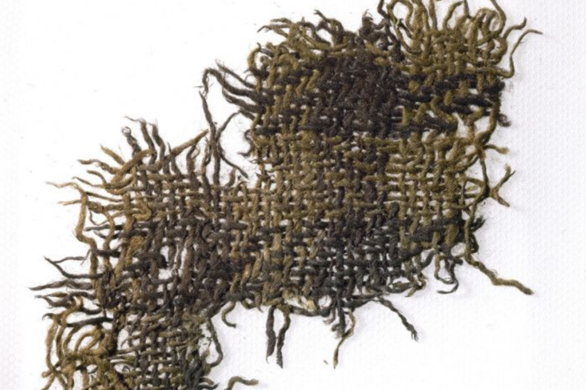

> *"For the purposes of this Act, a tartan is a design which is capable of being woven consisting
> of two or more alternating coloured stripes which combine vertically and horizontally to form a
> repeated chequered pattern."*
>
> — *Scottish Register of Tartans Act 2008*, section 2[^srt-act]

<figure>

<figcaption>The <a href="">Falkirk tartan</a> — Scotland's oldest
surviving check, 3rd&nbsp;century&nbsp;AD.</figcaption>
</figure>

This is how the Scottish Parliament defined tartan when it set up the Scottish Register of
Tartans. It is the *end* of a journey that begins in ancient Eurasia. This post follows that
whole line: from the birth of weaving to its eventual flowering, much later, in Scotland into a
joyful way of celebrating cultural and family identity.

## Looms to Twill

People were dressed long before they could weave. The neatest clue to when we first put on clothes
is a faintly absurd one — lice. At some point the body louse split off from the head louse and
took to living in clothing rather than on the scalp, which it could only do once there were
clothes to live in; dating that split by their genetics puts the first clothing somewhere between
40,000 and 170,000 years ago.[^lice] Whatever the true figure, those first clothes were not woven
at all — they were animal skins and furs, and skins stayed the humble end of the wardrobe for a
very long time. Even in the cities of ancient Sumer, ordinary winter dress was still sheep fur,
while finer woven wool marked you out.[^sumer]

Weaving did not begin on a loom. The oldest textile we have was made entirely by hand — plant
fibre twined, looped and knotted into cloth, found in Guitarrero Cave high in the Peruvian Andes
and roughly twelve thousand years old.[^guitarrero] It belongs to a New World tradition with no
connection to the Old World story whatsoever, and that is the telling part: cloth was plainly
invented more than once, by people who never met. Weaving is not one culture's idea that spread —
it is something humans reach for wherever they settle.

The loom, and the plain *tabby* cloth that comes off it, appears later — and in a different fibre
in each part of the world:

- Anatolia — the oldest loom-woven cloth in the Old World, from Çatalhöyük, around 6700 BC: a
  plain tabby, woven (a recent surprise) not from flax but from oak bast, the inner bark of the
  tree.[^catal]
- Egypt and north-east Africa — flax linen. Egyptians were weaving it by about 5000 BC; a loom is
  even painted on a pottery dish from Badari (c. 3600 BC), and the linen Tarkhan Dress (c. 3400
  BC) is the oldest woven garment found anywhere.[^tarkhan]
- The Indus Valley — cotton. Cotton threads survive at Mehrgarh from about 6000 BC, and woven
  cotton cloth at Mohenjo-daro from about 3000 BC.[^cotton]
- China — silk. Traces of silk protein appear in tombs at Jiahu some 8,500 years ago; the oldest
  surviving *woven* silk is from Qianshanyang, about 2700 BC.[^silk] It appears in high-status
  graves: silk, and the dyeing of it, were marks of rank from the very start.

Different fibre, different corner of the world — and all of it plain weave. The upright
warp-weighted loom that the whole later tartan tradition runs on belongs to this early world too —
it is in Europe by the late sixth millennium BC — and at first it weaves plain cloth like
everything else.[^iberianloom]

> twining and looping → the loom and plain tabby → twill → coloured, checked twill → the tartan sett

Twill comes later than all of it, and the checked twill that becomes tartan later still. The
earliest twill *check* we have — the Tarim plaid of western China, the oldest thing that genuinely
looks like tartan — is only about three thousand years old, more than five thousand years after
that first loom cloth at Çatalhöyük. It has a post of its own:
[**The Tarim Tartan**]().

One caution to carry forward. Cloth rots. It survives only where the ground is exceptionally dry,
frozen, or waterlogged — a desert, a glacier, a salt mine, a bog. So the map of "oldest surviving
textiles" is really a map of *where cloth happened to last*, not where it was first made. Almost
everything from the wet, temperate places — which is to say almost everywhere people actually
lived — is simply gone.

## Twill and woolly sheep

Twill is a wool weave. That sounds like a small technical point, but it is the hinge of the whole
story, because tartan is twill and twill, in practice, means wool.

I will be honest: I do not really know *why* twill and wool belong together — only that they
plainly do. Across the early loom world the fibre and the weave line up. Egypt wove superb linen
for three thousand years and kept it almost all plain, and what little twill turns up there
usually marks wool or imported cloth; the Indus wove cotton and China silk, and both stayed
overwhelmingly plain too. Twill, where it appears, travels with wool.[^wooltwill] The usual
explanation is in the fibre: flax, cotton and reeled silk are smooth and fairly inelastic, content
in an over-one-under-one tabby, while wool is springy, crimped and elastic — which is what the
over-two diagonal of a twill seems to want, a cloth that drapes, gives a little on the bias and
traps air to hold warmth. That may be the whole of it; but the pairing is clearer than its cause,
and I would rather flag the connection honestly than pretend I can fully account for it.

But the wool had to be invented first. Sheep were domesticated early — around 11,000 to 9,000 BC
in the Near East — though not for wool: they were kept for meat, milk and skins, and the first
sheep were not woolly at all. A wild sheep wears a double coat, coarse hair over a short downy
undercoat; the dense, single, ever-growing woolly fleece we now take for granted is a bred thing,
selected over thousands of years. The breeding for wool seems to begin around 6000 BC, but real
woven wool comes only two or three thousand years later — the oldest claimed wool is from the
north Caucasus, around 3700–3200 BC — and it is the Bronze Age that pushes hardest for the dense,
white, continuously-growing fleece that takes dye cleanly.[^woollysheep]

And that is the moment everything tartan needs falls into place at once. A woolly sheep gives you a
fibre springy enough to make twill worth weaving; one that comes ready-coloured — black, white,
grey and brown straight off the animal — so a two-colour check costs nothing but sorting the
fleece; and one that takes dye beautifully, so colour becomes a luxury you can add on top. The
cheap cloth is the natural-fleece check; the dear cloth is the dyed one — the same split we saw
between sheep-fur Sumerians and silk-wearing elites, now built into the wool itself. Diagonal
twill, natural-colour checks, and dye for those who could afford it: every ingredient of tartan is
on the table by the Bronze Age. What is left is to find it in the ground — which is where we turn
next.

## It is twill

The single most important technical fact about tartan is the one that is easiest to overlook: it
is a **twill**. Plain weave crosses each thread over one and under one; **2/2 twill** goes over
two and under two, stepping the offset along by one thread each row, so the cloth carries a
diagonal grain. That grain is why tartan drapes softly, gives a little on the bias, and shows its
colours as the slightly blurred diagonal blocks we recognise. The Dictionary's whole scope is
this family — **2/2-twill, horizontally-and-vertically symmetric setts** — because holding the
weave constant is what lets a [pattern]() be a clean unit of meaning.

And it is the same 2/2-twill family at every point in the deep history:

- the **Hallstatt** salt-mine textiles of the eastern Alps (c. 800–400 BC),
- the **Tarim Basin** plaid of Xinjiang (c. 1200 BC) — see the companion post,
  [*The Tarim Tartan*](),
- and the woollens of **Roman Britain**, where at Vindolanda on Hadrian's Wall roughly
  **two-thirds of the cloth is 2/2 diamond twill**.[^wild-vind]

There is even a neat division of labour by weave. Twill, the weavers of Hallstatt understood, has
"better heat retention properties than tabby" and is "more pliable" — so it makes the *garment*,
the cloak or tunic that must drape and keep you warm. The firm, dense **rep** (a warp-faced plain
weave) was kept for the *bands* — head-bands, belts, borders, carrying straps — because it holds
its shape.[^gromer-trad] The body of tartan is twill; its edges are not.

## A tradition that evolves — even its weave changed

It is tempting to imagine ancient tartan as our tartan, only older. It was not. The tradition has
*evolved* at every level, and the clearest proof is that **the weave itself changed**.

Most tartan today is **plain 2/2 twill**, with all the interest carried by the dyed colour sett.
The early evidence runs the *other* way: it prefers the more elaborate **patterned-structure**
twills, with the colour often plainer. At Vindolanda the favourite was not plain twill at all but
**diamond twill** (~62% of the cloth; plain 2/2 only ~5%) — Wild notes "diamond twill was the
preferred structure, despite the extra demands which it makes upon the weaver."[^wild-vind] The
[Falkirk]() cloth is a **herringbone**; the Hallstatt corpus runs to
herringbone, zigzag, pointed and diamond twills. Over time the complexity **migrated from the
structure into the colour**: the weave simplified to plain 2/2, while the sett grew elaborate.
(The older taste never died — plenty of cloth is still woven as herringbone, and herringbone
rules in tweed.)

The colour evolved too. The earliest checks lean heavily on the **natural colours of the fleece**
— black, white, grey, brown — because dyed colour was expensive; a thin precious line of woad
blue or madder red was set against broad fields of free natural wool. Only later does the dense,
many-coloured dyed sett become the norm. And the very **word** is a latecomer: "tartan" is
probably from Old French *tiretaine*, a cloth name, not a pattern; the native Gaelic for the
pattern is **breacan**, "chequered". The earliest record of the word "tartane" in Scots is only
**1538**.[^dost] A tradition this changeable in weave, colour and name is not a relic; it is
alive.

## The Indo-European thread — loosely

The most striking thing about the deep history is its **geographic reach**. The same idea —
coloured checks and stripes on a 2/2-twill ground — turns up at both ends of the
Indo-European-speaking world at roughly the same time:

- **East:** the **Tarim Basin** plaid (Xinjiang, c. 1200 BC), woven by Tocharian-speaking
  communities — a diagonal-twill check up to six colours, ~6,000 km from Scotland.[^penn]
- **Centre:** **Hallstatt** (c. 800–400 BC), the proto-Celtic salt-mining world of the eastern
  Alps, with dyed checks and dogtooth on 2/2 twill.[^gromer-trad]
- **West / Atlantic:** the British and **Irish** woollen tradition, the [Falkirk]()
  check, and the Atlantic Celtic façade reaching down to **Galicia** in north-west Iberia.

The Greek and Roman writers saw it from the outside and remarked on it: **Diodorus Siculus**
(drawing on the lost Posidonius) describes Gauls in striped cloaks "in which are set checks,
close together and of varied hues",[^diodorus] and **Virgil** has them "gleam in striped cloaks"
(*virgatis sagulis*).[^virgil] (A caution for anyone reaching for the classics: **Tacitus does
*not* describe tartan-clad Britons** — his coloured-cloth passage is about Germanic dress, not
Celtic.)

But "Indo-European" here must be held *loosely*, and this is where older popular accounts go
wrong. The link is one of **shared craft and culture, not a single migrating people**. The 2021
genome study of the Bronze-Age Tarim mummies found them to be a **genetically isolated,
indigenous population** — not incoming Celts or steppe migrants.[^nature] What travelled across
Eurasia was the *technology and the taste* — woolly sheep and the twill-plaid check — spread by
contact and a common cultural world, not a folk-migration carrying tartan east. The cloth is a
shared inheritance, which is the better story anyway: a craft, not a flag.

## The development of tartan in Scotland

The whole arc gathered into one view — not to scale (it cannot be), each stop given equal room,
the colour chips running from natural fleece to dyed just as tartan's own palette did. The deep
prehistory is behind us now; what follows is the Scottish end of the line.

<ol class="timeline">
<li style="--c:#5c4433">

170,000–40,000 years ago Clothing — skins and furs, dated by the body louse
</li>
<li style="--c:#b7a98c">

from c. 3500 BC Wool — woolly sheep bred from their hairy ancestors
</li>
<li style="--c:#b0593f">

c. 1500–1200 BC Twill — Bronze-Age wool twills; the <a href="">Tarim</a> plaid, the oldest check
</li>
<li style="--c:#7a6a52">

c. 250–900 AD Roman &amp; Pictish Scotland — the <a href="">Falkirk</a> check, Scotland's oldest
</li>
<li style="--c:#34557a">

1200–1650 Early Scots — Glen Affric, the oldest true Scottish tartan; "tartane" first recorded
</li>
<li style="--c:#3f6b4a">

c. 1600–1745 Jacobite flourish — Highland dress at its height
</li>
<li style="--c:#33312e">

1746–1782 Jacobite repression — the Dress Act bans Highland dress
</li>
<li style="--c:#8d2f33">

1782–1901 Revival &amp; Victoriana — Scott's 1822 pageant; Victoria at Balmoral
</li>
<li style="--c:repeating-linear-gradient(180deg,#34557a 0 5px,#8d2f33 5px 10px,#3f6b4a 10px 15px)">

1996 / 2008 STA &amp; the Register — the Authority, then the statutory Register
</li>
</ol>

If the genesis is Eurasian, the **flowering is unmistakably Scottish**, and it is recent. The
western branch of the tradition stayed alive in Highland Scotland, and there it grew into
something the rest of the world did not have: a system of *named* setts tied to clan and place.
The stages are worth keeping straight, because the popular story collapses them.

- **3rd century AD — the [Falkirk]() sett.** Scotland's oldest surviving
  scrap of check, a simple black-and-white twill of natural wool, kept by accident as a stopper
  in a pot of Roman coins. The *cloth* tradition is this old in Scotland; the clan system is not.
- **16th century — the [Glen Affric tartan]().** Pulled from a peat bog
  and radiocarbon-dated to c. 1500–1600, this is the **oldest surviving piece of true Scottish
  tartan** — a multi-colour sett dyed with woad/indigo, madder and natural browns, with no
  synthetic dye.[^affric] The same dye-pot the Tarim weaver reached for, two and a half thousand
  years later.
- **1538 — first in the records.** The Treasurer's accounts of **James V** record "Heland
  tartane"; the word, and Highland tartan as everyday Highland dress, are now documented.[^dost]
- **1746–1782 — proscription.** After the last Jacobite rising the **Dress Act** banned Highland
  dress, including tartan, in an effort to break the clan system. Repealed in 1782, it left
  tartan to be remembered and reinvented rather than continuously worn — a hinge in the story.
- **1822 — the pageant.** **George IV's** visit to Edinburgh, stage-managed by **Walter Scott**
  as a sea of tartan, turned the cloth from a proscribed Highland habit into a national, romantic
  costume — and set off the demand that the mills would soon codify.
- **late 18th–19th century — codification.** **Wilsons of Bannockburn**, the great weaving firm,
  named patterns after towns, districts and people in their pattern books; the **Highland Society
  of London** began collecting and registering "clan" tartans from 1815; and the Sobieski
  Stuarts' ***Vestiarium Scoticum*** (1842) — a **forgery** — supplied a whole invented canon of
  clan setts that Victorian Scotland eagerly adopted. Victoria and Albert at Balmoral did the
  rest.
- **today — the Register.** The **Scottish Register of Tartans** now records the sett formally as
  a thread count, and over seven thousand designs are recorded. The clan-symbol layer that most
  people *mean* by "tartan" is, in other words, barely two centuries old — an Enlightenment-and-
  Victorian construction laid over a genuinely ancient cloth.

None of that makes the clan tartans inauthentic; it makes them the **latest chapter** of a long
book. The Dictionary's whole approach — treating a tartan as a [pattern]()
rather than a single thread count or a single name — is really a way of seeing that long book as
one continuous text, in which a 16th-century bog scrap, a Wilsons pattern-book sett and a modern
registered design can be recognised as moments in one evolving tradition.

## The honest position

Set strictly, the fully-developed, multi-colour **symmetric sett** that the
[definition]() requires survives first only at early-modern Glen Affric — so
we should not claim ancient cloth was "tartan" outright. What we *can* say, and what the evidence
strongly supports, is that **every ingredient of tartan is ancient**: the 2/2-twill ground, the
colour-striping and checking of it, the natural-fleece palette, the diagonal-twill plaid at the
far edge of the world, and the native *breacan* idea. Put together:

> **Tartan is the late Scottish naming and codification of an ancient, evolving, loosely
> Indo-European tradition of coloured striped twill — older in time, and wider in geography, than
> the Scottish story alone allows.**

That is the line the Dictionary keeps: from Hallstatt — and, we can now add, from the Tarim Basin
— through to today.

---

*Companion piece: [**The Tarim Tartan**]() takes the oldest surviving
specimen and works a sett from it. See also [**What is Tartan?**]().*

---

[^srt-act]: Scottish Register of Tartans Act 2008 (asp 7), s. 2, "Meaning of 'tartan'".
  <https://www.legislation.gov.uk/asp/2008/7/section/2>
[^guitarrero]: Jolie et al. (2011), on the twined textiles and cordage of Guitarrero Cave, Peru;
  see *Current Anthropology* / summary at
  <https://www.sciencedaily.com/releases/2011/04/110413121008.htm>
[^catal]: Rast-Eicher et al. (2021), "The use of local fibres for textiles at Neolithic
  Çatalhöyük", *Antiquity*.
  <https://www.cambridge.org/core/journals/antiquity/article/use-of-local-fibres-for-textiles-at-neolithic-catalhoyuk/294D8367B55E0A752ACC1825035840FC>
[^iberianloom]: "The oldest loom-woven textiles from the Iberian Peninsula and the European
  loom", *Scientific Reports* (2021) — earliest Iberian loom cloth is flax tabby (Peñacalera,
  Córdoba, later 4th millennium BC); the warp-weighted loom reaches Central Europe in the late
  6th millennium BC; all examined early examples are plain weave, with no twill.
  <https://www.nature.com/articles/s41598-021-01349-5>
[^tarkhan]: Egyptian flax-linen weaving dates from c. 5000 BC; a loom is depicted on a pottery
  dish from Badari (c. 3600 BC), and the linen *Tarkhan Dress* (radiocarbon-dated 3482–3102 BC) is
  the oldest surviving woven garment. A. Stevenson & M. Dee, "Confirmation of the world's oldest
  woven garment: the Tarkhan Dress", *Antiquity* (Project Gallery).
  <https://antiquity.ac.uk/projgall/stevenson349>
[^cotton]: Earliest cotton: mineralised cotton threads on a copper bead at Neolithic Mehrgarh,
  Pakistan, c. 6000 BC; the oldest woven cotton is a fragment adhering to a silver vase at
  Mohenjo-daro, c. 3000 BC. "First Evidence of Cotton at Neolithic Mehrgarh, Pakistan", Harappa.
  <https://www.harappa.com/content/first-evidence-cotton-neolithic-mehrgarh-pakistan>
[^silk]: Biomolecular traces of silk fibroin in tombs at Jiahu, Henan, c. 8,500 years ago (Gong
  et al., *PLOS ONE*, 2016, <https://pmc.ncbi.nlm.nih.gov/articles/PMC5152897/>); the oldest
  surviving *woven* silk is from Qianshanyang (Liangzhu culture), c. 2700 BC.
[^lice]: The body louse lives in clothing rather than on the skin, so it could only evolve once
  humans wore clothes — which makes the genetic split between head and body lice a rough clock for
  when clothing began. Estimates run from 40,000 to 170,000 years ago (Kittler, Kayser &
  Stoneking; a 2003 study suggested ~107,000 years, a 2011 study ~170,000). *History of clothing
  and textiles*, Wikipedia. <https://en.wikipedia.org/wiki/History_of_clothing_and_textiles>
[^sumer]: In ancient Mesopotamia ordinary Sumerian dress was simple, with winter clothing made of
  sheep fur, while the tufted woollen *kaunakes* marked higher rank. *History of clothing and
  textiles*, Wikipedia. <https://en.wikipedia.org/wiki/History_of_clothing_and_textiles>
[^wooltwill]: Twill is warmer, more pliable and more elastic than plain tabby (K. Grömer,
  "Tradition, creativity and innovation: the development of textile expertise from the Bronze Age
  to the Hallstatt period", in *Textiles from Hallstatt*, 2013) — properties that suit springy
  wool, whereas smooth, inelastic linen sits more naturally in plain weave.
  <https://www.academia.edu/11038057/>
[^woollysheep]: Sheep were domesticated c. 11,000–9,000 BC for meat, milk and skins; the single
  woolly fleece is a later bred trait — wild sheep have a double coat of coarse hair over a downy
  undercoat. Selection for wool may begin c. 6000 BC, with woven wool only two to three thousand
  years later, and dense white fleeces bred in the Bronze Age. "Domestication of the sheep",
  Wikipedia <https://en.wikipedia.org/wiki/Domestication_of_the_sheep>; "Approaching sheep herds
  origins and the emergence of the wool economy in continental Europe during the Bronze Age",
  *Archaeological and Anthropological Sciences* (2019)
  <https://link.springer.com/article/10.1007/s12520-019-00856-x>. The oldest claimed wool —
  contested — is from Klady (Majkop), north Caucasus, c. 3700–3200 BC (Shishlina et al. 2003)
  <https://www.academia.edu/24477597/>.
[^wild-vind]: J. P. Wild, "Vindolanda 1985–1988: The Textiles", *Vindolanda Research Reports,
  New Series, Vol. III*, 76–90 — diamond twill ~62%, plain 2/2 ~5%, ~20% of the cloth dyed.
[^gromer-trad]: K. Grömer, "Tradition, creativity and innovation — the development of textile
  expertise from the Bronze Age to the Hallstatt period", in *Textiles from Hallstatt* (2013).
  <https://www.academia.edu/11038057/>
[^penn]: *Ancient Mummies of the Tarim Basin*, Expedition Magazine, Penn Museum.
  <https://www.penn.museum/sites/expedition/ancient-mummies-of-the-tarim-basin/>
[^nature]: F. Zhang et al. (2021), "The genomic origins of the Bronze Age Tarim Basin mummies",
  *Nature*. <https://www.nature.com/articles/s41586-021-04052-7>
[^diodorus]: Diodorus Siculus, *Library of History* 5.30 (drawing on Posidonius).
  <https://gaulishpolytheism.com/diodorus-siculus-on-gaul-book-5/>
[^virgil]: Virgil, *Aeneid* 8.659–661 (*virgatis lucent sagulis*), Perseus.
  <https://www.perseus.tufts.edu/hopper/text?doc=Perseus:text:1999.02.0055:book=8:card=630>
[^dost]: *Dictionary of the Older Scots Tongue*, s.v. *tartane* — earliest quotation 1538.
  <https://www.dsl.ac.uk/entry/dost/tartane>
[^affric]: *Scotland's oldest tartan discovered by Scottish Tartans Authority*, V&A Dundee.
  <https://www.vam.ac.uk/dundee/info/scotland-s-oldest-tartan-discovered-by-scottish-tartans-authority>
