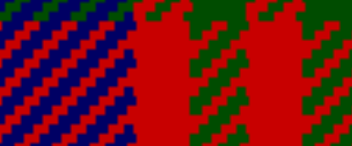
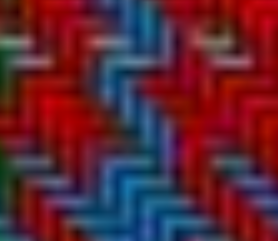
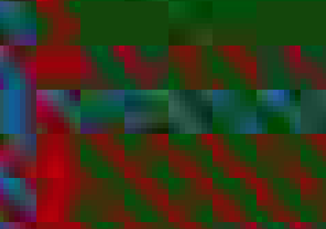

---
title: "Selecting Colours"
date: 2023-04-14
slug: colour-selection
---

This is a broader description about selecting colours.  See the [selection of colours](/posts/colours/) for the choices of base colours using the Scottish Tartan Registry base colours.

This is partly my journey on discovering how to select and specify colours.  When you start looking at colour spaces you can start with [Wikipedia](https://en.wikipedia.org/wiki/Color_space).  I am keen to know how much a colour varies from a standard colour and what a standard colour is.

## Linear transformations
On my computer I have an sRGB monitor with a gamma of 2.2 which seems quite accurate (Microsoft Surface checked with a DataColour spyder).  However the gamut is limited compared to the Adobe gamut.

I can transform from one space to another but want to make sure the transformation is lossless.  So an out of gamut sRGB needs to use values greater than 255 and small than 0 to represent the whole colour space.

The CSS standard has looked at OKLAB as a colour space that is very similar to *LAB but gives more linear differences in the blue space.  This sounds exactly what I am looking for.

Many pictures use other models, eg the CIExy 1935 model is popular and the *LAB space is used as a more modern reference.  Eg the data colour tools support it.  However this is not used so much as a reference for textiles or paints.

There are references that have appeared.  

- Listed papers
- 

## Color checker

[!Colour Checker](colour_checker.png)

I have started to do a deep dive on colour checkers using ipython notebook and am trying out
jupyterlite [on my development website](https://drummonds.github.io/jupyterlite/lab/index.html)  This is also available on binder.org however I think the jupytelite one is faster and easier to use.

The interesting thing about the colour checker is that it is a well known reference of 24 colours which
there are physical copies that everyone can have.  The information is not particularly open but the
original work was published ina 1976 in a paper and so most information is derived from that.

It is a good starting point to play with a set of colours and to try and convert from and to them.

### Topics
 Each of these will be covered in a notebook as well as being summarised here.
 
- [Use of the python colour module](https://drummonds.github.io/jupyterlite/lab?path=Using+colour+module.ipynb) from [Colour Science](https://www.colour-science.org/)
- [Colour checkers]() a general overview
- conversion from colour space to sRGB and effect of illumination
- Constructing shading diagrams from a colour to white and black
- Pictures of Tartan with differen colours effect of shading?
- uncoated to coated Pantone colours effect of shading
- Calibrating a Colour checker using a spyder print.
- taking pictures and converting to colours
- taking tartan samples and converting to colours
- exploration of nearest Pantone colours

The 24 colour Macbeth ColorChecker is listed simply on [Wikipedia](https://en.wikipedia.org/wiki/ColorChecker) which lists all the colours and their sRGB versions. 

Eg the Gretag McBeth model and the current Data color checker.  The gretagmacbeth of which I have a small chart has the same layout whereeas the data colour version eg below has a different arrangment.  The story is complicated [BabelColor](https://babelcolor.com/colorchecker-2.htm#xl_CCP2_WhichData) have measured charts and shown that the Macbeth prior to 2014 is not the same colours as the 1976 paper by McCamy.  Also around 2104 there was a change of perhaps 2Δe LAB.  The datacolour colours are similar but in a slightly different arrangement.

[PDF](SpyderCheckr_Color_Data.pdf)

It has been converted to Text by Christopher Bartneck and I have documented a minor error in it [here](https://www.bytestone.uk/posts/colourcalibration/).  This has been corrected in the second version which is published on datacolors Japanese site.

The 48 colour version is listed on their [Japanese website](http://www.datacolor.jp/assets/files/SpyderCheckr_Color_Data_V2.pdf).  The right hand side version does seem to be the same as my 24 colour version.     
And I have copied the file here:

[PDF 2](SpyderCheckr_Color_Data_V2.pdf)

This is based on data the X-Rite published at one stage although they have now removed it from their web site.

The same author has modelled the Pantone colours although has avoided naming them as such and the efforts preserved in the internet archive:

SpyderCheckr_Color_Data.pdf

To furher complicate things the colour specifcation are in CIE 1931 space.  The python 
module colour-science has a list of tables.  However my gretag macbeth mini has a calibration sheet with it and the data matches that of the 1976 rather than the 2005 data (it could be that old). P/N 50111

I need to checkout linear transforms between different colour spaces and then come back to this calibration.

## Pigment based model

Pantone provide a reference based on mixing 15 inks to provide spot colour inks.  The names of these are then standardised.  They used ot have about 1200 but now have more than 2000.  The perceived colour though varies depending on how it is used.  Even with the same dilution and application there is a difference between printing on coated and uncoated papers.  This is not a small difference.

## Pictures and representations of colour

A problem that I have come acrosss is that my first generation weaving pattern is very simple but makes it easy to work out what colour you are using:

So the representation of the weave is solid colours.  The raw PNG gets scale when magnified under the browser.  Other weaving patterns give a more realistic version of a weave eg the [Scottish Tartan Registry](https://www.tartanregister.gov.uk/tartanLargeImage?ref=980):

The problem with this is that the pixels of each colour now vary depending on the position.  Additionally this is a JPEG so if you compress it (admittely this is a high compression) but you can see artifacts coming into the colour of each pixel:

## Colour distance

I am interested in measuring colour distance.  I am planning to use the simple DE in LAB space in the oklab space if the transform is reversible and then to measure the distance to nearest colours.  

The aim will be to show colour variations in small steps in a mapping of the 3 d version to a 2 d hexagonal map.  With the distance from target colour represented as the distance to the next known colour. 

## Reference colours

Gernot Hoffman has published a detailed swatch and measurement of 1137 coated colour patches
https://web.archive.org/web/20061212221321/http://www.fho-emden.de/~hoffmann/swatch16032005.pdf

The nice thing about this is that he has published at the back a standard set of colour swatches rotating though the colour wheeel describing the nearest match colour:

[Swatches PDF](swatch16032005.pdf)

I am hoping to be able to replicate this so that I can see the effect of lighting angled on a colour and how it is represented.  This will hopeflly give me the ability to work back from an image to a reference colour.

One thing to note is that many of the colours are outside the sRGB triangle.

2728C as S 0 72 190, or in hex #0048BE
On https://tartandictionary.org/posts/colours/ I have 2728 uncoated as #4f69c1 and coated as #0047bb which is close but not the same as Pantones published data of 2023-02-15.

The distance sRGB euclidian is about 3.1 in the blue dimension.