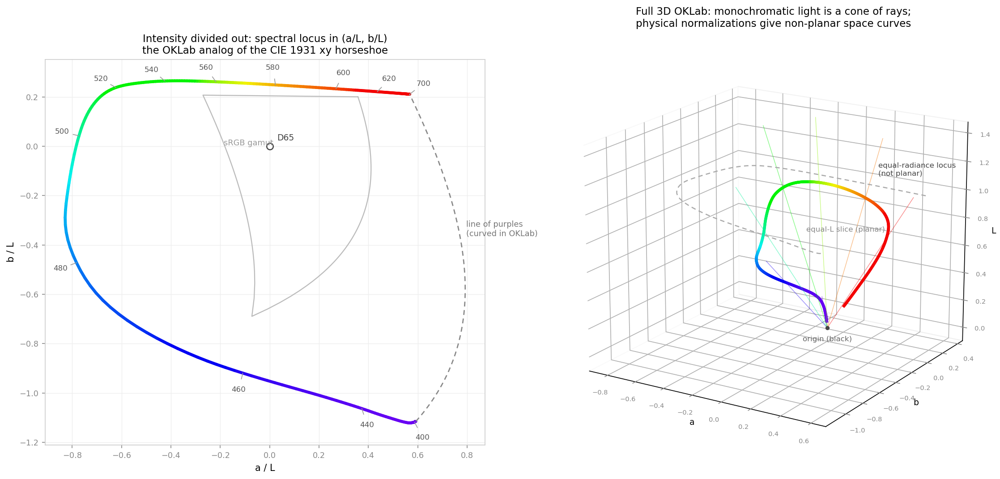

The dictionary does all of its colour reasoning in OKLab — classifying shades, measuring
ΔTartan, drawing dye-range maps. Those maps always show colours *inside* a gamut. This story
asks the opposite question: where is the **outer edge of all physically possible colour** —
the locus of pure monochromatic light, the curve that draws the famous horseshoe of the
[CIE 1931 chromaticity diagram](https://en.wikipedia.org/wiki/CIE_1931_color_space) — when you
plot it in OKLab?

## Why this is not a straight translation

The CIE 1931 horseshoe is a **chromaticity** diagram. It lives in a projective plane: the
tristimulus values are normalised, \\( x = X/(X+Y+Z),\; y = Y/(X+Y+Z) \\), so intensity is
divided out and each monochromatic wavelength collapses to a single point.

OKLab is a three-dimensional *appearance* space. A monochromatic light has a free intensity,
so in OKLab it is not a point at all — it is a whole **ray**, and the set of all monochromatic
lights is a **cone of rays through the origin** (right panel above). Before you can plot "the"
locus you must choose how to cut that cone, and different cuts give genuinely different
shapes — including ones that do not lie in any plane.

## The rays are straight — a small derivation

OKLab is defined (Ottosson) as two matrix maps around a cube root, with no offsets:

$$
\mathrm{Lab} = M_2 \cdot \sqrt[3]{\,M_1 \cdot \mathrm{XYZ}\,}
$$

Scale the intensity of a light by \\(k\\): XYZ becomes \\(k\,\mathrm{XYZ}\\), the LMS vector
becomes \\(k\,\mathrm{LMS}\\), the cube root turns that into a **uniform** factor
\\(k^{1/3}\\), and the final linear map preserves it. So

$$
(L, a, b) \;\longmapsto\; (k^{1/3}L,\; k^{1/3}a,\; k^{1/3}b).
$$

Every intensity ray in XYZ maps to a *straight* ray through the OKLab origin. Two useful
consequences fall straight out:

- **OkLCH hue is intensity-invariant.** \\(h = \operatorname{atan2}(b, a)\\) is unchanged by
  the common factor. A wavelength has a well-defined OKLab hue angle.
- **The ratios \\(a/L\\) and \\(b/L\\) are intensity-invariant.** They are the natural OKLab
  analog of the \\((x, y)\\) chromaticity coordinates.

## Cut 1 — divide intensity out (the horseshoe's analog)

Plot \\((a/L,\; b/L)\\) for each wavelength (left panel). The recipe:

1. For each wavelength take the CIE 1931 2° colour-matching-function triple
   \\((\bar{x}, \bar{y}, \bar{z})\\) as the XYZ of that monochromatic light — the scale is
   irrelevant, that is the point.
2. Convert XYZ → OKLab with a **signed** cube root: spectral stimuli sit far outside any
   display gamut and can push one LMS component slightly negative. (`np.cbrt` is signed;
   `pow(x, 1/3)` is not.)
3. Plot \\((a/L, b/L)\\). D65 lands exactly at the origin, because OKLab is normalised so
   that D65 white has \\(a = b = 0\\).

The result is recognisably the horseshoe's cousin: red through green along the top, the long
blue sweep down the left, violet curling in at the bottom right, everything beyond ~650 nm
piling up at the red corner just as it does in \\(xy\\). The sRGB gamut — the RGB cube's
edges pushed through the same projection — floats inside it around the white point.

One familiar feature breaks: **the line of purples is not straight**. In \\(xy\\) it is
straight because chromaticity is a projective-linear map, and mixtures of two lights lie on
the segment between them. The cube root destroys that linearity, so in OKLab the purple
boundary must be *computed* — mix the endpoint stimuli,
\\(t \cdot \mathrm{XYZ}(400\,\text{nm}) + (1-t)\cdot \mathrm{XYZ}(700\,\text{nm})\\),
and map each mixture. It comes out bowed (dashed curve).

## Cut 2 — fix the physics (and leave the plane)

Dividing by \\(L\\) is a mathematician's cut. A physicist would instead fix a normalisation
and keep all three coordinates:

- **Equal radiance** — plot the CMF triple directly. This is the solid 3D curve in the right
  panel: lightness peaks near 555 nm where the eye is most sensitive and dives toward the
  origin (black) at both spectral ends, where the eye barely responds at all.
- **Equal luminance** — scale every wavelength to the same \\(Y\\). Also a space curve, with
  the tails now flung far outward instead of collapsing.

Neither curve lies in any plane — the spectral locus in OKLab is intrinsically a
three-dimensional object. Only the artificial constant-\\(L\\) slice of the cone (dashed ring)
is planar, and that is the shape the left panel flattens.

## Practical notes

- **Use the real CMF table, not analytic fits.** A first draft of the diagram used the
  Wyman–Sloan–Shirley Gaussian approximation and the locus grew a false loop at the violet
  end: the fitted \\(\bar{y}\\) tail is ~3× too large below 410 nm, and chromaticity is a
  ratio of near-zero numbers there, so tail error dominates. The bundled
  [`ciexyz31_1.csv`](ciexyz31_1.csv) is the CVRL 1 nm table; the full derivation is in the
  bundled [`oklab_locus_final.py`](oklab_locus_final.py).
- **OKLab is an extrapolation out there.** It was fitted to display-gamut data, so near the
  spectral locus the space is a smooth extension, not a perceptual measurement. That is fine
  for plotting and for hue bookkeeping, but chroma *distances* near the edge should not be
  read as calibrated ΔE — a caveat that matters when we reason about how far a dye gamut
  could ever be pushed.

For the dictionary the takeaway is orientation: our dye-range maps live on constant-\\(L\\)
slices, and this curve is the absolute boundary those slices can never cross — the rim of
colour itself.
