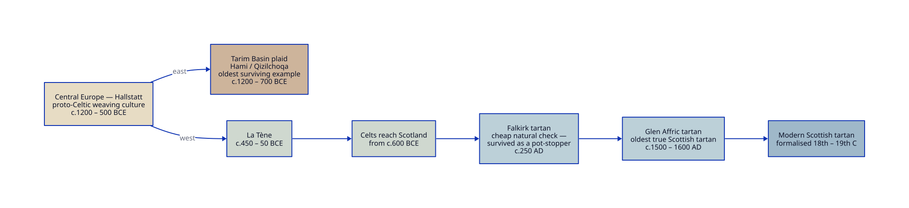

There is a piece of checked woollen cloth, woven somewhere on the rim of the Taklamakan desert
about three thousand years ago, that looks unmistakably like tartan. It is not Scottish. It is
not even, in origin, eastern. It is, I think, the key to what Scottish tartan really *is* — the
**oldest surviving example** of a single weaving culture that spread out of central Europe,
pushing *east* across the steppe to the Taklamakan and *west* through the Alps and down into the
Highlands. The Tarim cloth is not a root; it is the far end of one branch, preserved by a lucky
accident of dry salt earth. Setting it beside the Scottish tradition does something I rather
like: it turns tartan from a nationalist badge into a shared European — even Eurasian —
inheritance. A craft, not a flag.

This post works that idea out. I take the surviving cloth, read a sett from the
image, regularise it into a traditional tartan, and then ask what it would have looked like new —
before three millennia in the ground bleached the dyes. Along the way: the colours and their
plant dyes, the other reconstructions people have attempted, the curious case of Cherchen Man's
leggings (which are *not* a tartan), and the newly dated [Glen Affric tartan][affric-vam], which
is the oldest true Scottish tartan we have and the other bookend of the story.

## A 3000-year weave

The Dictionary's mission is to sustain *the living Scottish Celtic tartan tradition — the line
that runs from Hallstatt through to today*. The Tarim cloth lets us extend that line by another
thousand years and several thousand miles, because the same weave appears at both ends of it at
once.

The textiles of the Tarim Basin — from the cemeteries at Qizilchoqa, Hami and Zaghunluq in
Xinjiang — survive because the desert is bone dry and salty. They date from roughly 1400 BCE into
the late first millennium BCE.[^penn] Among them are plain two-colour checks, stripes, and plaids
in **up to six colours**, all built on the **2/2 diagonal twill** — the very weave that gives
tartan its soft diagonal grain.[^spp345] Elizabeth Wayland Barber, who studied them closely,
concluded that this cloth is structurally of a piece with the plaids recovered from the
Hallstatt salt mines in the Alps — the textiles of the early, proto-Celtic world — dating to
about the same period, around 1000 BCE.[^barber]

That is the heart of it. Two finds, far apart, making the *same* cloth by the *same* method at
about the *same* time. The point is not that Scotland copied the East, or the East Scotland.
Neither is the source. Both are *ends* of one Bronze- and Iron-Age weaving culture that radiated
out of the central-European, proto-Celtic world — carried by the spread of Indo-European peoples
— eastward to the Tarim Basin and westward into Britain. Tarim is simply where the dry salt earth
preserved the oldest legible specimen; Scotland is where the tradition is still, three thousand
years on, alive.

The Dictionary's [scope]() is, deliberately, exactly this family: **2/2-twill,
horizontally-and-vertically symmetric setts**. The Tarim plaid is admissible on its own terms —
it is a symmetric twill check — which is why it belongs here as a *pattern*, not as a curiosity.

## Working a sett from the image

This is the Hami fragment.[^penn] The ground has faded to tan; the check is carried by fine,
often paired, darker lines over broad fields.

You cannot machine-read a sett off a photograph like this. Our reverse-weaver only round-trips
*synthetic* setts the engine drew itself; it has no purchase on a frayed, irregular,
hand-spun ancient cloth where the "blue" has lost almost all of its colour and the thread counts
were never regular to begin with. So this is a judgement, not a measurement: I sampled scanlines
across the clean centre of the fragment to get the *proportions* — broad grounds, with narrow
guard lines that frequently come in pairs — and then **regularised** that into a traditional,
symmetric tartan.

The reading gives a reflective sett with the pattern mirroring about the centres of the broad
grounds:

> **Brown/36  Blue/4  Brown/4  Blue/4** &nbsp;(pivoting on the brown grounds)

A broad brown field, then a *blue – brown – blue* tramline of guard stripes, repeated. Rendered
as a 2/2 twill in the faded, as-found colours sampled from the cloth, it comes out like this:

That is a draft, made outside the engine purely to agree the *shape*. The thread count above is
what will be **imported into the Dictionary**: once it is in, the engine generates the canonical
[pattern]() and the proper renders, and those are what we will actually use across the
site — including, eventually, as the page background.

## Reconstructing the colour

What survives is not what was woven. The browns and tans we see are three thousand years of
fading, soiling and burial; the blue is a ghost of itself. To picture the original we have to ask
which dyes were in the dyer's pot.

Analysis of Xinjiang textiles of this kind finds a consistent, small palette: **reds from
madder** (a *Rubia* root), **blues from an indigo plant** (woad or true indigo), and **yellows**
from a source that has not been pinned down — with oranges made by overdyeing red with
yellow.[^dyes] The browns, importantly, may never have been dyed at all: Tarim sheep gave wool in
natural browns, greys and creams, and much of the "brown" in these plaids is likely the fleece's
own colour, which is why it has held while the dyed blue has faded.

So a reconstruction is really two moves: restore the *dyed* blue to the strength fresh woad
gives, and recognise the ground as a living natural brown rather than a dead tan. Done that way,
the same sett wakes up:

Brown fleece, a deep woad-blue check. Sober, warm, and entirely plausible for a 1000-BCE
herding people — and a recognisable ancestor of the blue-and-earth Border setts that come much
later.

## Why mostly brown: the economics of colour

Look again at that sett — broad brown grounds, only thin lines of blue — and notice that it is
not just an aesthetic choice. It is an economic one. **Dyed colour was expensive.** Madder and
woad meant growing or trading the plant, fuel and time at the dye-pot, and skilled labour;
undyed wool meant none of that. And wool came ready-coloured: sheep are born **black, white,
grey and brown**, so a check in natural fleece colours cost essentially nothing beyond the
weaving. It follows that most cloth, most of the time, was cheap natural-wool check — black,
white, brown — with dyed colour used sparingly, as a thin precious accent. The Hami sett wears
its budget on its sleeve: a great deal of free brown, a little dear blue.

This has a sharp consequence for what we *find*, and it is worth stating plainly because it can
mislead. The richly coloured Tarim plaids come out of **tombs** — and you are buried in your
best. Grave finds therefore over-represent the high-value, heavily dyed end of the cloth: they
are the exception dressed up as the rule. The ordinary cheap cloth, by contrast, almost never
survives on purpose; it survives by accident. The [Falkirk tartan]() — Scotland's oldest
surviving scrap, a plain black-and-white check of natural wool — lasted only because someone
stuffed it into the mouth of a pot of Roman coins as a **stopper**, and the pot was buried and
forgotten. The luxury is preserved because it was treasured; the everyday is preserved because it
was rubbish. Keep that asymmetry in mind whenever a single spectacular find is asked to stand for
a whole culture's wardrobe.

## Other variants

The Hami cemeteries did not weave one cloth, they wove a family of them. The published fragments
run from simple two-colour checks up to plaids of six colours, with the bands varying in
width.[^spp345] In the Dictionary's language these are **Variants** of one design — the same
underlying pattern, re-coloured and re-scaled — exactly as a clan tartan has ancient, modern,
weathered and dress Variants today. When the base sett is in the corpus, sitting the Tarim
Variants alongside it is the natural next step, and a quiet demonstration of the Dictionary's
whole thesis: that the *pattern*, not any single thread count, is the unit of meaning.

## The leggings are not a tartan

It is tempting to fold Cherchen Man into the tartan story wholesale, but his famous leggings
deserve a footnote of their own — and a correction. Cherchen Man (the "Ur-David", c.1000 BCE,
buried at Zaghunluq near Qiemo) wore a red twill tunic and bright leggings,[^cherchen] and they
are often waved at as "tartan". They are not. The leggings are **diagonal colour-block work** —
fields of solid colour set on the diagonal — not a warp-and-weft check. The thing worth telling
there is a *colour* story (a confident, even gaudy use of dyed reds and blues on the body) and a
*pattern* story about diagonal blocking, which is a different design idea from the crossed-stripe
sett of the Hami plaid. Worth its own piece; not part of the sett above.

(For completeness, the black-and-white "checked leggings" sometimes shown next to Cherchen Man in
older write-ups are a different thing entirely — they are from the Caledonian figure on the
Caracalla group, a Scottish/Roman-era image, not a Tarim find.)

## Other reconstructions

I am not the first to try to bring this cloth back. Barber's *The Mummies of Ürümchi* is the
foundational reconstruction, both of the weave structure and of the Hallstatt connection.[^barber]
Hand-weavers and tartan enthusiasts have since produced their own "Takla Makan" / Qizilchoqa
plaids, working from the same published fragments, and they differ — as reconstructions always
do — in exactly the two places where the evidence is thin: the precise band proportions, and how
far to push the faded colour back toward its original strength. That spread of attempts is not a
weakness; it is the honest shape of working from a single decayed sample. My version is one more
reading, made explicit so it can be argued with.

## The other bookend: Glen Affric

If Tarim is the oldest surviving example of the thesis, the **Glen Affric tartan** is the
Scottish proof that the western branch stayed alive. A scrap of woollen cloth pulled from a peat bog in Glen Affric — about nineteen miles
west of Loch Ness — has been dated by the Scottish Tartans Authority, through dye analysis at
National Museums Scotland and radiocarbon testing, to **c.1500–1600 AD** (a range of 1500–1655,
most probably the sixteenth century).[^affric-vam][^affric-ls] The peat sealed it from the air
and preserved it. It is now the **oldest surviving piece of true Scottish tartan**.

The science is telling for our purposes. The dye analysis confirmed **indigo or woad in the
green**, with brown and probably red and yellow alongside — the same plant palette as the Tarim
plaid, two and a half thousand years and half a world away — and found **no synthetic dyes at
all**, consistent with a date before the 1750s.[^affric-vam] The cloth has since been re-woven by
House of Edgar under the tartan historian Peter Macdonald.[^affric-stv] Woad-blue, madder,
natural browns: the dyer at Glen Affric was reaching for the same pot the dyer at Hami reached
for. That, more than any pattern detail, is the thread that runs the whole three thousand years.

## Where this goes next

The post comes first; the sett follows it into the corpus. The thread count —
**Brown/36 Blue/4 Brown/4 Blue/4**, reflective — is the thing to import. Once the engine has it,
it will generate the canonical pattern and the renders, the faded Variant becomes a real corpus
image, and *that* is what we will set as the site background — a faded three-thousand-year-old
plaid quietly underlying a dictionary of its descendants.

---

[affric-vam]: https://www.vam.ac.uk/dundee/info/scotland-s-oldest-tartan-discovered-by-scottish-tartans-authority

[^penn]: *Ancient Mummies of the Tarim Basin*, Expedition Magazine, Penn Museum.
  <https://www.penn.museum/sites/expedition/ancient-mummies-of-the-tarim-basin/>
[^spp345]: *The Remarkable Textile History Preserved in Eurasian Salt Mines*, Sino-Platonic Papers
  345. <https://sino-platonic.org/complete/spp345_salt_preserved_ancient_textiles.pdf>
[^barber]: Barber, Elizabeth Wayland (1999). *The Mummies of Ürümchi*. London: Pan Books.
  ISBN 0-330-36897-4.
[^dyes]: *Characterization of dyestuffs in ancient textiles from Xinjiang*, Journal of
  Archaeological Science. <https://www.sciencedirect.com/science/article/abs/pii/S0305440307001574>
[^cherchen]: *Cherchen Man*, Wikipedia. <https://en.wikipedia.org/wiki/Cherchen_Man>
[^affric-vam]: *Scotland's oldest tartan discovered by Scottish Tartans Authority*, V&A Dundee.
  <https://www.vam.ac.uk/dundee/info/scotland-s-oldest-tartan-discovered-by-scottish-tartans-authority>
[^affric-ls]: *Oldest Scottish tartan ever found was preserved in a bog for over 400 years*,
  Live Science. <https://www.livescience.com/oldest-scottish-tartan-ever-found-was-preserved-in-a-bog-for-over-400-years>
[^affric-stv]: *Experts recreate Scotland's oldest tartan after discovering in Glen Affric bog*,
  STV News. <https://news.stv.tv/scotland/experts-recreate-scotlands-oldest-tartan-after-discovering-in-glen-affric-bog>
