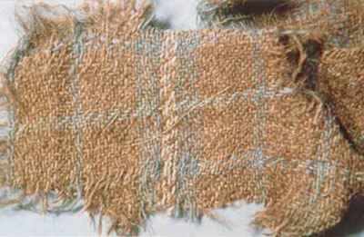
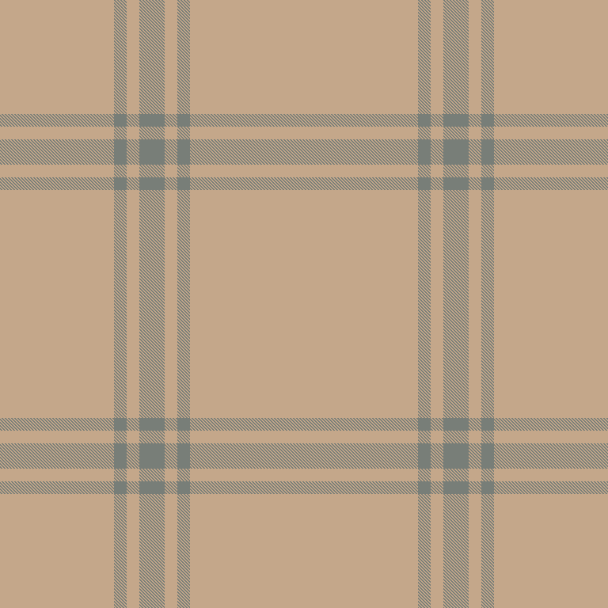
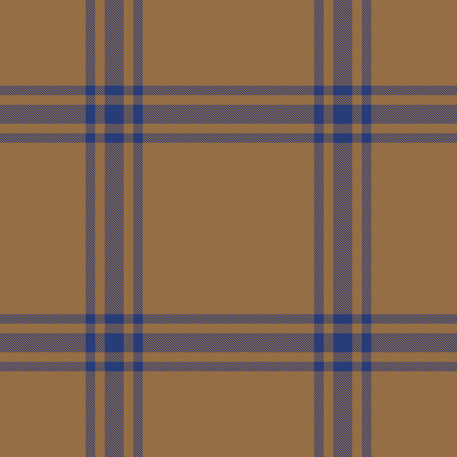

There is a piece of checked woollen cloth, woven on the rim of the Taklamakan desert about three
thousand years ago, that looks unmistakably like tartan — the **oldest surviving example** of the
2/2-twill check tradition. *Why* that matters, and how the same weave reaches from Xinjiang to the
Highlands, is the subject of the companion post,
[**The Origins of Tartan**](). This post does the narrower, hands-on
job: it takes the surviving Hami fragment, **reads a [sett]() from it**,
reconstructs the colours the burial bleached away — and sets my reading beside the other
reconstructions people have made of the same cloth, because this is a guess, and guesses should
be compared.

A warning up front: everything here is a **judgement, not a measurement**. The cloth is frayed,
hand-spun and irregular, the "blue" has lost almost all its colour, and the thread counts were
never regular to begin with. What follows is one reading, made explicit so it can be argued with.

## Working a sett from the image

This is the Hami fragment.[^penn] The ground has faded to tan; the check is carried by fine,
often paired, darker lines over broad fields.

You cannot machine-read a sett off a photograph like this — our reverse-weaver only round-trips
*synthetic* setts the engine drew itself. So I sampled scanlines across the clean centre of the
fragment to get the *proportions* — broad grounds, with narrow guard lines that frequently come
in pairs — and then **regularised** that into a symmetric tartan.

The structure has **two scales**, which is the part that makes it tartan-like rather than a plain
stripe: a **check that repeats**, and over it a sparser **white overcheck** — a fine white line
that strikes across only at the wider interval, after at least two repeats of the base check. And
there is a trap in the colour: the broad fields that *look* brown today are almost certainly not
natural brown wool at all but **red, faded** — see the colour reconstruction below. Read with the
true colours, the [thread count]() is:

> **W/4  B8  R16  B4  R16  B/4**  &nbsp;(reflective; pivots on the white overcheck and the central blue)
>
> &nbsp;&nbsp;W = white · B = blue · R = red (madder) — … W │ B8 R16 B4 R16 │ B … — broad red
> grounds with blue guards, the red/blue check running twice before the white overstrikes.

It remains a **reconstruction, not a measurement** — the overcheck interval and the band
proportions are the thinnest parts of the evidence. But this is the reading to **import into the
Dictionary**; once it is in, the engine generates the canonical [pattern]()
and the proper renders.

> **Note on the renders below.** The two images that follow were drawn from an *earlier* reading
> that both omitted the white overcheck **and** mistook the faded red ground for natural brown.
> They are kept only to show the *method*; they are wrong on colour and on the white, and are
> being re-rendered to the `W/4 B8 R16 B4 R16 B/4` sett above.

## Reconstructing the colour

What survives is not what was woven, and the gap is larger than it looks. Three thousand years of
fading, soiling and burial have shifted **every** colour, and the trap is that they have shifted
*towards brown* — making a once-bright cloth read as a sober earth-toned one. Reading the fade
back out:

- the **white** has dimmed to a **cream**;
- the **blue** has softened to a lovely **light blue** — a ghost of fresh woad;
- and, the crucial point, the broad **red** grounds have faded to a **light brown**.

That last move is the whole reconstruction. The eye reads those broad fields as natural brown
fleece; the dye tells a different story. Analysis of Xinjiang textiles of this kind finds a
consistent small palette of **madder reds** (a *Rubia* root), **indigo-plant blues** (woad or
true indigo) and yellows.[^dyes] Restore the three — cream back to white, light blue back to
woad-blue, light brown back to **madder red** — and the cloth is not the thrifty brown-and-blue
thing it first appears but a **vivid red, blue and white check**: a madder-red ground, woad-blue
guards, a fine cream-white overcheck.

A madder-red ground, a deep woad-blue check and a fine cream overcheck: not sober at all, but a
confident, high-status cloth — and a recognisable ancestor of the red-and-blue setts that come
much later.

## A dyed cloth in disguise

The reconstruction overturns the cloth's first impression, and that reversal is the lesson worth
keeping. It *looks* like a thrifty brown-and-blue check; it is in fact a **dyed cloth at the
expensive end** — a madder-red ground is anything but cheap. Dyed colour cost real money: madder
and woad meant growing or trading the plant, fuel, time at the dye-pot and skilled labour. Wool,
by contrast, came **ready-coloured** — sheep are born black, white, grey and brown — so the cheap
everyday cloth was natural-fleece check, and the dear cloth was the dyed one.

Which is exactly why this cloth was in a **tomb**: you are buried in your best, so grave finds
over-represent the heavily dyed, high-status end of the wardrobe. The ordinary natural-fleece
check survives, when it survives at all, by accident, not on purpose. The irony of the Hami plaid
is that three thousand years in the ground **faded its expensive red into the look of cheap
brown** — disguising a grave-good as a work-shirt. Keep that double warning — about what gets
buried, and about what fading does to colour — whenever one spectacular find is asked to stand
for a whole culture's cloth.

## The leggings are not this cloth

A quick correction, because it recurs: Cherchen Man's famous bright **leggings** (the "Ur-David",
c. 1000 BCE, Zaghunluq) are often waved at as "tartan", and they are not — they are **diagonal
colour-block work**, fields of solid colour set on the diagonal, not a warp-and-weft check.[^cherchen]
A different design idea, and not part of the Hami sett above. (The black-and-white "checked
leggings" sometimes shown beside him in older write-ups are a different thing again — a
Caledonian figure from the Roman-era Caracalla group, not a Tarim find.)

## Other reconstructions

I am not the first to try to bring this cloth back, and the point of a reconstruction is to set
it beside the others. The honest shape of working from a single decayed sample is that the
attempts **differ** — exactly in the two thin places, the band proportions and how far to push
the faded colour back:

- **Elizabeth Barber**, *The Mummies of Ürümchi* (1999) — the foundational reconstruction of both
  the weave structure and the Hallstatt connection.[^barber]
- **The "Takla Makan" tartans** — hand-weavers and designers have regularised the Qizilchoqa
  plaid into woven tartans; "Takla Makan" and "Takla Makan #2" are recorded designs derived
  directly from the Hami cloth.[^takla][^venetianred]
- **The "Qizilchoqa tartan tissue"** reconstruction discussed and illustrated by
  Geometricae.[^geometricae]

Each is one reading. Mine — a madder-red ground with woad-blue guards and a white overcheck — is
one more, offered with its thread count written down precisely (`W/4 B8 R16 B4 R16 B/4`) so the
next person can disagree with the numbers rather than the impression.

## Where this goes next

The post comes first; the sett follows it into the corpus — *once it is agreed*. The
reconstruction itself — reading `W/4 B8 R16 B4 R16 B/4` from the cloth and rendering it in both
its faded and its restored colours (the **madder red**, the **woad blue** and the **white
overcheck** the burial disguised) — is **new research**, kept in the *tartan-weaver* project; the
two images above are its earlier, superseded reading and are being redrawn there. Only once the
sett is settled is it imported into the Dictionary, which then derives its canonical
[pattern]() — so a faded three-thousand-year-old plaid can quietly underlie a
dictionary of its descendants. For the wider story this fragment belongs to — twill, the loose
Indo-European thread, and the Scottish flowering — see
[**The Origins of Tartan**]().

---

[^penn]: *Ancient Mummies of the Tarim Basin*, Expedition Magazine, Penn Museum.
  <https://www.penn.museum/sites/expedition/ancient-mummies-of-the-tarim-basin/>
[^dyes]: *Characterization of dyestuffs in ancient textiles from Xinjiang*, Journal of
  Archaeological Science. <https://www.sciencedirect.com/science/article/abs/pii/S0305440307001574>
[^cherchen]: *Cherchen Man*, Wikipedia. <https://en.wikipedia.org/wiki/Cherchen_Man>
[^barber]: Barber, Elizabeth Wayland (1999). *The Mummies of Ürümchi*. London: Pan Books.
  ISBN 0-330-36897-4.
[^takla]: "Takla Makan #2" tartan, design derived from the Qizilchoqa/Hami plaid.
  <https://clan.com/design/4409-Takla-Makan->
[^venetianred]: *Takla Makan Tartan*, Venetian Red Art Blog.
  <https://venetianred.wordpress.com/2008/11/20/takla-makan-tartan/>
[^geometricae]: *Qizilchoqa Tartan Tissue*, Geometricae.
  <https://www.geometricae.com/2019/10/31/qizilchoqa-tartan-tissue-anonymous/>
