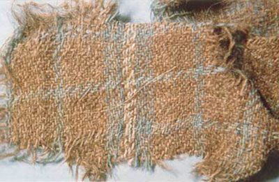
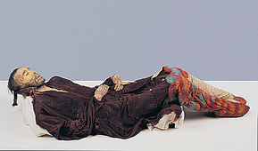
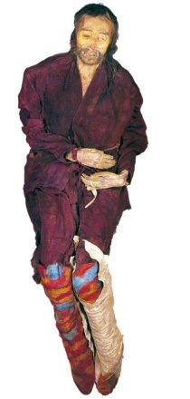
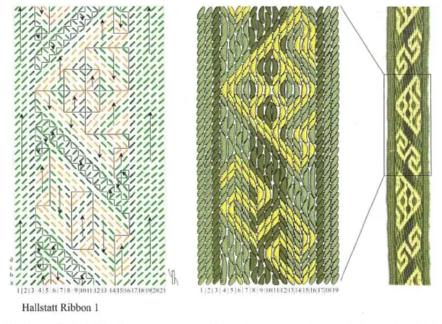
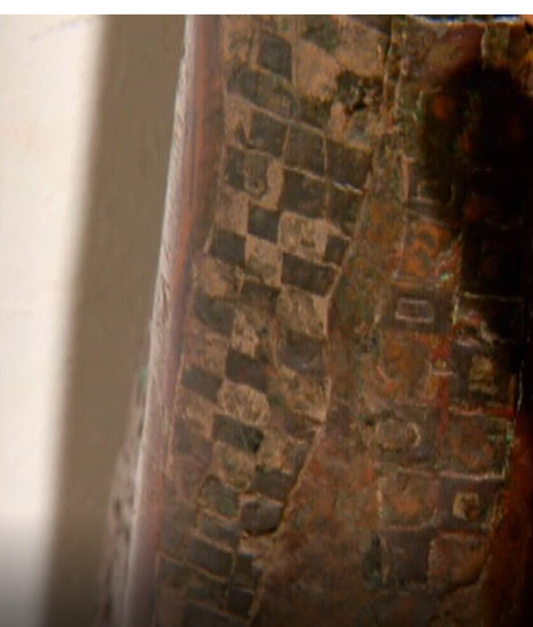
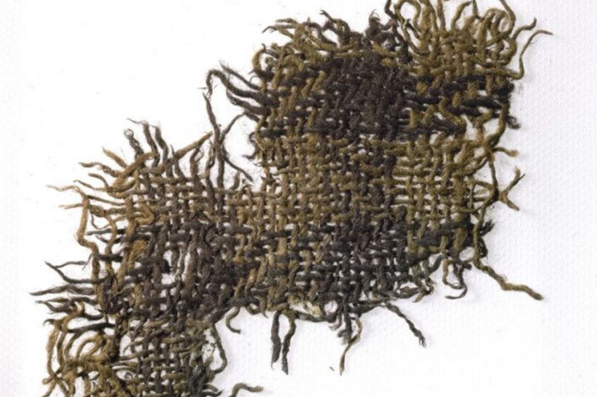
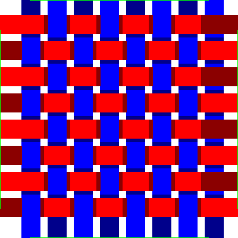
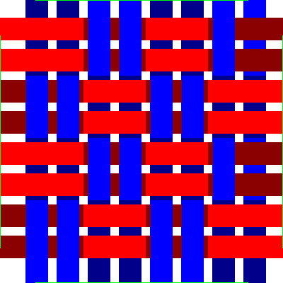
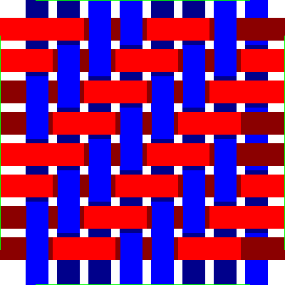

Tartan or checked weaving pattern has ancient origins.  Perhaps it came with the spread of the ancient Bronze age Celts from Austria and Turkey.  To the East there may be a link to the [Tarim Mummies][] as was popularised by Elizabeth Barber[^1].  This currently has got caught up in origin stories of the Han.  Notable mummies are the tall, red-haired "Chärchän man" or the "Ur-David" (1000 BCE); who wore a red twill tunic and tartan leggings.  Elizabeth Barber highlights the similarities between this and  fragments recovered from salt mines associated with the Hallstatt culture.

[Tarim Mummies]:https://en.wikipedia.org/wiki/Tarim_mummies
[^1]: Barber, Elizabeth Wayland (1999). The Mummies of Ürümchi. London: Pan Books. ISBN 0-330-36897-4.

Even more amazing is the Hami fragment of cloth in the same article of cloth.  This is apparently also dated to ca [1200 BCE to 700 BCE].



[1200 BCE to 700 BCE]:http://web.archive.org/web/20090225114606/http://pastmist.wordpress.com/
## Cherchen man:




## Halstatt patterns
The [Hallstatt weaving][] was more complex than simple tartans:



This is a 3/1 Twill.  The importance is that twill weaving patterns associated with Celtic origins from the very earliest era.

## Scottish tartans

There are a couple of examples from the Roman Era.  The [BBC reported][] on a statue in Morocco, North Africa of Emperor Caracalla (198 to 217) with a small Caledonian warrior.  The picture below shows a fragment of the legging of the warrier with a black and white check pattern.



### Falkirk tartan
The [first actual sample of tartan][] was a scrap found buried in a pot near the Antoine Wall and is now in the [National Museum for Scotland][].

[National Museum for Scotland]: https://nms.scran.ac.uk/database/record.php?usi=000-100-036-743-C


This is amazingly a 2/2 twill with a threadcount of ca White/8 Black/8.  It was dated by the coinage also contained in the pot to about the middle of the 3rd century.  There have been changes in technique over the centuries as the Falkirk Local history society has an [examination of the weave][].  So the Falkirk tartan uses Z spun whereas most modern tartans eg by Lochcarron are S spun, this denotes the direction of rotation of the thread.

I visited this in 2022 and it is just on display in the basement as a number of items.  It is really amazing that it didn't warrant a much more glamorous display.

[first actual sample of tartan]: https://en.wikipedia.org/wiki/Border_tartan
[examination of the weave]: https://falkirklocalhistorysociety.files.wordpress.com/2019/02/object-4-falkirk-tartan.pdf
In case the link gets broken I have copy here.
[copy here](FalkirkLocalHistorySociety.pdf "Falkirk Tartan examination")


[BBC reported]:https://www.bbc.co.uk/news/uk-scotland-20579219


[Hallstatt weaving]: https://www.academia.edu/1488597/Hallstatt_Tablet_Weaving


## Modern Scottish Tartans
These are still 2/2 Twills but have are S spun.  The Celtic tradition of weaving carried on and then got formalised during the Scottish Renaissance after the Jacobite rebellions.  One the threads of this is the [Highland Society of London][] formed in 1778, in 1782 they managed to help repeal the Disarming Act of 1746 which amongst other things banned the wearing of highland dress.

In 1815 they collected tartans from Clan Chiefs  of samples of their tartan.  This was taken up by [Walter Scott][] who pamphletted Edinburgh before George the 4ths Visit in 1822 and enoucraged people to wear traditional Highland Dress:

[Walter Scott]: https://en.wikipedia.org/wiki/Walter_Scott

```
Gentlemen may appear in any uniform to which they
have a right; and for those who present themselves as
Highlanders, the ancient costume of their country is always
sufficient dress. Those who wear the Highland dress must,
however, be careful to be armed in the proper Highland
fashion, —steel-wrought pistols, broadsword, and dirk
```
[Highland Society of London]: https://highlandsocietyoflondon.org/history.php


## Drummonds of Megginch Tartan

In a Castle of Dreams[^2] Admiral Adam Drummond writes to his son John (JMD) who had been ill at Fontainebleau  on August the 17th. "Robert, James, Charles and their cousins all marched in the procession of Highanlders fully accoutred in their Highland garb, and looked all I could desire and wish."

That was the start of the [Drummonds of Megginch tartan][].

[Drummonds of Megginch tartan]:
[^2]: Castle of Dreams, Cherry Drummond 1970 Typewritten manuscript.

## Weaving patterns

The simplest weaving pattern is a plain weave:



By doing two threads at once you get a basket weave.  The weft shuttle goes forwards and backwards before the worp threads have to change:



By offseting the change by one you get a 2 x 2 twill.  There are other patterns possible but this give you nice diagonal stripes and is what is used for tartan:




