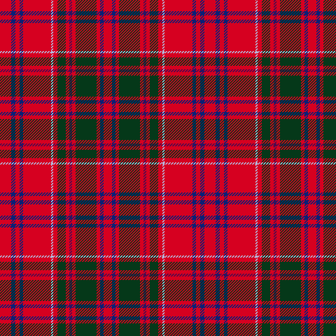

Few tartans are seen by more people than the red one wrapped around a box of **Walkers
Shortbread** — a Speyside biscuit, "established 1898", sold the world over in its tartan livery.
In 2016 Walkers registered that packaging as a UK trade mark
([UK00003180795](https://trademarks.ipo.gov.uk/ipo-tmcase/page/Results/1/UK00003180795)), and
the device shows the tartan plainly.

")

It is usually called Royal Stewart, but a glance at the cloth is enough to doubt that — the ground
is right, but the green blocks are too large and there is no white overcheck. So the question for
this post is the narrow, hands-on one: **what is the sett?**

## Reading it by hand

The trade-mark image is a photograph of *folded* cloth, not a flat swatch, so it cannot simply be
machine-read. I worked it the slow way: flattened the folds by tracing the warp and weft lines and
straightening them, then counted the cloth strip by strip in a zoomed view, fixing each band's
colour and width into a thread count. The reading is:

> **R/12 DB5 R5 DG30 R5 DP4 R5 DG12 R6 LB3 R40 DB5 R6 DB6 R/16**  &nbsp;(reflective)
>
> &nbsp;&nbsp;R = red · DB = navy · DG = bottle green · LB = azure · DP = a fine purple overcheck

Woven from that thread count, the sett is:

## It is a Grant

With the sett in hand the identity settles, and it is not Stewart at all: it is **Grant** — a red
ground carrying broad bottle-green blocks with navy and azure guards. That fits its home: Walkers
bake at **Aberlour on Speyside**, in the heart of Grant country, so the firm wraps its shortbread
in the local clan's cloth. The recovered sett is recorded in the Dictionary as
[**Walkers Shortbread**](/variants/s15/r16db6r6db5r40lb3r6dg12r5dp4r5dg30r5db5r12/).

---

*For the method, see [**The Tarim Tartan**]() and
[**The Falkirk Tartan**](), where a sett is worked from an image by
hand; and [**What is Tartan?**]() for what a sett and a thread count are.*
