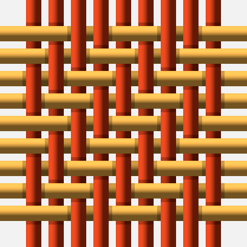
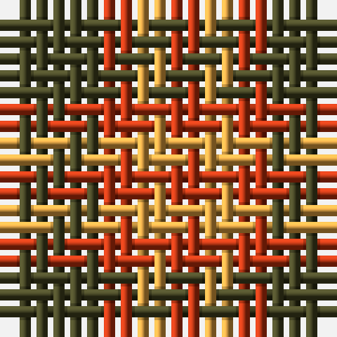
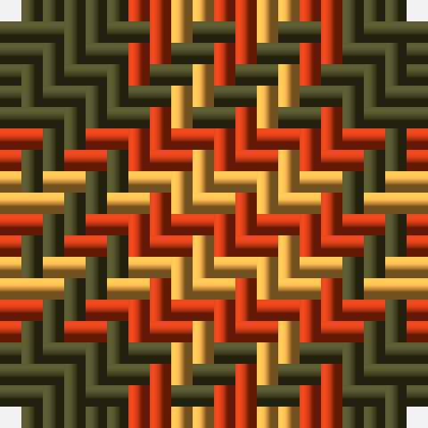
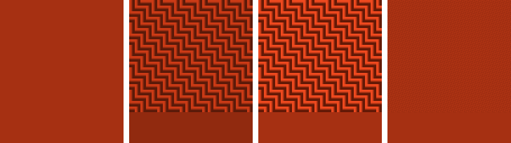
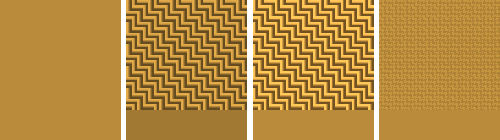
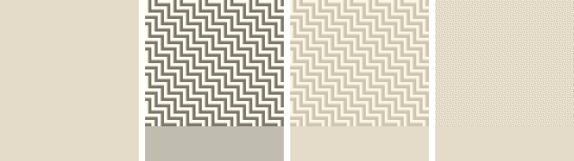
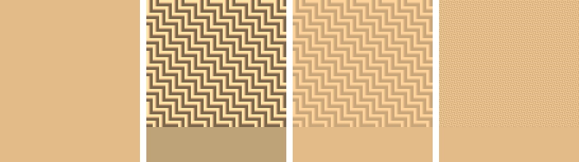

Every woven swatch in the Dictionary — the samples on the variant pages, the favicon, the
background tiles, the patches on the [print sheets](/ttd/print/) — is woven in software, thread
by thread. This is the story of how that weaving works, and of a calibration problem it turned
out to have: the woven cloth measured **darker** than the dye it was woven from.

## The loom, pulled apart

Tartan is a **2/2 twill**: each warp (vertical) thread passes *over two* weft (horizontal)
threads, then *under two*, and each row of weft advances the pattern by one thread. Woven at a
few fat threads, with gaps left open so every crossing is visible, the software's loom looks
like this:

<figure>

<figcaption>Red warp, ochre weft, over two and under two — the advance of one thread per row makes the twill diagonal.</figcaption>
</figure>

The over-two-under-two is why tartan blends colour the way it does: where a red warp crosses an
ochre weft, the eye gets two threads of each in alternation — an even mixture, organised along
the diagonal. Give the loom a real thread count and the mixture becomes the familiar
half-tone bands between the solid blocks:

<figure>

<figcaption>A small sett, still pulled apart: solid colour where warp and weft agree, an even blend where they cross.</figcaption>
</figure>

Real cloth has no gaps — the weft is beaten down so the threads touch. Close the gaps and the
same sett becomes cloth (this is how every woven example in the Dictionary is rendered; the
pulled-apart view is kept for figures like these):

<figure>

<figcaption>The same sett woven closed. The threads keep their rounded, lit look — a highlight toward the top-left, shadow toward the bottom-right.</figcaption>
</figure>

## The patches that measured wrong

The [print sheets](/ttd/print/) show each dye of a tartan two ways: a **clean patch** — a flat
block of the dye, the colour a specifier would quote — and a **woven patch**, the same dye on
the loom, twill texture and all. They ought to be the *same colour*: weaving redistributes a
dye's light into sheen and shadow, but it should not change how much light there is.

Measure them, though, and they disagreed. By "measure" we mean the simplest thing that can be
done to a patch of pixels, and the thing everything downstream actually does: **average them** —
sum the sRGB bytes, channel by channel, and divide. A browser downscaling an image, a print
pipeline rastering a sheet, an eyedropper over a blurred screenshot, a spectrophotometer held to
the screen: every one of them converges on that straight pixel average, so that is the average
the woven patch must hold. The dyes below are the
[Duke of Perth 1739](/tartans/d/du/duke-of-perth-1739/) palette from the
[Duprà portrait](/paintings/duke-of-perth-portrait/), plus an undyed wool white; this was the
woven patch's pixel average before calibration:

| dye | flat | woven patch measured | ΔL (OKLab) |
|---|---|---|---|
| madder red | `#A63012` | `#912A0F` | −0.044 |
| dark green | `#3E3E21` | `#36361D` | −0.030 |
| ochre yellow | `#B98B3B` | `#A17933` | −0.064 |
| undyed white | `#E4DCC8` | `#C0BCAF` | −0.101 |

Every patch measured darker — worst for light dyes. Two bugs in the lighting model, invisible
one thread at a time, conspired:

1. **The shading profile lost light.** Each thread is drawn as a half-round tube lit from the
   top-left — a cosine highlight rolling into shadow. That profile averaged about 0.87, not 1: a
   13% dimming quietly baked into every thread.
2. **The shading was applied to sRGB bytes.** Multiplying encoded pixel values by a brightness
   factor is not the same as dimming light — sRGB is deliberately non-linear. A byte factor of
   0.87 removes not 13% of the *light* but roughly a quarter of it, and the two effects
   compound.

## The calibration

The fix keeps the look and repairs the arithmetic — a handful of changes to the renderer
(`internal/weave`), each one sentence long:

- **Shade in linear light.** Decode each channel out of sRGB, multiply by the lighting factor,
  encode back. Light scales linearly; bytes do not.
- **Normalise the profile to mean exactly 1.** The rounded thread now *redistributes* its dye's
  reflectance — brighter sheen, deeper shadow — but the total is preserved for every thread
  thickness, so a woven patch measures its dye by construction.
- **Compress the sheen on bright dyes.** A display cannot show a highlight brighter than its
  white; on a light dye the sheen would clip and the lost light would darken the patch all over
  again. So the profile is squeezed toward flat — exactly enough that the brightest channel
  never clips — which keeps the mean true and the hue untouched. Pure white weaves flat, as it
  must.
- **Shade fine threads gently.** At two pixels a thread cannot be seen round, and the full
  profile would make a violent one-pixel checker — pixels at 1.7× and 0.3× the dye — which is
  precisely the fine detail that physical panels and browser rescaling reproduce worst: a
  spectrophotometer held to the screen reads such a patch dark even when the pixel data
  averages true. So the shading contrast tapers with thread thickness; a 2-pixel thread gets
  one gently lighter pixel toward the light and one gently darker, squeezed about 1 so the
  linear-light mean stays exact.
- **Pay the encoding's toll.** Even with the linear arithmetic repaired, the straight pixel
  average still read dark — sRGB's encoding is concave, so the bytes a shadow costs outnumber
  the bytes the sheen earns (up to 14/256 on the madder red at print-size threads). The last
  step calibrates each dye's shading directly against the measurement: keep the profile's
  contrast, bisect a small per-channel gain — the same darkness and light, lifted together —
  until the woven patch's pixel average lands within 1/256 of the flat dye. Per channel, so
  each channel's average is preserved and the colour balance never moves.

A note on colour spaces, since the measuring is the point: the lighting profile is normalised
in **linear RGB**, which is a linear transform of CIE XYZ — light that adds true in one adds
true in the other, exactly. But the final gain is calibrated in **encoded sRGB**, because that
is where pixels are stored and where everything that consumes them averages. OKLCh is used only
for reporting differences, never for the averaging itself.

The same patches after calibration, each strip four swatches wide and every swatch sitting on
a band of its own measured mean: **flat dye**, the **old renderer** (8-pixel threads, so the
twill is visible), the **calibrated renderer** at the same fat threads, and the calibrated
renderer at **two pixels per thread** — life size, 96 dpi at ~16 threads/cm, the scale the
variant-page samples actually render at and the finest regime the renderer has. Watch the seam
between each cloth and the band under it: on the old swatch the band steps visibly darker than
the flat dye; on the calibrated ones — fat or fine — the seam vanishes.

<figure>

<figcaption>Madder red <code>#A63012</code> — flat · before · calibrated · calibrated at 2px/thread. Pixel averages: <code>#912A0F</code> before; <code>#A63012</code> exactly, at both thread scales.</figcaption>
</figure>

<figure>

<figcaption>Ochre yellow <code>#B98B3B</code> — before <code>#A17933</code>; calibrated <code>#B98B3B</code> at both scales.</figcaption>
</figure>

<figure>

<figcaption>Undyed white <code>#E4DCC8</code> — the worst case before (<code>#C0BCAF</code>, ΔL −0.101). After, the sheen is compressed so the highlight cannot clip, and the patch averages the dye exactly at both scales.</figcaption>
</figure>

<figure>

<figcaption>Supplier ochre <code>#E2BB89</code> (L 0.815) — the dye a spectrophotometer held to the screen was measured against, and the reading that opened this whole calibration. Under the old renderer it averaged <code>#BFA378</code> (ΔL −0.085). Calibrated: <code>#E2BB89</code> exactly, fat or fine.</figcaption>
</figure>

| dye | flat | before (8px) | ΔL | calibrated | ΔL | calibrated 2px | ΔL |
|---|---|---|---|---|---|---|---|
| madder red | `#A63012` | `#912A0F` | −0.044 | `#A63012` | 0.000 | `#A63012` | 0.000 |
| dark green | `#3E3E21` | `#36361D` | −0.030 | `#3E3E21` | 0.000 | `#3E3E21` | 0.000 |
| ochre yellow | `#B98B3B` | `#A17933` | −0.064 | `#B98B3B` | 0.000 | `#B98B3B` | 0.000 |
| undyed white | `#E4DCC8` | `#C0BCAF` | −0.101 | `#E4DCC8` | 0.000 | `#E4DCC8` | 0.000 |
| supplier ochre | `#E2BB89` | `#BFA378` | −0.085 | `#E2BB89` | 0.000 | `#E2BB89` | 0.000 |

The contract is now a unit test: weave a gapless patch of any dye at any thread thickness the
site or its print outputs use — from one pixel to thirty — average the pixels, and the result
must sit within **1/256 per channel** of the flat dye, pure white included. A companion test
walks the whole print grid (the 300 ppi print sheet and postcard, the weave-an-image extremes)
and holds the same line: printing a tartan with the weave effect does not change its colour.

## Why it matters here

The Dictionary increasingly leans on **measured colour**: dyes read from
[paintings](/paintings/), supplier shade cards, and cloth measured with a spectrophotometer.
That pipeline only closes if the last step — putting a colour back on the simulated loom —
neither brightens nor darkens it. Every woven render on the site now carries this calibration:
what you specify is what the cloth measures.

*The figures on this page are generated by `cmd/weavestory` in the
[tartan-weaver](https://codeberg.org/hum3/tartan-weaver) engine; the renderer is
`internal/weave`, and the measured-colour contract is `TestWovenPatchByteAverageMatchesFlat`.*
