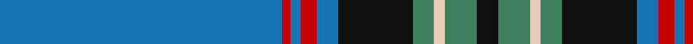

In pattern [BRBRBKGWGK](/patterns/brbrbkgwgk/).

This was sourced from register-of-tartans.  It is a [10 stripes tartan](/stripes/stripes10/).

Original link https://www.tartanregister.gov.uk/tartanDetails.aspx?ref=3297

## Attestations

This cloth appears in 2 source records; the oldest owns this page.

- 01/01/1985 — Parr (register-of-tartans, [record](https://www.tartanregister.gov.uk/tartanDetails.aspx?ref=3297))
- 1985 — Parr (white lines) (Name) (tartans-authority, [record](http://www.tartansauthority.com/tartan-ferret/display/439/))

## Register references

External register numbers recorded for this tartan.

- Scottish Register of Tartans: [3297](https://www.tartanregister.gov.uk/tartanDetails.aspx?ref=3297)
- Scottish Tartans Authority (ITI): 439
- Scottish Tartans World Register: 439

## Thread count
B/106 R3 B4 R6 B8 K28 G8 LR4 G12 K/8

## Palette
Each colour and its ΔE from the base-6 reference it is a variant of.

| Colour | Shade | Base | ΔE (OKLab) |
|---|---|---|---|
| B | <code style="background-color:#1474B4;">#1474B4</code> `#1474B4` | B <code style="background-color:#2A418A;">#2A418A</code> | 0.15 |
| G | <code style="background-color:#408060;">#408060</code> `#408060` | G <code style="background-color:#006100;">#006100</code> | 0.14 |
| K | <code style="background-color:#101010;">#101010</code> `#101010` | K <code style="background-color:#000000;">#000000</code> | 0.17 |
| LR | <code style="background-color:#E8CCB8;">#E8CCB8</code> `#E8CCB8` | W <code style="background-color:#F7F7F7;">#F7F7F7</code> | 0.12 |
| R | <code style="background-color:#C80000;">#C80000</code> `#C80000` | R <code style="background-color:#CC0000;">#CC0000</code> | 0.01 |

## Nearest tartans

The nearest existing variants by ΔTartan distance.

1. [Seacliff Academy](/setts/s10/b46w1k3wa4k3ba3k2ba11k1wa2~b003c64-ba2474e8-k101010-wffffff-wa82cffd~x2/) — ΔT 0.94
1. [Shaughnessy](/setts/s12/b68w4ba10y2ba3wa3ba3g11b8ba3b3wa3~b003c64-ba4c2424-g408060-w98c8e8-wafcfcfc-ye8c000~x2/) — ΔT 1.22
1. [British Caledonian Airways #1](/setts/s12/b68r5k9r3k3w3k3ra20b9k3b5w4~b003c64-k101010-r98481c-ra888888-wc0c0c0/) — ΔT 1.27
1. [Riyadh Caledonian (Corporate)](/setts/s13/b23g4b1w1b3g5b1ba4b3y1g3w1g4~b2c2c80-ba780078-g006818-we0e0e0-ye8c000~x4/) — ΔT 1.30
1. [Chateau](/setts/s10/b36k3g3ba1g3k3b4g6k1ba2~b306084-ba488cc0-g484800-k000000~x4/) — ΔT 1.32
1. [Glasgow Clyde College](/setts/s9/b48r1ba10r1b10bb2ba27w1ra3~b5c8ca8-ba202060-bb5c5c5c-rc80000-ra9c68a4-wfcfcfc~x2/) — ΔT 1.35
1. [MacLean of Kingairloch (Personal)](/setts/s10/b81k6y1k2w2k2g12ga28w1ga4~b1474b4-g006818-ga604000-k101010-wfcfcfc-ye8c000~x2/) — ΔT 1.36
1. [Unknown](/setts/s11/r3w1r1w1r2w3r14b2r2b32ra2~b003c64-r888888-rac80000-we8ccb8~x2/) — ΔT 1.38
1. [Fife Flyers (Corporate)](/setts/s8/b2w2b43ba5bb4y8bb2w2~b003c64-ba1474b4-bb202060-wfcfcfc-yfccc00~x2/) — ΔT 1.39
1. [Canmore Highland Games](/setts/s12/g70b3k9w4k4ba4k3b12g9k4g4r4~b000099-ba660066-g006666-k101010-r996600-wffffff~x2/) — ΔT 1.40

## Neighbour map

Every grey dot is one of 15726 variants placed by the first two principal components of the ΔTartan feature space (44% of its variance). Red is this tartan; blue dots are its nearest — click one to open its page.

<svg viewBox="0 0 640 380" role="img" style="max-width:100%;height:auto;border:1px solid #e0e0e0;border-radius:4px;display:block" xmlns="http://www.w3.org/2000/svg"><image href="/nn/cloud.v1.png" width="640" height="380"/><a href="/setts/s10/b46w1k3wa4k3ba3k2ba11k1wa2~b003c64-ba2474e8-k101010-wffffff-wa82cffd~x2/"><circle cx="393.1" cy="83.9" r="4" fill="#3465a4"><title>Seacliff Academy</title></circle></a><a href="/setts/s12/b68w4ba10y2ba3wa3ba3g11b8ba3b3wa3~b003c64-ba4c2424-g408060-w98c8e8-wafcfcfc-ye8c000~x2/"><circle cx="399.6" cy="70.9" r="4" fill="#3465a4"><title>Shaughnessy</title></circle></a><a href="/setts/s12/b68r5k9r3k3w3k3ra20b9k3b5w4~b003c64-k101010-r98481c-ra888888-wc0c0c0/"><circle cx="374.2" cy="109.8" r="4" fill="#3465a4"><title>British Caledonian Airways #1</title></circle></a><a href="/setts/s13/b23g4b1w1b3g5b1ba4b3y1g3w1g4~b2c2c80-ba780078-g006818-we0e0e0-ye8c000~x4/"><circle cx="350.2" cy="113.7" r="4" fill="#3465a4"><title>Riyadh Caledonian (Corporate)</title></circle></a><a href="/setts/s10/b36k3g3ba1g3k3b4g6k1ba2~b306084-ba488cc0-g484800-k000000~x4/"><circle cx="448.5" cy="120.7" r="4" fill="#3465a4"><title>Chateau</title></circle></a><a href="/setts/s9/b48r1ba10r1b10bb2ba27w1ra3~b5c8ca8-ba202060-bb5c5c5c-rc80000-ra9c68a4-wfcfcfc~x2/"><circle cx="369.9" cy="85.5" r="4" fill="#3465a4"><title>Glasgow Clyde College</title></circle></a><a href="/setts/s10/b81k6y1k2w2k2g12ga28w1ga4~b1474b4-g006818-ga604000-k101010-wfcfcfc-ye8c000~x2/"><circle cx="382.3" cy="67.1" r="4" fill="#3465a4"><title>MacLean of Kingairloch (Personal)</title></circle></a><a href="/setts/s11/r3w1r1w1r2w3r14b2r2b32ra2~b003c64-r888888-rac80000-we8ccb8~x2/"><circle cx="372.3" cy="106.4" r="4" fill="#3465a4"><title>Unknown</title></circle></a><a href="/setts/s8/b2w2b43ba5bb4y8bb2w2~b003c64-ba1474b4-bb202060-wfcfcfc-yfccc00~x2/"><circle cx="375.3" cy="115.9" r="4" fill="#3465a4"><title>Fife Flyers (Corporate)</title></circle></a><a href="/setts/s12/g70b3k9w4k4ba4k3b12g9k4g4r4~b000099-ba660066-g006666-k101010-r996600-wffffff~x2/"><circle cx="375.9" cy="91.0" r="4" fill="#3465a4"><title>Canmore Highland Games</title></circle></a><circle cx="400.1" cy="96.4" r="5" fill="#c00000"/></svg>

ID: /setts/s10/b106r3b4r6b8k28g8w4g12k8~b1474b4-g408060-k101010-rc80000-we8ccb8/
