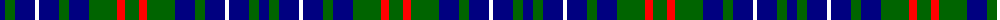

In pattern [BGBWBGBGRG](/patterns/bgbwbgbgrg/).

This was sourced from register-of-tartans.  It is a [10 stripes tartan](/stripes/stripes10/).

Original link https://www.tartanregister.gov.uk/tartanDetails.aspx?ref=10398

## Thread count
DB/10 G10 DB20 W4 DB20 G10 DB20 G28 R8 G/14

## Palette
Each colour and its ΔE from the base-6 reference it is a variant of.

| Colour | Shade | Base | ΔE (OKLab) |
|---|---|---|---|
| DB | <code style="background-color:#000080;">#000080</code> `#000080` | B <code style="background-color:#2C4084;">#2C4084</code> | 0.14 |
| G | <code style="background-color:#006400;">#006400</code> `#006400` | G <code style="background-color:#006400;">#006400</code> | 0.00 |
| R | <code style="background-color:#FF0000;">#FF0000</code> `#FF0000` | R <code style="background-color:#C80000;">#C80000</code> | 0.11 |
| W | <code style="background-color:#FFFFFF;">#FFFFFF</code> `#FFFFFF` | W <code style="background-color:#F4F4F0;">#F4F4F0</code> | 0.03 |

ID: /setts/s10/b10g10b20w4b20g10b20g28r8g14-b000080-g006400-rff0000-wffffff/
