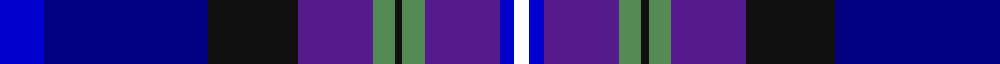

In pattern [BBKBGKGBBW](/patterns/bbkbgkgbbw/).

This was sourced from register-of-tartans.  It is a [10 stripes tartan](/stripes/stripes10/).

Original link https://www.tartanregister.gov.uk/tartanDetails.aspx?ref=10157

## Thread count
B/12 DB44 K24 P20 LG6 K2 LG6 P20 B4 W/4

## Palette
Each colour and its ΔE from the base-6 reference it is a variant of.

| Colour | Shade | Base | ΔE (OKLab) |
|---|---|---|---|
| B | <code style="background-color:#0000CD;">#0000CD</code> `#0000CD` | B <code style="background-color:#2A418A;">#2A418A</code> | 0.14 |
| DB | <code style="background-color:#000080;">#000080</code> `#000080` | B <code style="background-color:#2A418A;">#2A418A</code> | 0.14 |
| K | <code style="background-color:#101010;">#101010</code> `#101010` | K <code style="background-color:#000000;">#000000</code> | 0.17 |
| LG | <code style="background-color:#548B54;">#548B54</code> `#548B54` | G <code style="background-color:#006100;">#006100</code> | 0.16 |
| P | <code style="background-color:#551A8B;">#551A8B</code> `#551A8B` | B <code style="background-color:#2A418A;">#2A418A</code> | 0.10 |
| W | <code style="background-color:#FFFFFF;">#FFFFFF</code> `#FFFFFF` | W <code style="background-color:#F7F7F7;">#F7F7F7</code> | 0.02 |

## Nearest tartans

The nearest existing variants by ΔTartan distance.

1. [Bute Heather, Ancient](/setts/s11/b12w2ba36k12ba8k8bb16y2bb16k4b10-b000080-ba3c82af-bb800080-k101010-we0e0e0-y00fa9a/) — ΔT 1.34
1. [Scottish Tourist Guides Association](/setts/s13/g24b6ga6b6ga6b24ba6b6ba4b4ba28gb2w6-b551a8b-ba00009c-g006400-ga7a7a7a-gb8b7500-wffffff/) — ΔT 1.38
1. [Cowal (Corporate)](/setts/s10/b12ba44k24bb20g6k2g6bb20b4w4-b1c0070-ba003c64-bb780078-g006818-k101010-we0e0e0/) — ΔT 1.41
1. [U.S. 2001 Air Force](/setts/s12/b66ba6b14ba6b66r4k44g6bb98g6k44r4-b1474b4-ba1c0070-bb2c2c80-g006818-k101010-rc80000/) — ΔT 1.60
1. [Lang of Sherbrooke (Personal)](/setts/s11/g20y4b4g4b26g4b4g2k26ba48w4-b780078-ba2c2c80-g00643c-k101010-wfcfcfc-ye8c000/) — ΔT 1.62
1. [Ryder Cup 2014 (Corporate)](/setts/s16/w6b42ba16bb2ba8bb2ba6bb4ba4bb4ba2bb6ba2bb24bc10y6-b202060-ba2c2c80-bb2888c4-bc1c0070-wfcfcfc-yfccc00/) — ΔT 1.64
1. [Ancient Gathering](/setts/s8/b2ba24r12w2y6b28bb36w2-b1c1c50-ba5c8ca8-bb003c64-rb458ac-wffffff-ybc8c00/) — ΔT 1.67
1. [Lang of Sherbrooke (Personal)](/setts/s11/g20y4k4g4k26g4k4g2b26ba48w4-b780078-ba2c2c80-g00643c-k101010-wfcfcfc-ye8c000/) — ΔT 1.69
1. [Royal Air Force Regimental Tartan Tartan Number: 2123. Earliest known date: 1988 The Royal Air Force initially declined to approve this tartan for members of the Air Services. However the tartan was worn by Scottish ex-servicemen and those who have served in Scotland and became quite popular. In 2002 it was officially adopted by the RAF. See products available Copyright © Blair Urquhart, Comrie, 2015](/setts/s11/w8b16r6b50k26ba8bb58b6bb16b4r6-b2c2c80-ba1c0070-bb5c8ca8-k101010-r901c38-we0e0e0/) — ΔT 1.76
1. [Scottish Tourist Guides Assoc. (Corp](/setts/s13/g24b6y6b6y6b24ba6b6ba4b4ba28ya2w6-b440044-ba2c2c80-g003820-we0e0e0-ya0a0a0-yabc8c00/) — ΔT 1.78

## Neighbour map

Every grey dot is one of 15726 variants placed by the first two principal components of the ΔTartan feature space (44% of its variance). Red is this tartan; blue dots are its nearest — click one to open its page.

<svg viewBox="0 0 640 380" role="img" style="max-width:100%;height:auto;border:1px solid #e0e0e0;border-radius:4px;display:block" xmlns="http://www.w3.org/2000/svg"><image href="/nn/cloud.v1.png" width="640" height="380"/><a href="/setts/s11/b12w2ba36k12ba8k8bb16y2bb16k4b10-b000080-ba3c82af-bb800080-k101010-we0e0e0-y00fa9a/"><circle cx="136.9" cy="133.1" r="4" fill="#3465a4"><title>Bute Heather, Ancient</title></circle></a><a href="/setts/s13/g24b6ga6b6ga6b24ba6b6ba4b4ba28gb2w6-b551a8b-ba00009c-g006400-ga7a7a7a-gb8b7500-wffffff/"><circle cx="139.8" cy="132.5" r="4" fill="#3465a4"><title>Scottish Tourist Guides Association</title></circle></a><a href="/setts/s10/b12ba44k24bb20g6k2g6bb20b4w4-b1c0070-ba003c64-bb780078-g006818-k101010-we0e0e0/"><circle cx="167.5" cy="140.0" r="4" fill="#3465a4"><title>Cowal (Corporate)</title></circle></a><a href="/setts/s12/b66ba6b14ba6b66r4k44g6bb98g6k44r4-b1474b4-ba1c0070-bb2c2c80-g006818-k101010-rc80000/"><circle cx="218.3" cy="119.7" r="4" fill="#3465a4"><title>U.S. 2001 Air Force</title></circle></a><a href="/setts/s11/g20y4b4g4b26g4b4g2k26ba48w4-b780078-ba2c2c80-g00643c-k101010-wfcfcfc-ye8c000/"><circle cx="169.5" cy="107.9" r="4" fill="#3465a4"><title>Lang of Sherbrooke (Personal)</title></circle></a><a href="/setts/s16/w6b42ba16bb2ba8bb2ba6bb4ba4bb4ba2bb6ba2bb24bc10y6-b202060-ba2c2c80-bb2888c4-bc1c0070-wfcfcfc-yfccc00/"><circle cx="137.4" cy="91.3" r="4" fill="#3465a4"><title>Ryder Cup 2014 (Corporate)</title></circle></a><a href="/setts/s8/b2ba24r12w2y6b28bb36w2-b1c1c50-ba5c8ca8-bb003c64-rb458ac-wffffff-ybc8c00/"><circle cx="142.1" cy="140.6" r="4" fill="#3465a4"><title>Ancient Gathering</title></circle></a><a href="/setts/s11/g20y4k4g4k26g4k4g2b26ba48w4-b780078-ba2c2c80-g00643c-k101010-wfcfcfc-ye8c000/"><circle cx="166.8" cy="108.5" r="4" fill="#3465a4"><title>Lang of Sherbrooke (Personal)</title></circle></a><a href="/setts/s11/w8b16r6b50k26ba8bb58b6bb16b4r6-b2c2c80-ba1c0070-bb5c8ca8-k101010-r901c38-we0e0e0/"><circle cx="168.9" cy="131.4" r="4" fill="#3465a4"><title>Royal Air Force Regimental Tartan Tartan Number: 2123. Earliest known date: 1988 The Royal Air Force initially declined to approve this tartan for members of the Air Services. However the tartan was worn by Scottish ex-servicemen and those who have served in Scotland and became quite popular. In 2002 it was officially adopted by the RAF. See products available Copyright © Blair Urquhart, Comrie, 2015</title></circle></a><a href="/setts/s13/g24b6y6b6y6b24ba6b6ba4b4ba28ya2w6-b440044-ba2c2c80-g003820-we0e0e0-ya0a0a0-yabc8c00/"><circle cx="155.0" cy="135.1" r="4" fill="#3465a4"><title>Scottish Tourist Guides Assoc. (Corp</title></circle></a><circle cx="146.0" cy="135.9" r="5" fill="#c00000"/></svg>

ID: /setts/s10/b12ba44k24bb20g6k2g6bb20b4w4-b0000cd-ba000080-bb551a8b-g548b54-k101010-wffffff/
