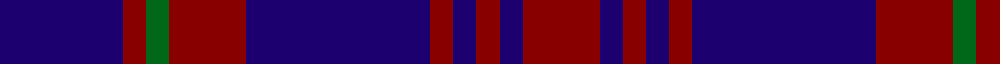

In pattern [BRGRBRBRBR](/patterns/brgrbrbrbr/).

This was sourced from register-of-tartans.  It is a [10 stripes tartan](/stripes/stripes10/).

Original link https://www.tartanregister.gov.uk/tartanDetails.aspx?ref=3143

## Attestations

This cloth appears in 2 source records; the oldest owns this page.

- 01/01/2002 — Nithsdale (Dalgliesh) (register-of-tartans, [record](https://www.tartanregister.gov.uk/tartanDetails.aspx?ref=3143))
- pre 2002 — Nithsdale (District) (tartans-authority, [record](http://www.tartansauthority.com/tartan-ferret/display/5617/))

## Thread count
DB/32 DR6 G6 DR20 DB48 DR6 DB6 DR6 DB6 DR/20

## Palette
Each colour and its ΔE from the base-6 reference it is a variant of.

| Colour | Shade | Base | ΔE (OKLab) |
|---|---|---|---|
| DB | <code style="background-color:#1C0070;">#1C0070</code> `#1C0070` | B <code style="background-color:#2A418A;">#2A418A</code> | 0.14 |
| DR | <code style="background-color:#880000;">#880000</code> `#880000` | R <code style="background-color:#CC0000;">#CC0000</code> | 0.15 |
| G | <code style="background-color:#006818;">#006818</code> `#006818` | G <code style="background-color:#006100;">#006100</code> | 0.02 |

## Nearest tartans

The nearest existing variants by ΔTartan distance.

1. [Caledonian Oriental Airlines (Corporate)](/setts/s11/k4r3k13b10k3b5k3b5k13b25y4~b6c0070-k101010-rc80000-ybc8c00~x2/) — ΔT 1.41
1. [Robbins](/setts/s6/b1r3b1r3b6g1~b1c0070-g006818-r880000~x8/) — ΔT 1.43
1. [Priest](/setts/s11/g1k4g1b2g1k8g1k8b7g1k1~b780078-g789484-k101010~x4/) — ΔT 1.45
1. [Embrace, The](/setts/s8/b10r24b4r3b24w2r6b6~b000088-r8c0000-wfcfcfc~x2/) — ΔT 1.47
1. [Ibrox](/setts/s11/b4r2b2r4k7b10w2k13b18k2b2~b2c2c80-k101010-rc80000-we0e0e0~x4/) — ΔT 1.49
1. [Pride of Kinross](/setts/s8/k20b2k6b2k4b27w2b8~b2c2c80-k101010-wfcfcfc~x2/) — ΔT 1.58
1. [Pride of Kinross](/setts/s8/k20b2k6b2k4b27w2b8~b2c2c80-k101010-wffffff~x2/) — ΔT 1.59
1. [Morgan (MacKay Blue) Clan Tartan Tartan Number: 264. Earliest known date: 1842 The design comes from the Vestiarium Scoticum (1842). The authors, the Sobieski Stuart brothers, enjoyed a popular following among the Scottish gentry in the early Victorian era, and in the spirit of the times, added mystery, romance and some spurious historical documentation to the subject of tartan. Of the better known tartans, the book offers some minor variation, but in other cases it provides the only recorded version of many tartans in use today. See products available Copyright © Blair Urquhart, Comrie, 2015](/setts/s6/b1k3b1k3b8r1~b2c2c80-k101010-rc80000~x4/) — ΔT 1.61
1. [Highland Spirit](/setts/s8/k21b15k5b15k5b15k21w2~b780078-k000c3c-we0e0e0~x2/) — ΔT 1.65
1. [Royal Scotsman Train (Corporate)](/setts/s6/b5k2b14k14b2y2~b2c2c80-k101010-yb8b4b8~x2/) — ΔT 1.66

## Neighbour map

Every grey dot is one of 15726 variants placed by the first two principal components of the ΔTartan feature space (44% of its variance). Red is this tartan; blue dots are its nearest — click one to open its page.

<svg viewBox="0 0 640 380" role="img" style="max-width:100%;height:auto;border:1px solid #e0e0e0;border-radius:4px;display:block" xmlns="http://www.w3.org/2000/svg"><image href="/nn/cloud.v1.png" width="640" height="380"/><a href="/setts/s11/k4r3k13b10k3b5k3b5k13b25y4~b6c0070-k101010-rc80000-ybc8c00~x2/"><circle cx="308.5" cy="206.5" r="4" fill="#3465a4"><title>Caledonian Oriental Airlines (Corporate)</title></circle></a><a href="/setts/s6/b1r3b1r3b6g1~b1c0070-g006818-r880000~x8/"><circle cx="330.7" cy="272.2" r="4" fill="#3465a4"><title>Robbins</title></circle></a><a href="/setts/s11/g1k4g1b2g1k8g1k8b7g1k1~b780078-g789484-k101010~x4/"><circle cx="338.7" cy="214.1" r="4" fill="#3465a4"><title>Priest</title></circle></a><a href="/setts/s8/b10r24b4r3b24w2r6b6~b000088-r8c0000-wfcfcfc~x2/"><circle cx="350.6" cy="214.2" r="4" fill="#3465a4"><title>Embrace, The</title></circle></a><a href="/setts/s11/b4r2b2r4k7b10w2k13b18k2b2~b2c2c80-k101010-rc80000-we0e0e0~x4/"><circle cx="302.8" cy="201.6" r="4" fill="#3465a4"><title>Ibrox</title></circle></a><a href="/setts/s8/k20b2k6b2k4b27w2b8~b2c2c80-k101010-wfcfcfc~x2/"><circle cx="388.1" cy="219.6" r="4" fill="#3465a4"><title>Pride of Kinross</title></circle></a><a href="/setts/s8/k20b2k6b2k4b27w2b8~b2c2c80-k101010-wffffff~x2/"><circle cx="387.2" cy="219.2" r="4" fill="#3465a4"><title>Pride of Kinross</title></circle></a><a href="/setts/s6/b1k3b1k3b8r1~b2c2c80-k101010-rc80000~x4/"><circle cx="402.2" cy="267.4" r="4" fill="#3465a4"><title>Morgan (MacKay Blue) Clan Tartan Tartan Number: 264. Earliest known date: 1842 The design comes from the Vestiarium Scoticum (1842). The authors, the Sobieski Stuart brothers, enjoyed a popular following among the Scottish gentry in the early Victorian era, and in the spirit of the times, added mystery, romance and some spurious historical documentation to the subject of tartan. Of the better known tartans, the book offers some minor variation, but in other cases it provides the only recorded version of many tartans in use today. See products available Copyright © Blair Urquhart, Comrie, 2015</title></circle></a><a href="/setts/s8/k21b15k5b15k5b15k21w2~b780078-k000c3c-we0e0e0~x2/"><circle cx="337.7" cy="260.1" r="4" fill="#3465a4"><title>Highland Spirit</title></circle></a><a href="/setts/s6/b5k2b14k14b2y2~b2c2c80-k101010-yb8b4b8~x2/"><circle cx="350.4" cy="267.7" r="4" fill="#3465a4"><title>Royal Scotsman Train (Corporate)</title></circle></a><circle cx="381.6" cy="230.2" r="5" fill="#c00000"/></svg>

ID: /setts/s10/b16r3g3r10b24r3b3r3b3r10~b1c0070-g006818-r880000~x2/
