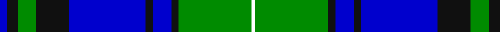

In pattern [BKGKBKBKGW](/patterns/bkgkbkbkgw/).

This was sourced from register-of-tartans.  It is a [10 stripes tartan](/stripes/stripes10/).

Original link https://www.tartanregister.gov.uk/tartanDetails.aspx?ref=10190

## Thread count
B/4 K6 G10 K18 B42 K4 B10 K4 G40 W/2

## Palette
Each colour and its ΔE from the base-6 reference it is a variant of.

| Colour | Shade | Base | ΔE (OKLab) |
|---|---|---|---|
| B | <code style="background-color:#0000CD;">#0000CD</code> `#0000CD` | B <code style="background-color:#2A418A;">#2A418A</code> | 0.14 |
| G | <code style="background-color:#008B00;">#008B00</code> `#008B00` | G <code style="background-color:#006100;">#006100</code> | 0.13 |
| K | <code style="background-color:#101010;">#101010</code> `#101010` | K <code style="background-color:#000000;">#000000</code> | 0.17 |
| W | <code style="background-color:#FFFFFF;">#FFFFFF</code> `#FFFFFF` | W <code style="background-color:#F7F7F7;">#F7F7F7</code> | 0.02 |

## Nearest tartans

The nearest existing variants by ΔTartan distance.

1. [Unidentified No 52](/setts/s8/g19w1b12ba2b2ba2b2ba16x2~b080848-ba0596fa-g005020-we0e0e0/) — ΔT 0.79
1. [Unnamed, No 52](/setts/s8/g19w1b12ba2b2ba2b2ba16x2~b000050-ba8080d0-g008000-we0e0e0/) — ΔT 1.08
1. [Ebdon-Muir (Personal)](/setts/s9/b4ba40k15g10b2g10b2g10w4x2~b551a8b-ba00009c-g006400-k101010-wffffaa/) — ΔT 1.26
1. [Coopers & Lybrand](/setts/s11/b4g4r1ba18b4k2g16r1ba6b4k2x2~b5480b0-ba000050-g008000-k000000-rc00000/) — ΔT 1.29
1. [McKirgan/Mackirgan](/setts/s11/g2b2w1r2w1b3g1b12g18w1r2x2~b00008b-g006400-rc80000-wffffff/) — ΔT 1.37
1. [Hebridean Old](/setts/s9/b2k2b18ba1k13ba1g16b3k2x2~b304080-ba8080d0-g008000-k000000/) — ΔT 1.38
1. [Ebdon Muir (Personal)](/setts/s9/b4ba40k15g10b2g10b2g10w4x2~b780078-ba000058-g00801c-k101010-wf0f0c4/) — ΔT 1.41
1. [Ferguson (Tarlogie)](/setts/s9/b24k8g8r2g4k1w2k1g4x2~b3850c8-g146400-k101010-rc80000-wfcfcfc/) — ΔT 1.42
1. [Colvin](/setts/s8/b36w4b4w4b16g64r9b6x2~b00008c-g004c00-r8c0000-wc8c8c8/) — ΔT 1.43
1. [Fair Trade](/setts/s15/k8b2k2b24k8w2k1w2k4w2k1w2k8g16k4x2~b1474b4-g006818-k101010-wfcfcfc/) — ΔT 1.44

## Neighbour map

Every grey dot is one of 15726 variants placed by the first two principal components of the ΔTartan feature space (44% of its variance). Red is this tartan; blue dots are its nearest — click one to open its page.

<svg viewBox="0 0 640 380" role="img" style="max-width:100%;height:auto;border:1px solid #e0e0e0;border-radius:4px;display:block" xmlns="http://www.w3.org/2000/svg"><image href="/nn/cloud.v1.png" width="640" height="380"/><a href="/setts/s8/g19w1b12ba2b2ba2b2ba16x2~b080848-ba0596fa-g005020-we0e0e0/"><circle cx="206.6" cy="165.0" r="4" fill="#3465a4"><title>Unidentified No 52</title></circle></a><a href="/setts/s8/g19w1b12ba2b2ba2b2ba16x2~b000050-ba8080d0-g008000-we0e0e0/"><circle cx="204.1" cy="159.3" r="4" fill="#3465a4"><title>Unnamed, No 52</title></circle></a><a href="/setts/s9/b4ba40k15g10b2g10b2g10w4x2~b551a8b-ba00009c-g006400-k101010-wffffaa/"><circle cx="209.6" cy="143.4" r="4" fill="#3465a4"><title>Ebdon-Muir (Personal)</title></circle></a><a href="/setts/s11/b4g4r1ba18b4k2g16r1ba6b4k2x2~b5480b0-ba000050-g008000-k000000-rc00000/"><circle cx="179.7" cy="137.1" r="4" fill="#3465a4"><title>Coopers &amp; Lybrand</title></circle></a><a href="/setts/s11/g2b2w1r2w1b3g1b12g18w1r2x2~b00008b-g006400-rc80000-wffffff/"><circle cx="266.0" cy="132.5" r="4" fill="#3465a4"><title>McKirgan/Mackirgan</title></circle></a><a href="/setts/s9/b2k2b18ba1k13ba1g16b3k2x2~b304080-ba8080d0-g008000-k000000/"><circle cx="216.5" cy="159.5" r="4" fill="#3465a4"><title>Hebridean Old</title></circle></a><a href="/setts/s9/b4ba40k15g10b2g10b2g10w4x2~b780078-ba000058-g00801c-k101010-wf0f0c4/"><circle cx="203.7" cy="139.8" r="4" fill="#3465a4"><title>Ebdon Muir (Personal)</title></circle></a><a href="/setts/s9/b24k8g8r2g4k1w2k1g4x2~b3850c8-g146400-k101010-rc80000-wfcfcfc/"><circle cx="241.5" cy="124.9" r="4" fill="#3465a4"><title>Ferguson (Tarlogie)</title></circle></a><a href="/setts/s8/b36w4b4w4b16g64r9b6x2~b00008c-g004c00-r8c0000-wc8c8c8/"><circle cx="286.7" cy="174.9" r="4" fill="#3465a4"><title>Colvin</title></circle></a><a href="/setts/s15/k8b2k2b24k8w2k1w2k4w2k1w2k8g16k4x2~b1474b4-g006818-k101010-wfcfcfc/"><circle cx="214.9" cy="116.0" r="4" fill="#3465a4"><title>Fair Trade</title></circle></a><circle cx="218.4" cy="150.6" r="5" fill="#c00000"/></svg>

ID: /setts/s10/b2k3g5k9b21k2b5k2g20w1x2~b0000cd-g008b00-k101010-wffffff/
