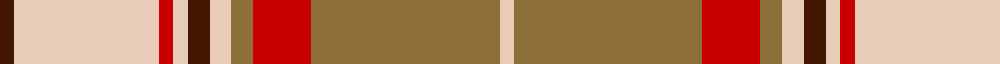

In pattern [BWRWBWGRGW](/patterns/bwrwbwgrgw/).

This was sourced from register-of-tartans.  It is a [10 stripes tartan](/stripes/stripes10/).

Original link https://www.tartanregister.gov.uk/tartanDetails.aspx?ref=2111

## Thread count
DR/4 LR40 R4 LR4 DR6 LR6 LT6 R16 LT52 LR/4

## Palette
Each colour and its ΔE from the base-6 reference it is a variant of.

| Colour | Shade | Base | ΔE (OKLab) |
|---|---|---|---|
| DR | <code style="background-color:#441800;">#441800</code> `#441800` | B <code style="background-color:#2A418A;">#2A418A</code> | 0.23 |
| LR | <code style="background-color:#E8CCB8;">#E8CCB8</code> `#E8CCB8` | W <code style="background-color:#F7F7F7;">#F7F7F7</code> | 0.12 |
| LT | <code style="background-color:#8C7038;">#8C7038</code> `#8C7038` | G <code style="background-color:#006100;">#006100</code> | 0.18 |
| R | <code style="background-color:#C80000;">#C80000</code> `#C80000` | R <code style="background-color:#CC0000;">#CC0000</code> | 0.01 |

## Nearest tartans

The nearest existing variants by ΔTartan distance.

1. [Karibu](/setts/s9/g12w1r1w4r1w1r8y2r1x4~g3c773c-rb3003c-wffffff-yffcc00/) — ΔT 1.03
1. [Ballater Trade or 'Fancy' Tartan Tartan Number: 1708. Earliest known date: Modern Many new designs have been given district names to promote their Scottish connections. However, these names should not be confused with the District tartans which have earned their title through 'use and wont' and not a little history. See products available Copyright © Blair Urquhart, Comrie, 2015](/setts/s9/r12w2y3w2r3k5r2y18w2x2~k101010-rc80000-we0e0e0-ya08858/) — ΔT 1.12
1. [MacDonald of Kingsburgh](/setts/s9/r3g3y2r18w2g21y2g2y3x2~g408060-rc80000-wfcfcfc-yd09800/) — ΔT 1.18
1. [MacKellar Dress (Reproduction colours)](/setts/s11/r35w4r3y7r3w4r7g15ya4w36ya5x2~g2a2303-rbe7832-we0e0e0-ye8c000-ya949494/) — ΔT 1.21
1. [Karibu (Corporate)](/setts/s9/g12w1r1w4r1w1r8y2r1x4~g006818-rc80000-wfcfcfc-ye8c000/) — ΔT 1.25
1. [Ben Cleuch (Fashion)](/setts/s11/r68w3r3w8r3w3w24g16ra3g20w3x2~g64340c-ra07c58-ra90000c-wf8f4d0/) — ΔT 1.26
1. [MacKellar, dress](/setts/s11/r35w4r3y7r3w4r7b15g4w36g5x2~b401000-g808080-r906030-we0e0e0-yf0c000/) — ΔT 1.30
1. [Scrymgeour](/setts/s12/r15k1y2g3r2k1y15k1r2g3y2k1x6~g408060-k101010-rc80000-yd09800/) — ΔT 1.30
1. [Scrimgeour of Glassary](/setts/s12/r32k3y6g10r6k3y32k3r6g10y6k3x2~g408060-k101010-rc80000-yd09800/) — ΔT 1.31
1. [Largs Dress (1983)](/setts/s13/w4r21b4ra16b4ra8b4ra4w3b6w49r3w4~b2c4084-rdc0000-rac87814-we0e0e0/) — ΔT 1.34

## Neighbour map

Every grey dot is one of 15726 variants placed by the first two principal components of the ΔTartan feature space (44% of its variance). Red is this tartan; blue dots are its nearest — click one to open its page.

<svg viewBox="0 0 640 380" role="img" style="max-width:100%;height:auto;border:1px solid #e0e0e0;border-radius:4px;display:block" xmlns="http://www.w3.org/2000/svg"><image href="/nn/cloud.v1.png" width="640" height="380"/><a href="/setts/s9/g12w1r1w4r1w1r8y2r1x4~g3c773c-rb3003c-wffffff-yffcc00/"><circle cx="202.3" cy="143.1" r="4" fill="#3465a4"><title>Karibu</title></circle></a><a href="/setts/s9/r12w2y3w2r3k5r2y18w2x2~k101010-rc80000-we0e0e0-ya08858/"><circle cx="229.4" cy="166.9" r="4" fill="#3465a4"><title>Ballater Trade or 'Fancy' Tartan Tartan Number: 1708. Earliest known date: Modern Many new designs have been given district names to promote their Scottish connections. However, these names should not be confused with the District tartans which have earned their title through 'use and wont' and not a little history. See products available Copyright © Blair Urquhart, Comrie, 2015</title></circle></a><a href="/setts/s9/r3g3y2r18w2g21y2g2y3x2~g408060-rc80000-wfcfcfc-yd09800/"><circle cx="296.0" cy="167.2" r="4" fill="#3465a4"><title>MacDonald of Kingsburgh</title></circle></a><a href="/setts/s11/r35w4r3y7r3w4r7g15ya4w36ya5x2~g2a2303-rbe7832-we0e0e0-ye8c000-ya949494/"><circle cx="185.5" cy="122.2" r="4" fill="#3465a4"><title>MacKellar Dress (Reproduction colours)</title></circle></a><a href="/setts/s9/g12w1r1w4r1w1r8y2r1x4~g006818-rc80000-wfcfcfc-ye8c000/"><circle cx="198.9" cy="143.4" r="4" fill="#3465a4"><title>Karibu (Corporate)</title></circle></a><a href="/setts/s11/r68w3r3w8r3w3w24g16ra3g20w3x2~g64340c-ra07c58-ra90000c-wf8f4d0/"><circle cx="291.2" cy="104.8" r="4" fill="#3465a4"><title>Ben Cleuch (Fashion)</title></circle></a><a href="/setts/s11/r35w4r3y7r3w4r7b15g4w36g5x2~b401000-g808080-r906030-we0e0e0-yf0c000/"><circle cx="178.4" cy="121.3" r="4" fill="#3465a4"><title>MacKellar, dress</title></circle></a><a href="/setts/s12/r15k1y2g3r2k1y15k1r2g3y2k1x6~g408060-k101010-rc80000-yd09800/"><circle cx="264.1" cy="124.6" r="4" fill="#3465a4"><title>Scrymgeour</title></circle></a><a href="/setts/s12/r32k3y6g10r6k3y32k3r6g10y6k3x2~g408060-k101010-rc80000-yd09800/"><circle cx="211.5" cy="149.5" r="4" fill="#3465a4"><title>Scrimgeour of Glassary</title></circle></a><a href="/setts/s13/w4r21b4ra16b4ra8b4ra4w3b6w49r3w4~b2c4084-rdc0000-rac87814-we0e0e0/"><circle cx="244.1" cy="104.0" r="4" fill="#3465a4"><title>Largs Dress (1983)</title></circle></a><circle cx="247.5" cy="139.3" r="5" fill="#c00000"/></svg>

ID: /setts/s10/b2w20r2w2b3w3g3r8g26w2x2~b441800-g8c7038-rc80000-we8ccb8/
