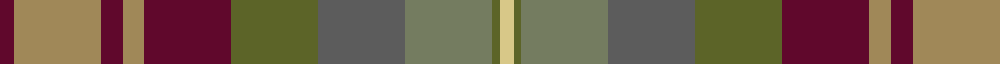

In pattern [BYBYBGBGGY](/patterns/bybybgbggy/).

This was sourced from register-of-tartans.  It is a [10 stripes tartan](/stripes/stripes10/).

Original link https://www.tartanregister.gov.uk/tartanDetails.aspx?ref=134

## Attestations

This cloth appears in 2 source records; the oldest owns this page.

- 01/09/2007 — Auld Scotland (register-of-tartans, [record](https://www.tartanregister.gov.uk/tartanDetails.aspx?ref=134))
- September 2007 — Auld Scotland (Fashion) (tartans-authority, [record](http://www.tartansauthority.com/tartan-ferret/display/7303/))

## Thread count
DR/4 LT24 DR6 LT6 DR24 Ga24 N24 G24 Ga2 LG/4

## Palette
Each colour and its ΔE from the base-6 reference it is a variant of.

| Colour | Shade | Base | ΔE (OKLab) |
|---|---|---|---|
| DR | <code style="background-color:#60082C;">#60082C</code> `#60082C` | B <code style="background-color:#2A418A;">#2A418A</code> | 0.20 |
| G | <code style="background-color:#747C60;">#747C60</code> `#747C60` | G <code style="background-color:#006100;">#006100</code> | 0.18 |
| Ga | <code style="background-color:#5C6428;">#5C6428</code> `#5C6428` | G <code style="background-color:#006100;">#006100</code> | 0.10 |
| LG | <code style="background-color:#D8C888;">#D8C888</code> `#D8C888` | Y <code style="background-color:#F2BF00;">#F2BF00</code> | 0.09 |
| LGa | <code style="background-color:#789484;">#789484</code> `#789484` | G <code style="background-color:#006100;">#006100</code> | 0.24 |
| LT | <code style="background-color:#A08858;">#A08858</code> `#A08858` | Y <code style="background-color:#F2BF00;">#F2BF00</code> | 0.21 |
| N | <code style="background-color:#5C5C5C;">#5C5C5C</code> `#5C5C5C` | B <code style="background-color:#2A418A;">#2A418A</code> | 0.15 |

## Nearest tartans

The nearest existing variants by ΔTartan distance.

1. [Auld Scotland Weavers Tartan Tartan Number: 7303. Earliest known date: September 2007 A new design from Lochcarron for the 2008 season. See products available Copyright © Blair Urquhart, Comrie, 2015](/setts/s10/k2y12b3y3b12g12ba12ga12g1ya2~b60082c-ba5c5c5c-g5c6428-ga747c60-k000000-ya08858-yad8c888~x2/) — ΔT 1.13
1. [Teallach](/setts/s9/y4r24g19w3ga23gb13g3b13g3~b505050-g604000-ga607030-gb808080-rc00000-we0e0e0-yf0c000~x2/) — ΔT 1.30
1. [Teallach Family Tartan Tartan Number: 832. Earliest known date: pre 2003 The tartan of the present chairman of the Scottish Tartans Society, Dr Gordon Teall of Teallach. See products available Copyright © Blair Urquhart, Comrie, 2015](/setts/s9/y4r24g19w3ga23ra13g3b13g3~b5c5c5c-g604000-ga5c6428-rc80000-ra888888-we0e0e0-ye8c000~x2/) — ΔT 1.32
1. [Bracken (WCWM)](/setts/s11/g30k6g6r6y6ra14k4ra3b14k6b16~b5c5c5c-g603800-k101010-rc80000-raa07c58-ydc943c~x2/) — ΔT 1.36
1. [Grewar (Name)](/setts/s10/r2g2r16g2b17ga10gb10g15ga1w2~b780078-g408060-ga003820-gb007460-r947040-we0e0e0~x2/) — ΔT 1.50
1. [Roscommon Irish County Tartan Tartan Number: 2246. Earliest known date: 1996 One of a series of Irish District tartans designed by Polly Wittering of the House of Edgar, with colours reminiscent of the Country with soft warm colours dominating. See products available Copyright © Blair Urquhart, Comrie, 2015](/setts/s10/r5y3r19b6y5b6g12ba5g12ba3~b4c3428-ba3c588c-g385c5c-rc05838-yc48800~x2/) — ΔT 1.56
1. [Teallach (Personal)](/setts/s9/y4r24g19w3ga23b13g3ra13g3~b5c5c5c-g604000-ga5c6428-rb84c00-ra888888-we0e0e0-ybc8c00~x2/) — ΔT 1.57
1. [Meath Irish County Tartan Tartan Number: 2269. Earliest known date: 1996 One of a series of Irish District tartans designed by Polly Wittering of the House of Edgar, with colours reminiscent of the Country with soft warm colours dominating. See products available Copyright © Blair Urquhart, Comrie, 2015](/setts/s12/y5b2r14g9ga8b3r3b3r3b3ga19ya3~b606884-g5c483c-ga385c59-rb45430-yc48800-yac4c4a4~x2/) — ΔT 1.61
1. [Blaylock Hunting](/setts/s12/g4y2g8b8r2b8r16k2b5y2r5ya2~b522720-g23613c-k101010-r894b18-yd6beb4-yad9b152~x2/) — ΔT 1.72
1. [Dutch Friendship (Fashion)](/setts/s10/b3k1g14ga14k14r14gb9r4gb14k3~b80507c-g5c6428-ga707454-gb604000-k00002c-rb46800~x2/) — ΔT 1.73

## Neighbour map

Every grey dot is one of 15726 variants placed by the first two principal components of the ΔTartan feature space (44% of its variance). Red is this tartan; blue dots are its nearest — click one to open its page.

<svg viewBox="0 0 640 380" role="img" style="max-width:100%;height:auto;border:1px solid #e0e0e0;border-radius:4px;display:block" xmlns="http://www.w3.org/2000/svg"><image href="/nn/cloud.v1.png" width="640" height="380"/><a href="/setts/s10/k2y12b3y3b12g12ba12ga12g1ya2~b60082c-ba5c5c5c-g5c6428-ga747c60-k000000-ya08858-yad8c888~x2/"><circle cx="77.6" cy="153.1" r="4" fill="#3465a4"><title>Auld Scotland Weavers Tartan Tartan Number: 7303. Earliest known date: September 2007 A new design from Lochcarron for the 2008 season. See products available Copyright © Blair Urquhart, Comrie, 2015</title></circle></a><a href="/setts/s9/y4r24g19w3ga23gb13g3b13g3~b505050-g604000-ga607030-gb808080-rc00000-we0e0e0-yf0c000~x2/"><circle cx="92.5" cy="171.1" r="4" fill="#3465a4"><title>Teallach</title></circle></a><a href="/setts/s9/y4r24g19w3ga23ra13g3b13g3~b5c5c5c-g604000-ga5c6428-rc80000-ra888888-we0e0e0-ye8c000~x2/"><circle cx="92.5" cy="170.4" r="4" fill="#3465a4"><title>Teallach Family Tartan Tartan Number: 832. Earliest known date: pre 2003 The tartan of the present chairman of the Scottish Tartans Society, Dr Gordon Teall of Teallach. See products available Copyright © Blair Urquhart, Comrie, 2015</title></circle></a><a href="/setts/s11/g30k6g6r6y6ra14k4ra3b14k6b16~b5c5c5c-g603800-k101010-rc80000-raa07c58-ydc943c~x2/"><circle cx="148.0" cy="169.0" r="4" fill="#3465a4"><title>Bracken (WCWM)</title></circle></a><a href="/setts/s10/r2g2r16g2b17ga10gb10g15ga1w2~b780078-g408060-ga003820-gb007460-r947040-we0e0e0~x2/"><circle cx="127.4" cy="146.0" r="4" fill="#3465a4"><title>Grewar (Name)</title></circle></a><a href="/setts/s10/r5y3r19b6y5b6g12ba5g12ba3~b4c3428-ba3c588c-g385c5c-rc05838-yc48800~x2/"><circle cx="165.7" cy="223.4" r="4" fill="#3465a4"><title>Roscommon Irish County Tartan Tartan Number: 2246. Earliest known date: 1996 One of a series of Irish District tartans designed by Polly Wittering of the House of Edgar, with colours reminiscent of the Country with soft warm colours dominating. See products available Copyright © Blair Urquhart, Comrie, 2015</title></circle></a><a href="/setts/s9/y4r24g19w3ga23b13g3ra13g3~b5c5c5c-g604000-ga5c6428-rb84c00-ra888888-we0e0e0-ybc8c00~x2/"><circle cx="125.4" cy="187.4" r="4" fill="#3465a4"><title>Teallach (Personal)</title></circle></a><a href="/setts/s12/y5b2r14g9ga8b3r3b3r3b3ga19ya3~b606884-g5c483c-ga385c59-rb45430-yc48800-yac4c4a4~x2/"><circle cx="210.2" cy="179.6" r="4" fill="#3465a4"><title>Meath Irish County Tartan Tartan Number: 2269. Earliest known date: 1996 One of a series of Irish District tartans designed by Polly Wittering of the House of Edgar, with colours reminiscent of the Country with soft warm colours dominating. See products available Copyright © Blair Urquhart, Comrie, 2015</title></circle></a><a href="/setts/s12/g4y2g8b8r2b8r16k2b5y2r5ya2~b522720-g23613c-k101010-r894b18-yd6beb4-yad9b152~x2/"><circle cx="173.0" cy="177.3" r="4" fill="#3465a4"><title>Blaylock Hunting</title></circle></a><a href="/setts/s10/b3k1g14ga14k14r14gb9r4gb14k3~b80507c-g5c6428-ga707454-gb604000-k00002c-rb46800~x2/"><circle cx="90.5" cy="170.5" r="4" fill="#3465a4"><title>Dutch Friendship (Fashion)</title></circle></a><circle cx="128.1" cy="176.9" r="5" fill="#c00000"/></svg>

ID: /setts/s10/b2y12b3y3b12g12ba12ga12g1ya2~b60082c-ba5c5c5c-g5c6428-ga747c60-ya08858-yad8c888~x2/
