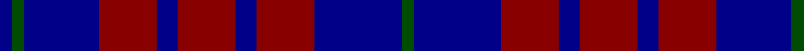

In pattern [BGBRBRBRBG](/patterns/bgbrbrbrbg/).

This was sourced from tartans-authority.  It is a [10 stripes tartan](/stripes/stripes10/).

Original link http://www.tartansauthority.com/tartan-ferret/display/5142/

## Thread count
DBa/6 G6 DBa36 DR28 DB10 DR28 DB10 DR28 DBa42 G/6

## Palette
Each colour and its ΔE from the base-6 reference it is a variant of.

| Colour | Shade | Base | ΔE (OKLab) |
|---|---|---|---|
| DB | <code style="background-color:#000088;">#000088</code> `#000088` | B <code style="background-color:#2A418A;">#2A418A</code> | 0.14 |
| DBa | <code style="background-color:#000088;">#000088</code> `#000088` | B <code style="background-color:#2A418A;">#2A418A</code> | 0.14 |
| DR | <code style="background-color:#880000;">#880000</code> `#880000` | R <code style="background-color:#CC0000;">#CC0000</code> | 0.15 |
| G | <code style="background-color:#004C00;">#004C00</code> `#004C00` | G <code style="background-color:#006100;">#006100</code> | 0.07 |

## Nearest tartans

The nearest existing variants by ΔTartan distance.

1. [Scottish N. A. Business Council (Co](/setts/s10/r2b6ba6b2r2b4ba6r2b2w1~b1c0070-ba003c64-rc80000-we0e0e0~x4/) — ΔT 0.71
1. [Heritage of Scotland](/setts/s7/b6w3b21k16ba6k3ba6~b2c2c80-ba780078-k101010-wf8f8f8~x2/) — ΔT 1.04
1. [Clergy "Two Spirit" (Personal)](/setts/s11/b1ba3b1ba2b1k6w1k6ba6b1k1~b5c8ca8-ba2c2c80-k101010-wc49cd8~x2/) — ΔT 1.17
1. [Clemson University](/setts/s13/b11k2b2k2b2k8ba8y2ba8k8b8k2b2~b2c2c80-ba780078-k101010-yd87c00~x4/) — ΔT 1.19
1. [Poulter Sandwich](/setts/s13/b69ba14b13ba14b13ba69bb72w13bb72ba69b68ba14b13~b440044-ba1870a4-bb141e46-w98c8e8/) — ΔT 1.32
1. [Allianz Deutschland 2012 (Corporate)](/setts/s7/b6ba3b6ba20k20ba8w4~b2c2c80-ba202060-k101010-wfcfcfc~x2/) — ΔT 1.39
1. [Clergy (Smith)](/setts/s11/b1ba3b1ba2b1k6b1k6ba6b1k1~b5c8ca8-ba2c2c80-k101010~x2/) — ΔT 1.46
1. [Komissarov, Dmitry (Personal)](/setts/s7/b30ba30g4ba4g4ba5r6~b640044-ba000048-g808080-r880000~x2/) — ΔT 1.46
1. [Lexington Fire Department](/setts/s8/k8b8k2b2w2k5b5r2~b1c0070-k101010-rc80000-we0e0e0~x5/) — ΔT 1.48
1. [Le Mirage (Corporate?)](/setts/s10/b36ba15r25w5k6b35ba15r7w5k6~b1c1c50-ba2c2c80-k101010-rc80000-we0e0e0/) — ΔT 1.50

## Neighbour map

Every grey dot is one of 15726 variants placed by the first two principal components of the ΔTartan feature space (44% of its variance). Red is this tartan; blue dots are its nearest — click one to open its page.

<svg viewBox="0 0 640 380" role="img" style="max-width:100%;height:auto;border:1px solid #e0e0e0;border-radius:4px;display:block" xmlns="http://www.w3.org/2000/svg"><image href="/nn/cloud.v1.png" width="640" height="380"/><a href="/setts/s10/r2b6ba6b2r2b4ba6r2b2w1~b1c0070-ba003c64-rc80000-we0e0e0~x4/"><circle cx="196.5" cy="243.0" r="4" fill="#3465a4"><title>Scottish N. A. Business Council (Co</title></circle></a><a href="/setts/s7/b6w3b21k16ba6k3ba6~b2c2c80-ba780078-k101010-wf8f8f8~x2/"><circle cx="223.4" cy="233.8" r="4" fill="#3465a4"><title>Heritage of Scotland</title></circle></a><a href="/setts/s11/b1ba3b1ba2b1k6w1k6ba6b1k1~b5c8ca8-ba2c2c80-k101010-wc49cd8~x2/"><circle cx="227.1" cy="218.9" r="4" fill="#3465a4"><title>Clergy &quot;Two Spirit&quot; (Personal)</title></circle></a><a href="/setts/s13/b11k2b2k2b2k8ba8y2ba8k8b8k2b2~b2c2c80-ba780078-k101010-yd87c00~x4/"><circle cx="210.3" cy="236.4" r="4" fill="#3465a4"><title>Clemson University</title></circle></a><a href="/setts/s13/b69ba14b13ba14b13ba69bb72w13bb72ba69b68ba14b13~b440044-ba1870a4-bb141e46-w98c8e8/"><circle cx="186.7" cy="227.6" r="4" fill="#3465a4"><title>Poulter Sandwich</title></circle></a><a href="/setts/s7/b6ba3b6ba20k20ba8w4~b2c2c80-ba202060-k101010-wfcfcfc~x2/"><circle cx="232.1" cy="248.4" r="4" fill="#3465a4"><title>Allianz Deutschland 2012 (Corporate)</title></circle></a><a href="/setts/s11/b1ba3b1ba2b1k6b1k6ba6b1k1~b5c8ca8-ba2c2c80-k101010~x2/"><circle cx="254.3" cy="238.5" r="4" fill="#3465a4"><title>Clergy (Smith)</title></circle></a><a href="/setts/s7/b30ba30g4ba4g4ba5r6~b640044-ba000048-g808080-r880000~x2/"><circle cx="290.0" cy="222.1" r="4" fill="#3465a4"><title>Komissarov, Dmitry (Personal)</title></circle></a><a href="/setts/s8/k8b8k2b2w2k5b5r2~b1c0070-k101010-rc80000-we0e0e0~x5/"><circle cx="198.6" cy="267.2" r="4" fill="#3465a4"><title>Lexington Fire Department</title></circle></a><a href="/setts/s10/b36ba15r25w5k6b35ba15r7w5k6~b1c1c50-ba2c2c80-k101010-rc80000-we0e0e0/"><circle cx="182.8" cy="190.2" r="4" fill="#3465a4"><title>Le Mirage (Corporate?)</title></circle></a><circle cx="227.4" cy="231.9" r="5" fill="#c00000"/></svg>

ID: /setts/s10/b3g3b18r14b5r14b5r14b21g3~b000088-g004c00-r880000~x2/
