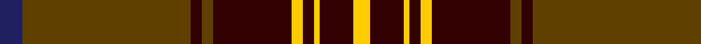

In pattern [BGKGKYKYKY](/patterns/bgkgkykyky/).

This was sourced from tartans-authority.  It is a [10 stripes tartan](/stripes/stripes10/).

Original link http://www.tartansauthority.com/tartan-ferret/display/11260/

## Thread count
DB/8 T60 DR4 T4 DR28 Y4 DR4 Y2 DR12 Y/6

## Palette
Each colour and its ΔE from the base-6 reference it is a variant of.

| Colour | Shade | Base | ΔE (OKLab) |
|---|---|---|---|
| DB | <code style="background-color:#202060;">#202060</code> `#202060` | B <code style="background-color:#2A418A;">#2A418A</code> | 0.11 |
| DR | <code style="background-color:#320000;">#320000</code> `#320000` | K <code style="background-color:#000000;">#000000</code> | 0.22 |
| T | <code style="background-color:#604000;">#604000</code> `#604000` | G <code style="background-color:#006100;">#006100</code> | 0.14 |
| Y | <code style="background-color:#FCCC00;">#FCCC00</code> `#FCCC00` | Y <code style="background-color:#F2BF00;">#F2BF00</code> | 0.04 |

## Nearest tartans

The nearest existing variants by ΔTartan distance.

1. [Harbor Club (Corporate)](/setts/s10/r47g14k5y2k3g7k3y2k5g14x2~g006428-k101010-r800028-ye8c000/) — ΔT 0.78
1. [MacAlister of Skye (Clan?)](/setts/s9/r4k5y1r26w1k30y1k1y4x2~k101010-r880000-wc0c0c0-yd09800/) — ΔT 0.91
1. [Glendronach Distillery](/setts/s10/g22r2w1y3r1g6r22y3r1g10x4~g103010-r70000c-wc4c4c4-yfcac00/) — ΔT 1.00
1. [Stewart of Atholl (Clan)](/setts/s9/g22k1g2k1g3k8r20k1r3x4~g005028-k101010-rc80000/) — ΔT 1.17
1. [Carrick (Clan)](/setts/s9/r28b12r3g20ba1g2ba1g2r7x2~b202060-ba440044-g006818-rc80000/) — ΔT 1.19
1. [Kenmore (Fashion)](/setts/s10/b22y11b2y4b2y6b16b40b2ya6x2~b3c2010-yc89800-yab0b0b0/) — ΔT 1.23
1. [Carrick](/setts/s9/r28b12r3g20ra1g2ra1g2r7x2~b202060-g006818-rc80000-ra981c70/) — ΔT 1.24
1. [Wcwm 1684](/setts/s10/r48k10b12k2r3k2b12k10r2y3x2~b14283c-k000000-r8c0000-yc89800/) — ΔT 1.24
1. [Stewart of Appin](/setts/s16/r3b2ba1r2g24r4g2r2b8r2g2r24b2ba1r2g2x2~b000052-ba4367ae-g11450d-raa0000/) — ΔT 1.26
1. [Stewart of Appin](/setts/s16/r3b2ba1r2g24r4g2r2b8r2g2r24b2ba1r2g2~b000052-ba4367ae-g11450d-raa0000/) — ΔT 1.26

## Neighbour map

Every grey dot is one of 15726 variants placed by the first two principal components of the ΔTartan feature space (44% of its variance). Red is this tartan; blue dots are its nearest — click one to open its page.

<svg viewBox="0 0 640 380" role="img" style="max-width:100%;height:auto;border:1px solid #e0e0e0;border-radius:4px;display:block" xmlns="http://www.w3.org/2000/svg"><image href="/nn/cloud.v1.png" width="640" height="380"/><a href="/setts/s10/r47g14k5y2k3g7k3y2k5g14x2~g006428-k101010-r800028-ye8c000/"><circle cx="323.1" cy="136.6" r="4" fill="#3465a4"><title>Harbor Club (Corporate)</title></circle></a><a href="/setts/s9/r4k5y1r26w1k30y1k1y4x2~k101010-r880000-wc0c0c0-yd09800/"><circle cx="363.7" cy="128.0" r="4" fill="#3465a4"><title>MacAlister of Skye (Clan?)</title></circle></a><a href="/setts/s10/g22r2w1y3r1g6r22y3r1g10x4~g103010-r70000c-wc4c4c4-yfcac00/"><circle cx="359.3" cy="153.6" r="4" fill="#3465a4"><title>Glendronach Distillery</title></circle></a><a href="/setts/s9/g22k1g2k1g3k8r20k1r3x4~g005028-k101010-rc80000/"><circle cx="326.1" cy="161.9" r="4" fill="#3465a4"><title>Stewart of Atholl (Clan)</title></circle></a><a href="/setts/s9/r28b12r3g20ba1g2ba1g2r7x2~b202060-ba440044-g006818-rc80000/"><circle cx="335.2" cy="136.4" r="4" fill="#3465a4"><title>Carrick (Clan)</title></circle></a><a href="/setts/s10/b22y11b2y4b2y6b16b40b2ya6x2~b3c2010-yc89800-yab0b0b0/"><circle cx="348.0" cy="156.6" r="4" fill="#3465a4"><title>Kenmore (Fashion)</title></circle></a><a href="/setts/s9/r28b12r3g20ra1g2ra1g2r7x2~b202060-g006818-rc80000-ra981c70/"><circle cx="337.1" cy="136.6" r="4" fill="#3465a4"><title>Carrick</title></circle></a><a href="/setts/s10/r48k10b12k2r3k2b12k10r2y3x2~b14283c-k000000-r8c0000-yc89800/"><circle cx="332.8" cy="131.0" r="4" fill="#3465a4"><title>Wcwm 1684</title></circle></a><a href="/setts/s16/r3b2ba1r2g24r4g2r2b8r2g2r24b2ba1r2g2x2~b000052-ba4367ae-g11450d-raa0000/"><circle cx="333.0" cy="108.4" r="4" fill="#3465a4"><title>Stewart of Appin</title></circle></a><a href="/setts/s16/r3b2ba1r2g24r4g2r2b8r2g2r24b2ba1r2g2~b000052-ba4367ae-g11450d-raa0000/"><circle cx="333.0" cy="108.4" r="4" fill="#3465a4"><title>Stewart of Appin</title></circle></a><circle cx="339.2" cy="123.5" r="5" fill="#c00000"/></svg>

ID: /setts/s10/b4g30k2g2k14y2k2y1k6y3x2~b202060-g604000-k320000-yfccc00/
