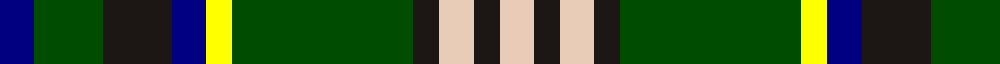

In pattern [BGKBYGKWKW](/patterns/bgkbygkwkw/).

This was sourced from register-of-tartans.  It is a [10 stripes tartan](/stripes/stripes10/).

Original link https://www.tartanregister.gov.uk/tartanDetails.aspx?ref=11410

## Thread count
DB/8 G16 K16 DB8 Y6 G42 K6 LR8 K6 LR/8

## Palette
Each colour and its ΔE from the base-6 reference it is a variant of.

| Colour | Shade | Base | ΔE (OKLab) |
|---|---|---|---|
| DB | <code style="background-color:#000080;">#000080</code> `#000080` | B <code style="background-color:#2A418A;">#2A418A</code> | 0.14 |
| G | <code style="background-color:#004C00;">#004C00</code> `#004C00` | G <code style="background-color:#006100;">#006100</code> | 0.07 |
| K | <code style="background-color:#1C1714;">#1C1714</code> `#1C1714` | K <code style="background-color:#000000;">#000000</code> | 0.21 |
| LR | <code style="background-color:#E8CCB8;">#E8CCB8</code> `#E8CCB8` | W <code style="background-color:#F7F7F7;">#F7F7F7</code> | 0.12 |
| Y | <code style="background-color:#FFFF00;">#FFFF00</code> `#FFFF00` | Y <code style="background-color:#F2BF00;">#F2BF00</code> | 0.16 |

## Nearest tartans

The nearest existing variants by ΔTartan distance.

1. [Allon/Allan](/setts/s10/g8w1g1r1g4k4b8k1b1k1~b304080-g008000-k000000-rc00000-we0e0e0~x2/) — ΔT 0.54
1. [Corstorphine Trial A](/setts/s10/k6y2g18w3g13k3y4k3b18w3~b2c2c80-g006818-k101010-wfcfcfc-ye8c000~x2/) — ΔT 0.72
1. [Skene](/setts/s12/k4b24k4r3k4g24k4y3k4g24r3k4~b304080-g008000-k000000-rc00000-yff8500~x2/) — ΔT 0.75
1. [Lindley-Highfield Name Tartan Tartan Number: 10002. Earliest known date: 13 February 2009 'Lindley-Highfield of Ballumbie Castle' is a tartan of the family of the Lindley-Highfields of Ballumbie Castle, sometime Barons of Cartsburn. The colours of this particular tartan are taken from the armorial bearings of the Head of the Family of Lindley-Highfield of Ballumbie Castle. See products available Copyright © Blair Urquhart, Comrie, 2015](/setts/s7/g7b3w1y2g1k2b1~b800080-g006400-k000000-wffffff-y32cd32~x8/) — ΔT 0.89
1. [MacRae, Ancient hunting](/setts/s8/g24k4g6r4g6k19b22w5~b304080-g008000-k000000-rc00000-we0e0e0~x2/) — ΔT 0.95
1. [Manx Ellan Vannin](/setts/s10/g14w2b3y7g2y7b3w2g14ba2~b202060-ba5c8ca8-g003820-we0e0e0-y98b480~x4/) — ΔT 0.97
1. [Hebrides](/setts/s9/k15y2k2w2k2g10r6k3w2~g004800-k0c0c04-rb07430-wc4c4c4-yc89800~x2/) — ΔT 1.04
1. [Wilson's, No 225](/setts/s9/g16ga2b13ba2k6y2g16ba2k12~b800080-ba5480b0-g008000-ga30a010-k000000-yf0c000~x2/) — ΔT 1.05
1. [MacCainsh](/setts/s11/r2b8k1g2k1g4k1g2k1b8y2~b304080-g008000-k000000-rc00000-yf0c000~x2/) — ΔT 1.08
1. [Wilson's, No 149](/setts/s11/g8b6k2b6g11ba2k2ba2g11w2k8~b304080-ba5480b0-g008000-k000000-we0e0e0~x2/) — ΔT 1.10

## Neighbour map

Every grey dot is one of 15726 variants placed by the first two principal components of the ΔTartan feature space (44% of its variance). Red is this tartan; blue dots are its nearest — click one to open its page.

<svg viewBox="0 0 640 380" role="img" style="max-width:100%;height:auto;border:1px solid #e0e0e0;border-radius:4px;display:block" xmlns="http://www.w3.org/2000/svg"><image href="/nn/cloud.v1.png" width="640" height="380"/><a href="/setts/s10/g8w1g1r1g4k4b8k1b1k1~b304080-g008000-k000000-rc00000-we0e0e0~x2/"><circle cx="164.5" cy="171.6" r="4" fill="#3465a4"><title>Allon/Allan</title></circle></a><a href="/setts/s10/k6y2g18w3g13k3y4k3b18w3~b2c2c80-g006818-k101010-wfcfcfc-ye8c000~x2/"><circle cx="144.4" cy="167.7" r="4" fill="#3465a4"><title>Corstorphine Trial A</title></circle></a><a href="/setts/s12/k4b24k4r3k4g24k4y3k4g24r3k4~b304080-g008000-k000000-rc00000-yff8500~x2/"><circle cx="174.7" cy="156.8" r="4" fill="#3465a4"><title>Skene</title></circle></a><a href="/setts/s7/g7b3w1y2g1k2b1~b800080-g006400-k000000-wffffff-y32cd32~x8/"><circle cx="159.9" cy="190.8" r="4" fill="#3465a4"><title>Lindley-Highfield Name Tartan Tartan Number: 10002. Earliest known date: 13 February 2009 'Lindley-Highfield of Ballumbie Castle' is a tartan of the family of the Lindley-Highfields of Ballumbie Castle, sometime Barons of Cartsburn. The colours of this particular tartan are taken from the armorial bearings of the Head of the Family of Lindley-Highfield of Ballumbie Castle. See products available Copyright © Blair Urquhart, Comrie, 2015</title></circle></a><a href="/setts/s8/g24k4g6r4g6k19b22w5~b304080-g008000-k000000-rc00000-we0e0e0~x2/"><circle cx="115.0" cy="203.0" r="4" fill="#3465a4"><title>MacRae, Ancient hunting</title></circle></a><a href="/setts/s10/g14w2b3y7g2y7b3w2g14ba2~b202060-ba5c8ca8-g003820-we0e0e0-y98b480~x4/"><circle cx="207.0" cy="184.7" r="4" fill="#3465a4"><title>Manx Ellan Vannin</title></circle></a><a href="/setts/s9/k15y2k2w2k2g10r6k3w2~g004800-k0c0c04-rb07430-wc4c4c4-yc89800~x2/"><circle cx="200.4" cy="180.4" r="4" fill="#3465a4"><title>Hebrides</title></circle></a><a href="/setts/s9/g16ga2b13ba2k6y2g16ba2k12~b800080-ba5480b0-g008000-ga30a010-k000000-yf0c000~x2/"><circle cx="131.6" cy="169.0" r="4" fill="#3465a4"><title>Wilson's, No 225</title></circle></a><a href="/setts/s11/r2b8k1g2k1g4k1g2k1b8y2~b304080-g008000-k000000-rc00000-yf0c000~x2/"><circle cx="196.4" cy="171.4" r="4" fill="#3465a4"><title>MacCainsh</title></circle></a><a href="/setts/s11/g8b6k2b6g11ba2k2ba2g11w2k8~b304080-ba5480b0-g008000-k000000-we0e0e0~x2/"><circle cx="148.6" cy="206.8" r="4" fill="#3465a4"><title>Wilson's, No 149</title></circle></a><circle cx="159.8" cy="179.5" r="5" fill="#c00000"/></svg>

ID: /setts/s10/b4g8k8b4y3g21k3w4k3w4~b000080-g004c00-k1c1714-we8ccb8-yffff00~x2/
