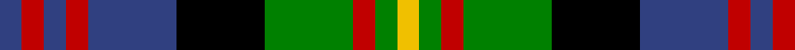

In pattern [BRBRBKGRGY](/patterns/brbrbkgrgy/).

This was sourced from weddslist.  It is a [10 stripes tartan](/stripes/stripes10/).

Original link http://www.weddslist.com/cgi-bin/tartans/pg.pl?source=sts

## Thread count
B/4 R4 B4 R4 B16 K16 G16 R4 G4 Y/4

## Palette
Each colour and its ΔE from the base-6 reference it is a variant of.

| Colour | Shade | Base | ΔE (OKLab) |
|---|---|---|---|
| B | <code style="background-color:#304080;">#304080</code> `#304080` | B <code style="background-color:#2C4084;">#2C4084</code> | 0.01 |
| G | <code style="background-color:#008000;">#008000</code> `#008000` | G <code style="background-color:#006400;">#006400</code> | 0.09 |
| K | <code style="background-color:#000000;">#000000</code> `#000000` | K <code style="background-color:#000000;">#000000</code> | 0.00 |
| R | <code style="background-color:#C00000;">#C00000</code> `#C00000` | R <code style="background-color:#C80000;">#C80000</code> | 0.02 |
| Y | <code style="background-color:#F0C000;">#F0C000</code> `#F0C000` | Y <code style="background-color:#E8C000;">#E8C000</code> | 0.01 |

## Nearest tartans

The nearest existing variants by ΔTartan distance.

1. [MacDonald of Clanranald 4](/setts/s13/b12r4b4r6b24r4k22w4g22r6g4r4g12-b304080-g008000-k000000-rc00000-we0e0e0/) — ΔT 0.85
1. [Carnegie](/setts/s13/b6r2b2r4b12r2k12g12r4g2r2g4y2-b304080-g008000-k000000-rc00000-yf0c000/) — ΔT 0.88
1. [Kinloch Anderson, hunting](/setts/s12/r8g28ra4g8ra4k12g6k12b28r4b8r8-b304080-g008000-k000000-r802040-raf07040/) — ΔT 1.00
1. [MacSporran](/setts/s13/b34r6b8r10b40r6k40g40r10g8r6k6y22-b304080-g008000-k000000-rc00000-yf0c000/) — ΔT 1.02
1. [Denovan, The Lairdship of..](/setts/s12/b20ba4b6r8b28r4k28g28r8g6ba4g20-b304080-ba800080-g008000-k000000-rc00000/) — ΔT 1.05
1. [Cooke](/setts/s7/k24b8ba48g32r20k8g12-b8080d0-ba304080-g008000-k000000-rc00020/) — ΔT 1.12
1. [Burnfoot Check](/setts/s8/r6g4b4g6k12ba4ra20ba4-b646464-ba00008c-g004c00-k000000-r8c0000-raa0783c/) — ΔT 1.12
1. [MacKean Dress (Personal)](/setts/s9/r6k12g24k6g6k12b18k6w6-b2c2c80-g006818-k101010-rc80000-we0e0e0/) — ΔT 1.14
1. [Clare](/setts/s11/r6b28g28b4r28b4r28b4ga28b4y6-b000050-g30a010-ga008000-r802040-yf0c000/) — ΔT 1.14
1. [MacDonald 2](/setts/s12/b16r4b4r8b20r4k22g20r8g4r4g16-b304080-g008000-k000000-rc00000/) — ΔT 1.14

## Neighbour map

Every grey dot is one of 15726 variants placed by the first two principal components of the ΔTartan feature space (44% of its variance). Red is this tartan; blue dots are its nearest — click one to open its page.

<svg viewBox="0 0 640 380" role="img" style="max-width:100%;height:auto;border:1px solid #e0e0e0;border-radius:4px;display:block" xmlns="http://www.w3.org/2000/svg"><image href="/nn/cloud.v1.png" width="640" height="380"/><a href="/setts/s13/b12r4b4r6b24r4k22w4g22r6g4r4g12-b304080-g008000-k000000-rc00000-we0e0e0/"><circle cx="77.8" cy="174.8" r="4" fill="#3465a4"><title>MacDonald of Clanranald 4</title></circle></a><a href="/setts/s13/b6r2b2r4b12r2k12g12r4g2r2g4y2-b304080-g008000-k000000-rc00000-yf0c000/"><circle cx="75.6" cy="172.6" r="4" fill="#3465a4"><title>Carnegie</title></circle></a><a href="/setts/s12/r8g28ra4g8ra4k12g6k12b28r4b8r8-b304080-g008000-k000000-r802040-raf07040/"><circle cx="87.9" cy="178.7" r="4" fill="#3465a4"><title>Kinloch Anderson, hunting</title></circle></a><a href="/setts/s13/b34r6b8r10b40r6k40g40r10g8r6k6y22-b304080-g008000-k000000-rc00000-yf0c000/"><circle cx="83.1" cy="165.5" r="4" fill="#3465a4"><title>MacSporran</title></circle></a><a href="/setts/s12/b20ba4b6r8b28r4k28g28r8g6ba4g20-b304080-ba800080-g008000-k000000-rc00000/"><circle cx="96.6" cy="182.7" r="4" fill="#3465a4"><title>Denovan, The Lairdship of..</title></circle></a><a href="/setts/s7/k24b8ba48g32r20k8g12-b8080d0-ba304080-g008000-k000000-rc00020/"><circle cx="78.2" cy="218.4" r="4" fill="#3465a4"><title>Cooke</title></circle></a><a href="/setts/s8/r6g4b4g6k12ba4ra20ba4-b646464-ba00008c-g004c00-k000000-r8c0000-raa0783c/"><circle cx="57.0" cy="191.5" r="4" fill="#3465a4"><title>Burnfoot Check</title></circle></a><a href="/setts/s9/r6k12g24k6g6k12b18k6w6-b2c2c80-g006818-k101010-rc80000-we0e0e0/"><circle cx="97.1" cy="234.9" r="4" fill="#3465a4"><title>MacKean Dress (Personal)</title></circle></a><a href="/setts/s11/r6b28g28b4r28b4r28b4ga28b4y6-b000050-g30a010-ga008000-r802040-yf0c000/"><circle cx="118.3" cy="180.1" r="4" fill="#3465a4"><title>Clare</title></circle></a><a href="/setts/s12/b16r4b4r8b20r4k22g20r8g4r4g16-b304080-g008000-k000000-rc00000/"><circle cx="92.5" cy="210.6" r="4" fill="#3465a4"><title>MacDonald 2</title></circle></a><circle cx="59.0" cy="203.1" r="5" fill="#c00000"/></svg>

ID: /setts/s10/b4r4b4r4b16k16g16r4g4y4-b304080-g008000-k000000-rc00000-yf0c000/
