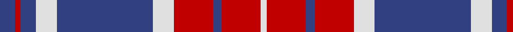

In pattern [BRBWBWRBRW](/patterns/brbwbwrbrw/).

This was sourced from weddslist.  It is a [10 stripes tartan](/stripes/stripes10/).

Original link http://www.weddslist.com/cgi-bin/tartans/pg.pl?source=sts

## Thread count
B/10 R4 B10 LN14 B64 LN14 R26 B6 R26 LN/4

## Palette
Each colour and its ΔE from the base-6 reference it is a variant of.

| Colour | Shade | Base | ΔE (OKLab) |
|---|---|---|---|
| B | <code style="background-color:#304080;">#304080</code> `#304080` | B <code style="background-color:#2A418A;">#2A418A</code> | 0.02 |
| LN | <code style="background-color:#E0E0E0;">#E0E0E0</code> `#E0E0E0` | W <code style="background-color:#F7F7F7;">#F7F7F7</code> | 0.07 |
| R | <code style="background-color:#C00000;">#C00000</code> `#C00000` | R <code style="background-color:#CC0000;">#CC0000</code> | 0.03 |

## Nearest tartans

The nearest existing variants by ΔTartan distance.

1. [America (Eagle version)](/setts/s10/b5r2b5w7b32w7r13b3r13w2x2~b2c2c80-rc80000-we0e0e0/) — ΔT 0.45
1. [American](/setts/s9/b2r21b1w4b7w2b2w2r2x4~b000088-ra00000-wc8c8c8/) — ΔT 1.18
1. [Frame](/setts/s12/w4b14r1b1w1b1r1b14r14b1r1w1x2~b304080-rc00000-we0e0e0/) — ΔT 1.20
1. [Frame Family Tartan Tartan Number: 1777. Earliest known date: 1983 Designed around 1982 by Donald B. Frame of 15584 Cornell Trail, Rosemont, MN 55068. USA and registered with Scottish Tartans Society. Other STS notes say 'Robert Frame' and Archie Frame from Ayrshire.. Sindex notes add "Mr Frame wrote of the design, 'arrived at after years of doodling ... the flag colours of Britain, Scotland and the US. B&W stripes in the red: R&W in the blue with St Andrews cross in the blue. A tartan is lines and stripes at right angles to each other.'!!" See products available Copyright © Blair Urquhart, Comrie, 2015](/setts/s12/w4b14r1b1w1b1r1b14r14b1r1w1x2~b2c2c80-rc80000-we0e0e0/) — ΔT 1.30
1. [Alma College](/setts/s9/g24k3g2k3g4k4r20k3r6x2~g0098a0-k000000-r980044/) — ΔT 1.38
1. [Fraser Arisaid Clan Tartan Tartan Number: 616. Earliest known date: 1987 Sample from D. Ikelman, Atlanta. A dress tartan probably designed for Highland Dancing. See products available Copyright © Blair Urquhart, Comrie, 2015](/setts/s10/b14w2b3w2ba10w32ba10b10w2b3x2~b003c64-ba680028-we0e0e0/) — ΔT 1.38
1. [Rafferty (Estimated threadcount)](/setts/s9/r15b2y1b10w1b2w1b2y1x4~b1474b4-r880000-wf8f8f8-ya08858/) — ΔT 1.41
1. [Lindsay Dress #2](/setts/s9/w29b2w2b2w2b14r31b2r3x2~b080848-r7c0034-we0e0e0/) — ΔT 1.41
1. [Fraser, Arisaid](/setts/s10/k14w2k3w2b10w32b10k10w2k3x2~b600030-k000030-we0e0e0/) — ΔT 1.41
1. [Mercer, James (Personal)](/setts/s9/b24w3b4y6b4w3b15r52b6~b2c2c80-rc80000-wf8f8f8-ye8c000/) — ΔT 1.42

## Neighbour map

Every grey dot is one of 15726 variants placed by the first two principal components of the ΔTartan feature space (44% of its variance). Red is this tartan; blue dots are its nearest — click one to open its page.

<svg viewBox="0 0 640 380" role="img" style="max-width:100%;height:auto;border:1px solid #e0e0e0;border-radius:4px;display:block" xmlns="http://www.w3.org/2000/svg"><image href="/nn/cloud.v1.png" width="640" height="380"/><a href="/setts/s10/b5r2b5w7b32w7r13b3r13w2x2~b2c2c80-rc80000-we0e0e0/"><circle cx="288.4" cy="161.7" r="4" fill="#3465a4"><title>America (Eagle version)</title></circle></a><a href="/setts/s9/b2r21b1w4b7w2b2w2r2x4~b000088-ra00000-wc8c8c8/"><circle cx="338.2" cy="139.7" r="4" fill="#3465a4"><title>American</title></circle></a><a href="/setts/s12/w4b14r1b1w1b1r1b14r14b1r1w1x2~b304080-rc00000-we0e0e0/"><circle cx="356.6" cy="152.9" r="4" fill="#3465a4"><title>Frame</title></circle></a><a href="/setts/s12/w4b14r1b1w1b1r1b14r14b1r1w1x2~b2c2c80-rc80000-we0e0e0/"><circle cx="348.8" cy="149.7" r="4" fill="#3465a4"><title>Frame Family Tartan Tartan Number: 1777. Earliest known date: 1983 Designed around 1982 by Donald B. Frame of 15584 Cornell Trail, Rosemont, MN 55068. USA and registered with Scottish Tartans Society. Other STS notes say 'Robert Frame' and Archie Frame from Ayrshire.. Sindex notes add &quot;Mr Frame wrote of the design, 'arrived at after years of doodling ... the flag colours of Britain, Scotland and the US. B&amp;W stripes in the red: R&amp;W in the blue with St Andrews cross in the blue. A tartan is lines and stripes at right angles to each other.'!!&quot; See products available Copyright © Blair Urquhart, Comrie, 2015</title></circle></a><a href="/setts/s9/g24k3g2k3g4k4r20k3r6x2~g0098a0-k000000-r980044/"><circle cx="246.5" cy="177.8" r="4" fill="#3465a4"><title>Alma College</title></circle></a><a href="/setts/s10/b14w2b3w2ba10w32ba10b10w2b3x2~b003c64-ba680028-we0e0e0/"><circle cx="232.3" cy="152.4" r="4" fill="#3465a4"><title>Fraser Arisaid Clan Tartan Tartan Number: 616. Earliest known date: 1987 Sample from D. Ikelman, Atlanta. A dress tartan probably designed for Highland Dancing. See products available Copyright © Blair Urquhart, Comrie, 2015</title></circle></a><a href="/setts/s9/r15b2y1b10w1b2w1b2y1x4~b1474b4-r880000-wf8f8f8-ya08858/"><circle cx="297.8" cy="148.2" r="4" fill="#3465a4"><title>Rafferty (Estimated threadcount)</title></circle></a><a href="/setts/s9/w29b2w2b2w2b14r31b2r3x2~b080848-r7c0034-we0e0e0/"><circle cx="234.8" cy="142.8" r="4" fill="#3465a4"><title>Lindsay Dress #2</title></circle></a><a href="/setts/s10/k14w2k3w2b10w32b10k10w2k3x2~b600030-k000030-we0e0e0/"><circle cx="226.0" cy="152.4" r="4" fill="#3465a4"><title>Fraser, Arisaid</title></circle></a><a href="/setts/s9/b24w3b4y6b4w3b15r52b6~b2c2c80-rc80000-wf8f8f8-ye8c000/"><circle cx="295.5" cy="135.8" r="4" fill="#3465a4"><title>Mercer, James (Personal)</title></circle></a><circle cx="294.1" cy="164.2" r="5" fill="#c00000"/></svg>

ID: /setts/s10/b5r2b5w7b32w7r13b3r13w2x2~b304080-rc00000-we0e0e0/
