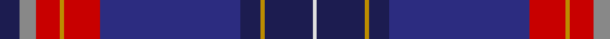

In pattern [BRRYRBBYBW](/patterns/brryrbbybw/).

This was sourced from register-of-tartans.  It is a [10 stripes tartan](/stripes/stripes10/).

Original link https://www.tartanregister.gov.uk/tartanDetails.aspx?ref=4403

## Attestations

This cloth appears in 2 source records; the oldest owns this page.

- 01/01/2007 — University of Dundee (register-of-tartans, [record](https://www.tartanregister.gov.uk/tartanDetails.aspx?ref=4403))
- pre 2007 — University of Dundee (Corporate) (tartans-authority, [record](http://www.tartansauthority.com/tartan-ferret/display/7169/))

## Thread count
DB/10 N8 R12 DY2 R18 DBa70 DB10 DY2 DB24 LN/2

## Palette
Each colour and its ΔE from the base-6 reference it is a variant of.

| Colour | Shade | Base | ΔE (OKLab) |
|---|---|---|---|
| DB | <code style="background-color:#1C1C50;">#1C1C50</code> `#1C1C50` | B <code style="background-color:#2A418A;">#2A418A</code> | 0.14 |
| DBa | <code style="background-color:#2C2C80;">#2C2C80</code> `#2C2C80` | B <code style="background-color:#2A418A;">#2A418A</code> | 0.06 |
| DY | <code style="background-color:#BC8C00;">#BC8C00</code> `#BC8C00` | Y <code style="background-color:#F2BF00;">#F2BF00</code> | 0.16 |
| LN | <code style="background-color:#E0E0E0;">#E0E0E0</code> `#E0E0E0` | W <code style="background-color:#F7F7F7;">#F7F7F7</code> | 0.07 |
| N | <code style="background-color:#888888;">#888888</code> `#888888` | R <code style="background-color:#CC0000;">#CC0000</code> | 0.24 |
| P | <code style="background-color:#780078;">#780078</code> `#780078` | B <code style="background-color:#2A418A;">#2A418A</code> | 0.17 |
| R | <code style="background-color:#C80000;">#C80000</code> `#C80000` | R <code style="background-color:#CC0000;">#CC0000</code> | 0.01 |
| W | <code style="background-color:#F8F8F8;">#F8F8F8</code> `#F8F8F8` | W <code style="background-color:#F7F7F7;">#F7F7F7</code> | 0.00 |

## Nearest tartans

The nearest existing variants by ΔTartan distance.

1. [Cumnock Hunting (District)](/setts/s10/b23w1b2ba16k3ba2k30y1k2r3x2~b780078-ba2c2c80-k101010-rc80000-we0e0e0-yfcb464/) — ΔT 0.80
1. [Holyrood Corporate Tartan Tartan Number: 98. Earliest known date: 1980 Holyrood is the Scottish equivalent of Buckingham Palace, the Queens official residence in Scotland. She is guarded by 'The Royal Company of Archers', a non military force provided by the chiefs of the clans. A sample of the Holyrood tartan was presented to the Scottish Tartans Society by Lochcarron Weavers in 1980. See products available Copyright © Blair Urquhart, Comrie, 2015](/setts/s11/b54ba14y3ba3w3ba3g9bb7ba2bb9w2x2~b202060-ba2c2c80-bb480800-g006818-we0e0e0-ye8c000/) — ΔT 1.15
1. [Pride of Scotland](/setts/s11/g9r2ra2g3ra18g2k2g1k19b33w2x2~b2c2c80-g006818-k101010-ra00048-ra981c70-wfcfcfc/) — ΔT 1.16
1. [Scottish Pride (Fashion)](/setts/s11/g6b2ba2g2ba15g3k2g1k15bb43w2x2~b780078-ba440044-bb2c2c80-g006818-k101010-we0e0e0/) — ΔT 1.21
1. [Heather (NSPCC) (Corporate)](/setts/s9/g4b48ba10w3ba16w3r30w3bb2x2~b6c0070-ba440044-bb1c0070-g006818-r888888-wc0c0c0/) — ΔT 1.23
1. [Accenture](/setts/s10/b3r1ba4g2ra2g21r3b21ba25w3x2~b780078-ba2c2c80-g006818-r888888-rac80000-we0e0e0/) — ΔT 1.29
1. [Sidey Dress Tartan (Name)](/setts/s10/b4w1k2b25k12ba1k2r16k2y1x2~b202060-ba1474b4-k101010-rc80000-we0e0e0-yd87c00/) — ΔT 1.29
1. [Scragg, Moran (Personal)](/setts/s10/g1b28k11r5w1r5k11y1k2g1x2~b3850c8-g006818-k101010-r880000-we0e0e0-yc4bc68/) — ΔT 1.34
1. [Fremont Presbyterian Church (P)](/setts/s8/k6r2k6r12w2b36y1g3x2~b2c2c80-g006818-k101010-rc80000-we0e0e0-ye8c000/) — ΔT 1.38
1. [Scotland the Brave (Fashion)](/setts/s10/b6w1b40r1k12g12r6g2ba2g4x2~b202060-ba780078-g285800-k101010-rb468ac-wf8f8f8/) — ΔT 1.42

## Neighbour map

Every grey dot is one of 15726 variants placed by the first two principal components of the ΔTartan feature space (44% of its variance). Red is this tartan; blue dots are its nearest — click one to open its page.

<svg viewBox="0 0 640 380" role="img" style="max-width:100%;height:auto;border:1px solid #e0e0e0;border-radius:4px;display:block" xmlns="http://www.w3.org/2000/svg"><image href="/nn/cloud.v1.png" width="640" height="380"/><a href="/setts/s10/b23w1b2ba16k3ba2k30y1k2r3x2~b780078-ba2c2c80-k101010-rc80000-we0e0e0-yfcb464/"><circle cx="274.1" cy="103.2" r="4" fill="#3465a4"><title>Cumnock Hunting (District)</title></circle></a><a href="/setts/s11/b54ba14y3ba3w3ba3g9bb7ba2bb9w2x2~b202060-ba2c2c80-bb480800-g006818-we0e0e0-ye8c000/"><circle cx="293.6" cy="94.2" r="4" fill="#3465a4"><title>Holyrood Corporate Tartan Tartan Number: 98. Earliest known date: 1980 Holyrood is the Scottish equivalent of Buckingham Palace, the Queens official residence in Scotland. She is guarded by 'The Royal Company of Archers', a non military force provided by the chiefs of the clans. A sample of the Holyrood tartan was presented to the Scottish Tartans Society by Lochcarron Weavers in 1980. See products available Copyright © Blair Urquhart, Comrie, 2015</title></circle></a><a href="/setts/s11/g9r2ra2g3ra18g2k2g1k19b33w2x2~b2c2c80-g006818-k101010-ra00048-ra981c70-wfcfcfc/"><circle cx="209.8" cy="90.0" r="4" fill="#3465a4"><title>Pride of Scotland</title></circle></a><a href="/setts/s11/g6b2ba2g2ba15g3k2g1k15bb43w2x2~b780078-ba440044-bb2c2c80-g006818-k101010-we0e0e0/"><circle cx="311.2" cy="86.9" r="4" fill="#3465a4"><title>Scottish Pride (Fashion)</title></circle></a><a href="/setts/s9/g4b48ba10w3ba16w3r30w3bb2x2~b6c0070-ba440044-bb1c0070-g006818-r888888-wc0c0c0/"><circle cx="230.8" cy="104.5" r="4" fill="#3465a4"><title>Heather (NSPCC) (Corporate)</title></circle></a><a href="/setts/s10/b3r1ba4g2ra2g21r3b21ba25w3x2~b780078-ba2c2c80-g006818-r888888-rac80000-we0e0e0/"><circle cx="201.7" cy="110.6" r="4" fill="#3465a4"><title>Accenture</title></circle></a><a href="/setts/s10/b4w1k2b25k12ba1k2r16k2y1x2~b202060-ba1474b4-k101010-rc80000-we0e0e0-yd87c00/"><circle cx="257.1" cy="103.1" r="4" fill="#3465a4"><title>Sidey Dress Tartan (Name)</title></circle></a><a href="/setts/s10/g1b28k11r5w1r5k11y1k2g1x2~b3850c8-g006818-k101010-r880000-we0e0e0-yc4bc68/"><circle cx="244.0" cy="96.3" r="4" fill="#3465a4"><title>Scragg, Moran (Personal)</title></circle></a><a href="/setts/s8/k6r2k6r12w2b36y1g3x2~b2c2c80-g006818-k101010-rc80000-we0e0e0-ye8c000/"><circle cx="309.8" cy="92.6" r="4" fill="#3465a4"><title>Fremont Presbyterian Church (P)</title></circle></a><a href="/setts/s10/b6w1b40r1k12g12r6g2ba2g4x2~b202060-ba780078-g285800-k101010-rb468ac-wf8f8f8/"><circle cx="336.2" cy="97.4" r="4" fill="#3465a4"><title>Scotland the Brave (Fashion)</title></circle></a><circle cx="280.2" cy="95.1" r="5" fill="#c00000"/></svg>

ID: /setts/s10/b5r4ra6y1ra9ba35b5y1b12w1x2~b1c1c50-ba2c2c80-r888888-rac80000-we0e0e0-ybc8c00/
