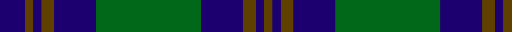

In pattern [BGBGBGBGBG](/patterns/bgbgbgbgbg/).

This was sourced from register-of-tartans.  It is a [10 stripes tartan](/stripes/stripes10/).

Original link https://www.tartanregister.gov.uk/tartanDetails.aspx?ref=1826

## Thread count
DB/12 T4 DB4 T6 DB20 G50 DB20 T6 DB4 T/4

## Palette
Each colour and its ΔE from the base-6 reference it is a variant of.

| Colour | Shade | Base | ΔE (OKLab) |
|---|---|---|---|
| DB | <code style="background-color:#1C0070;">#1C0070</code> `#1C0070` | B <code style="background-color:#2A418A;">#2A418A</code> | 0.14 |
| G | <code style="background-color:#006818;">#006818</code> `#006818` | G <code style="background-color:#006100;">#006100</code> | 0.02 |
| T | <code style="background-color:#604000;">#604000</code> `#604000` | G <code style="background-color:#006100;">#006100</code> | 0.14 |

## Nearest tartans

The nearest existing variants by ΔTartan distance.

1. [Brown, Barnaby (Personal)](/setts/s9/g2r1g8b2g1b2g1b10r2~b202060-g006818-rc8002c~x4/) — ΔT 0.78
1. [Brown, Barnaby (Personal)](/setts/s9/g2r1g8b2g1b2g1b10r2~b2c2c80-g006818-rc80000~x4/) — ΔT 0.80
1. [Barnaby Brown Pibroch](/setts/s9/g2r1g8b2g1b2g1b10r2~b000050-g004010-rc00020~x4/) — ΔT 0.89
1. [Rowan (Name)](/setts/s10/b1k1b8k2y1g12y1b8k1b1~b2c2c80-g006818-k101010-yd09800~x4/) — ΔT 0.95
1. [Shaw](/setts/s10/g24k2b3k2b8r2b8k2b3k2~b2c2c80-g006818-k101010-rc80000~x2/) — ΔT 1.03
1. [MacHarg, Iain](/setts/s9/g20k2g2k2g2k8b24ba3b3~b2c2c80-ba780078-g006818-k101010~x2/) — ΔT 1.13
1. [Kerr Hunting Clan Tartan Tartan Number: 782. Earliest known date: pre 2003 Nothing See products available Copyright © Blair Urquhart, Comrie, 2015](/setts/s10/g14k2g2k2g3k10b16k1b2k2~b2c2c80-g006818-k101010~x2/) — ΔT 1.15
1. [Stewart of Appin Htg (error)](/setts/s10/g8r3g3r5g26b7ba3b28r3b6~b2c2c80-ba5c8ca8-g006818-rc80000~x2/) — ΔT 1.19
1. [Rowan Family Tartan Tartan Number: 2067. Earliest known date: 1990 Designed for Mr Robert Rowan. See products available Copyright © Blair Urquhart, Comrie, 2015](/setts/s9/b1k1b8y1g12y1b8k1b1~b2c2c80-g006818-k101010-ye8c000~x2/) — ΔT 1.23
1. [Black Watch (Military)](/setts/s13/b11k1b1k1b1k8g8k1g8k8b8k1b1~b2c2c80-g006818-k101010~x4/) — ΔT 1.25

## Neighbour map

Every grey dot is one of 15726 variants placed by the first two principal components of the ΔTartan feature space (44% of its variance). Red is this tartan; blue dots are its nearest — click one to open its page.

<svg viewBox="0 0 640 380" role="img" style="max-width:100%;height:auto;border:1px solid #e0e0e0;border-radius:4px;display:block" xmlns="http://www.w3.org/2000/svg"><image href="/nn/cloud.v1.png" width="640" height="380"/><a href="/setts/s9/g2r1g8b2g1b2g1b10r2~b202060-g006818-rc8002c~x4/"><circle cx="316.8" cy="216.6" r="4" fill="#3465a4"><title>Brown, Barnaby (Personal)</title></circle></a><a href="/setts/s9/g2r1g8b2g1b2g1b10r2~b2c2c80-g006818-rc80000~x4/"><circle cx="319.7" cy="216.9" r="4" fill="#3465a4"><title>Brown, Barnaby (Personal)</title></circle></a><a href="/setts/s9/g2r1g8b2g1b2g1b10r2~b000050-g004010-rc00020~x4/"><circle cx="324.9" cy="225.3" r="4" fill="#3465a4"><title>Barnaby Brown Pibroch</title></circle></a><a href="/setts/s10/b1k1b8k2y1g12y1b8k1b1~b2c2c80-g006818-k101010-yd09800~x4/"><circle cx="297.3" cy="181.3" r="4" fill="#3465a4"><title>Rowan (Name)</title></circle></a><a href="/setts/s10/g24k2b3k2b8r2b8k2b3k2~b2c2c80-g006818-k101010-rc80000~x2/"><circle cx="281.6" cy="179.1" r="4" fill="#3465a4"><title>Shaw</title></circle></a><a href="/setts/s9/g20k2g2k2g2k8b24ba3b3~b2c2c80-ba780078-g006818-k101010~x2/"><circle cx="270.2" cy="189.1" r="4" fill="#3465a4"><title>MacHarg, Iain</title></circle></a><a href="/setts/s10/g14k2g2k2g3k10b16k1b2k2~b2c2c80-g006818-k101010~x2/"><circle cx="268.8" cy="198.3" r="4" fill="#3465a4"><title>Kerr Hunting Clan Tartan Tartan Number: 782. Earliest known date: pre 2003 Nothing See products available Copyright © Blair Urquhart, Comrie, 2015</title></circle></a><a href="/setts/s10/g8r3g3r5g26b7ba3b28r3b6~b2c2c80-ba5c8ca8-g006818-rc80000~x2/"><circle cx="268.7" cy="194.3" r="4" fill="#3465a4"><title>Stewart of Appin Htg (error)</title></circle></a><a href="/setts/s9/b1k1b8y1g12y1b8k1b1~b2c2c80-g006818-k101010-ye8c000~x2/"><circle cx="311.8" cy="183.7" r="4" fill="#3465a4"><title>Rowan Family Tartan Tartan Number: 2067. Earliest known date: 1990 Designed for Mr Robert Rowan. See products available Copyright © Blair Urquhart, Comrie, 2015</title></circle></a><a href="/setts/s13/b11k1b1k1b1k8g8k1g8k8b8k1b1~b2c2c80-g006818-k101010~x4/"><circle cx="254.9" cy="213.0" r="4" fill="#3465a4"><title>Black Watch (Military)</title></circle></a><circle cx="310.5" cy="201.5" r="5" fill="#c00000"/></svg>

ID: /setts/s10/b6g2b2g3b10ga25b10g3b2g2~b1c0070-g604000-ga006818~x2/
