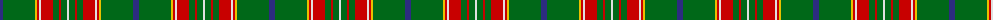

In pattern [BGYRWRGRGW](/patterns/bgyrwrgrgw/).

This was sourced from house-of-tartan.  It is a [10 stripes tartan](/stripes/stripes10/).

Original link http://www.house-of-tartan.scotland.net/house/TartanViewjs.asp?colr=Def&tnam=203

## Thread count
DB/6 G32 Y2 R2 LN2 R12 G6 R2 G6 LN/2

## Palette
Each colour and its ΔE from the base-6 reference it is a variant of.

| Colour | Shade | Base | ΔE (OKLab) |
|---|---|---|---|
| DB | <code style="background-color:#2C2C80;">#2C2C80</code> `#2C2C80` | B <code style="background-color:#2A418A;">#2A418A</code> | 0.06 |
| G | <code style="background-color:#006818;">#006818</code> `#006818` | G <code style="background-color:#006100;">#006100</code> | 0.02 |
| LN | <code style="background-color:#E0E0E0;">#E0E0E0</code> `#E0E0E0` | W <code style="background-color:#F7F7F7;">#F7F7F7</code> | 0.07 |
| R | <code style="background-color:#C80000;">#C80000</code> `#C80000` | R <code style="background-color:#CC0000;">#CC0000</code> | 0.01 |
| Y | <code style="background-color:#E8C000;">#E8C000</code> `#E8C000` | Y <code style="background-color:#F2BF00;">#F2BF00</code> | 0.02 |

## Nearest tartans

The nearest existing variants by ΔTartan distance.

1. [Canadian Caledonian](/setts/s10/b12g64y4r4w4r24g12r4g12w4-b2c2c80-g006818-rc80000-wfcfcfc-ye8c000/) — ΔT 0.22
1. [Hall (P.I.E.) (Personal)](/setts/s8/y10g6y6g106r14b10r26w8-b2c2c80-g006818-r901c38-wf8f8f8-ye8c000/) — ΔT 0.64
1. [Canadian Caledonian](/setts/s10/b6g32y2r2w2r12g6r2g6w2-b304080-g008000-rc00000-we0e0e0-yf0c000/) — ΔT 0.64
1. [Hynde (Sir John)](/setts/s11/g56r4g56r14w4r14w4r14k10b8w4-b6c0070-g006818-k101010-r880000-wc0c0c0/) — ΔT 0.84
1. [Crieff, and Strathearn](/setts/s7/g110b14r48g24ba8y6ba8-b800080-ba304080-g008000-rc00000-yf0c000/) — ΔT 0.93
1. [Crieff and Strathearn District Tartan Tartan Number: 664. Earliest known date: 1988 A branch of the Stewart clan from Galloway and the South West of Scotland. See products available Copyright © Blair Urquhart, Comrie, 2015](/setts/s7/g110b14r48g24ba8y6ba8-b780078-ba2c2c80-g006818-rc80000-ye8c000/) — ΔT 0.98
1. [Ronald, Clan (Clan)](/setts/s11/b8r4g40r4k24g48r8g4r4g12w8-b2c2c80-g006818-k101010-rc80000-we0e0e0/) — ΔT 1.04
1. [McAlifyfe (Personal)](/setts/s11/g6k6r12g12ra24g6k4g60y4g6k6-g707c30-k101010-rcc78a4-racc688c-ye8c000/) — ΔT 1.07
1. [William & Mary GALA (Corporate)](/setts/s11/k6b20g50y4g4y6g4y4g50b20w6-b2c2c80-g285800-k101010-wf8f8f8-ye8c000/) — ΔT 1.10
1. [Cavalier, Green](/setts/s11/g80b20r4b4w4b6ra16g12b4g8w4-b1c1c1c-g5c6428-ra07c58-raa00000-we0e0e0/) — ΔT 1.15

## Neighbour map

Every grey dot is one of 15726 variants placed by the first two principal components of the ΔTartan feature space (44% of its variance). Red is this tartan; blue dots are its nearest — click one to open its page.

<svg viewBox="0 0 640 380" role="img" style="max-width:100%;height:auto;border:1px solid #e0e0e0;border-radius:4px;display:block" xmlns="http://www.w3.org/2000/svg"><image href="/nn/cloud.v1.png" width="640" height="380"/><a href="/setts/s10/b12g64y4r4w4r24g12r4g12w4-b2c2c80-g006818-rc80000-wfcfcfc-ye8c000/"><circle cx="331.7" cy="129.2" r="4" fill="#3465a4"><title>Canadian Caledonian</title></circle></a><a href="/setts/s8/y10g6y6g106r14b10r26w8-b2c2c80-g006818-r901c38-wf8f8f8-ye8c000/"><circle cx="342.2" cy="129.9" r="4" fill="#3465a4"><title>Hall (P.I.E.) (Personal)</title></circle></a><a href="/setts/s10/b6g32y2r2w2r12g6r2g6w2-b304080-g008000-rc00000-we0e0e0-yf0c000/"><circle cx="337.6" cy="132.2" r="4" fill="#3465a4"><title>Canadian Caledonian</title></circle></a><a href="/setts/s11/g56r4g56r14w4r14w4r14k10b8w4-b6c0070-g006818-k101010-r880000-wc0c0c0/"><circle cx="333.2" cy="150.4" r="4" fill="#3465a4"><title>Hynde (Sir John)</title></circle></a><a href="/setts/s7/g110b14r48g24ba8y6ba8-b800080-ba304080-g008000-rc00000-yf0c000/"><circle cx="356.6" cy="152.7" r="4" fill="#3465a4"><title>Crieff, and Strathearn</title></circle></a><a href="/setts/s7/g110b14r48g24ba8y6ba8-b780078-ba2c2c80-g006818-rc80000-ye8c000/"><circle cx="363.7" cy="155.5" r="4" fill="#3465a4"><title>Crieff and Strathearn District Tartan Tartan Number: 664. Earliest known date: 1988 A branch of the Stewart clan from Galloway and the South West of Scotland. See products available Copyright © Blair Urquhart, Comrie, 2015</title></circle></a><a href="/setts/s11/b8r4g40r4k24g48r8g4r4g12w8-b2c2c80-g006818-k101010-rc80000-we0e0e0/"><circle cx="321.0" cy="158.6" r="4" fill="#3465a4"><title>Ronald, Clan (Clan)</title></circle></a><a href="/setts/s11/g6k6r12g12ra24g6k4g60y4g6k6-g707c30-k101010-rcc78a4-racc688c-ye8c000/"><circle cx="350.4" cy="134.3" r="4" fill="#3465a4"><title>McAlifyfe (Personal)</title></circle></a><a href="/setts/s11/k6b20g50y4g4y6g4y4g50b20w6-b2c2c80-g285800-k101010-wf8f8f8-ye8c000/"><circle cx="320.5" cy="150.9" r="4" fill="#3465a4"><title>William &amp; Mary GALA (Corporate)</title></circle></a><a href="/setts/s11/g80b20r4b4w4b6ra16g12b4g8w4-b1c1c1c-g5c6428-ra07c58-raa00000-we0e0e0/"><circle cx="384.6" cy="119.1" r="4" fill="#3465a4"><title>Cavalier, Green</title></circle></a><circle cx="338.3" cy="132.1" r="5" fill="#c00000"/></svg>

ID: /setts/s10/b6g32y2r2w2r12g6r2g6w2-b2c2c80-g006818-rc80000-we0e0e0-ye8c000/
