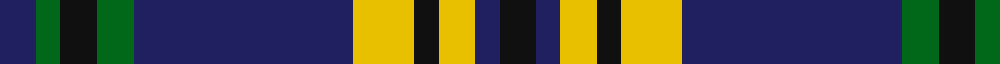

In pattern [BGKGBYKYBK](/patterns/bgkgbykybk/).

This was sourced from house-of-tartan.  It is a [10 stripes tartan](/stripes/stripes10/).

Original link http://www.house-of-tartan.scotland.net/house/TartanViewjs.asp?colr=Def&tnam=2398

## Thread count
DBa/6 G4 K6 G6 DBa36 Y10 K4 Y6 DBa4 K/6

## Palette
Each colour and its ΔE from the base-6 reference it is a variant of.

| Colour | Shade | Base | ΔE (OKLab) |
|---|---|---|---|
| DB | <code style="background-color:#2C2C80;">#2C2C80</code> `#2C2C80` | B <code style="background-color:#2A418A;">#2A418A</code> | 0.06 |
| DBa | <code style="background-color:#202060;">#202060</code> `#202060` | B <code style="background-color:#2A418A;">#2A418A</code> | 0.11 |
| G | <code style="background-color:#006818;">#006818</code> `#006818` | G <code style="background-color:#006100;">#006100</code> | 0.02 |
| K | <code style="background-color:#101010;">#101010</code> `#101010` | K <code style="background-color:#000000;">#000000</code> | 0.17 |
| Y | <code style="background-color:#E8C000;">#E8C000</code> `#E8C000` | Y <code style="background-color:#F2BF00;">#F2BF00</code> | 0.02 |

## Nearest tartans

The nearest existing variants by ΔTartan distance.

1. [Australian Police](/setts/s8/k10w10k10b22k6g34k60b6-b2888c4-g808080-k101010-we0e0e0/) — ΔT 0.74
1. [Guthrie (Name)](/setts/s9/k4g48k48r4k4r4k48b48r4-b1474b4-g408060-k101010-rc80000/) — ΔT 0.95
1. [Tweedside Hunting](/setts/s9/b72g8k8g20w8g8w8g8k8-b2c2c80-g006818-k101010-wfcfcfc/) — ΔT 0.95
1. [Murray of Elibank](/setts/s13/b56k6g24k6b8k21y6k21b8k6g24k6b56-b304080-g008000-k000000-yf0c000/) — ΔT 1.01
1. [Clan Iain Mhor (Name)](/setts/s13/g44w4g4b6ba4w4ba38w4ba4b6ba4w4ba38-b680028-ba1c1c1c-g006038-wfcfcfc/) — ΔT 1.08
1. [Auld Lang Syne, Grey Weavers Tartan Tartan Number: 8081. Earliest known date: pre 2007 From a woven sample from the weavers, Marton Mills. See products available Copyright © Blair Urquhart, Comrie, 2015](/setts/s12/w8k4r18r6ra6k6ra6k46r20k4r12k4-k101010-r888888-ra880000-we0e0e0/) — ΔT 1.08
1. [Tennessee State American District Tartan Tartan Number: 3067. Earliest known date: 1999 Official state tartan recorded at the Grandfather Mountain Highland Games, 1999. This ties in with the tartan displayed on the Tennessee Highland Game website. Colour choice explained as follows: Green for Agriculture; Blue for the Smoky Mountains; Purple for the State Flower the Iris; Red for Sacrifices of Veterans and Pioneers of the Volunteer State; White to symbolize the 3 Grand Divisions of the State of Tennessee. See products available Copyright © Blair Urquhart, Comrie, 2015](/setts/s10/r8b48w4b4g4r4g28b4g48w4-b1c0070-g006818-rc80000-we0e0e0/) — ΔT 1.08
1. [State Seal of Oregon (Fashion)](/setts/s13/b8k14y6k6b68k34b8k10b8k14ya22b10y8-b1474b4-k101010-ybc8c00-yaa08858/) — ΔT 1.11
1. [Dunbog Primary School](/setts/s10/r24b6g10b32y4g4y4b32g10b6-b000048-g447438-rc80000-ye8c000/) — ΔT 1.11
1. [Laing of Archiestown Clan/Family Tartan Tartan Number: 2544. Earliest known date: 1783 Said to have been woven in 1783 in Knockando Morayshire, by William Donald Laing of Queensland, Australia who donated a sample to the Tartans Society in 1996. The dark line in the centre of the red band is either blue or black. Apparently William Laing acquired the piece of tartan in 1961 from a Mr Jack Garden whose g.g. grandfather was John Laing (dob 1767) who wove the tartan. In the 1810 census he lived in his shop in the Square at Archiestown. See products available Copyright © Blair Urquhart, Comrie, 2015](/setts/s8/k8r8ka8r8b64r8ka8r8-b1474b4-k101010-ka000000-rc80000/) — ΔT 1.13

## Neighbour map

Every grey dot is one of 15726 variants placed by the first two principal components of the ΔTartan feature space (44% of its variance). Red is this tartan; blue dots are its nearest — click one to open its page.

<svg viewBox="0 0 640 380" role="img" style="max-width:100%;height:auto;border:1px solid #e0e0e0;border-radius:4px;display:block" xmlns="http://www.w3.org/2000/svg"><image href="/nn/cloud.v1.png" width="640" height="380"/><a href="/setts/s8/k10w10k10b22k6g34k60b6-b2888c4-g808080-k101010-we0e0e0/"><circle cx="255.2" cy="188.4" r="4" fill="#3465a4"><title>Australian Police</title></circle></a><a href="/setts/s9/k4g48k48r4k4r4k48b48r4-b1474b4-g408060-k101010-rc80000/"><circle cx="252.6" cy="184.2" r="4" fill="#3465a4"><title>Guthrie (Name)</title></circle></a><a href="/setts/s9/b72g8k8g20w8g8w8g8k8-b2c2c80-g006818-k101010-wfcfcfc/"><circle cx="239.5" cy="166.5" r="4" fill="#3465a4"><title>Tweedside Hunting</title></circle></a><a href="/setts/s13/b56k6g24k6b8k21y6k21b8k6g24k6b56-b304080-g008000-k000000-yf0c000/"><circle cx="237.5" cy="177.0" r="4" fill="#3465a4"><title>Murray of Elibank</title></circle></a><a href="/setts/s13/g44w4g4b6ba4w4ba38w4ba4b6ba4w4ba38-b680028-ba1c1c1c-g006038-wfcfcfc/"><circle cx="279.2" cy="149.9" r="4" fill="#3465a4"><title>Clan Iain Mhor (Name)</title></circle></a><a href="/setts/s12/w8k4r18r6ra6k6ra6k46r20k4r12k4-k101010-r888888-ra880000-we0e0e0/"><circle cx="235.3" cy="154.7" r="4" fill="#3465a4"><title>Auld Lang Syne, Grey Weavers Tartan Tartan Number: 8081. Earliest known date: pre 2007 From a woven sample from the weavers, Marton Mills. See products available Copyright © Blair Urquhart, Comrie, 2015</title></circle></a><a href="/setts/s10/r8b48w4b4g4r4g28b4g48w4-b1c0070-g006818-rc80000-we0e0e0/"><circle cx="282.3" cy="164.4" r="4" fill="#3465a4"><title>Tennessee State American District Tartan Tartan Number: 3067. Earliest known date: 1999 Official state tartan recorded at the Grandfather Mountain Highland Games, 1999. This ties in with the tartan displayed on the Tennessee Highland Game website. Colour choice explained as follows: Green for Agriculture; Blue for the Smoky Mountains; Purple for the State Flower the Iris; Red for Sacrifices of Veterans and Pioneers of the Volunteer State; White to symbolize the 3 Grand Divisions of the State of Tennessee. See products available Copyright © Blair Urquhart, Comrie, 2015</title></circle></a><a href="/setts/s13/b8k14y6k6b68k34b8k10b8k14ya22b10y8-b1474b4-k101010-ybc8c00-yaa08858/"><circle cx="240.6" cy="161.2" r="4" fill="#3465a4"><title>State Seal of Oregon (Fashion)</title></circle></a><a href="/setts/s10/r24b6g10b32y4g4y4b32g10b6-b000048-g447438-rc80000-ye8c000/"><circle cx="262.2" cy="193.8" r="4" fill="#3465a4"><title>Dunbog Primary School</title></circle></a><a href="/setts/s8/k8r8ka8r8b64r8ka8r8-b1474b4-k101010-ka000000-rc80000/"><circle cx="270.3" cy="168.6" r="4" fill="#3465a4"><title>Laing of Archiestown Clan/Family Tartan Tartan Number: 2544. Earliest known date: 1783 Said to have been woven in 1783 in Knockando Morayshire, by William Donald Laing of Queensland, Australia who donated a sample to the Tartans Society in 1996. The dark line in the centre of the red band is either blue or black. Apparently William Laing acquired the piece of tartan in 1961 from a Mr Jack Garden whose g.g. grandfather was John Laing (dob 1767) who wove the tartan. In the 1810 census he lived in his shop in the Square at Archiestown. See products available Copyright © Blair Urquhart, Comrie, 2015</title></circle></a><circle cx="243.2" cy="171.7" r="5" fill="#c00000"/></svg>

ID: /setts/s10/b6g4k6g6b36y10k4y6b4k6-b202060-g006818-k101010-ye8c000/
