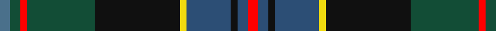

In pattern [BGRGKYBKBR](/patterns/bgrgkybkbr/).

This was sourced from register-of-tartans.  It is a [10 stripes tartan](/stripes/stripes10/).

Original link https://www.tartanregister.gov.uk/tartanDetails.aspx?ref=10725

## Thread count
B/6 DG6 R4 DG40 K50 Y4 Ba26 K4 Ba6 R/6

## Palette
Each colour and its ΔE from the base-6 reference it is a variant of.

| Colour | Shade | Base | ΔE (OKLab) |
|---|---|---|---|
| B | <code style="background-color:#4A708B;">#4A708B</code> `#4A708B` | B <code style="background-color:#2A418A;">#2A418A</code> | 0.15 |
| Ba | <code style="background-color:#2C4E75;">#2C4E75</code> `#2C4E75` | B <code style="background-color:#2A418A;">#2A418A</code> | 0.06 |
| DG | <code style="background-color:#124D36;">#124D36</code> `#124D36` | G <code style="background-color:#006100;">#006100</code> | 0.10 |
| K | <code style="background-color:#101010;">#101010</code> `#101010` | K <code style="background-color:#000000;">#000000</code> | 0.17 |
| R | <code style="background-color:#FF0000;">#FF0000</code> `#FF0000` | R <code style="background-color:#CC0000;">#CC0000</code> | 0.11 |
| Y | <code style="background-color:#F0DA0F;">#F0DA0F</code> `#F0DA0F` | Y <code style="background-color:#F2BF00;">#F2BF00</code> | 0.07 |

## Nearest tartans

The nearest existing variants by ΔTartan distance.

1. [Loch Freuchie District Tartan Tartan Number: 10725. Earliest known date: 25 October 2012 A tartan for the area around Loch Freuchie near Crieff. The tartan is based on the Murray of Atholl and Breadalbane setts, with differences, to relate the tartan to the particular Loch Freuchie area. Mr MacArthur-Fox has created a tartan for anyone to wear without fear of offending another person or group. See products available Copyright © Blair Urquhart, Comrie, 2015](/setts/s10/b6g6r4g40k50ka4ba26k4ba6r6-b4a708b-ba2c4e75-g124d36-k101010-ka000000-rff0000/) — ΔT 0.48
1. [Loch Freuchie (District)](/setts/s10/r6b6k4b36y4k50g40r4g6w6-b003c64-g006818-k101010-rc80000-w98c8e8-yfccc00/) — ΔT 0.70
1. [Wojtek Memorial Trust](/setts/s11/w6b30r12b6r6b8g22ga6g6ga56y6-b202060-g003820-ga005020-rdc0000-wffffff-ya08858/) — ΔT 0.71
1. [Wcwm 1290](/setts/s11/g56w4g6y8g6w4g6k28ya4b56w6-b202060-g003820-k101010-wc0c0c0-yd09800-ya48a4c0/) — ΔT 0.73
1. [Schmidt (2014)](/setts/s10/k6b40ba16b8g40k4g4r4g6y6-b202060-ba2c2c80-g006818-k101010-rc80000-yfccc00/) — ΔT 0.75
1. [Ayrton (amended)](/setts/s11/r8k4g50k4b20k4g8k4ba50k4y8-b3c82af-ba2c4084-g005020-k101010-rdc0000-ye8c000/) — ΔT 0.80
1. [Big Rory (Corporate)](/setts/s10/b10w5b48k35g5k5g35r5g5ba5-b2c607c-ba780078-g006818-k101010-rc80000-we0e0e0/) — ΔT 0.85
1. [Real Mary King's Close, The](/setts/s9/k4r4k30ra4k8ra4b18ba54w4-b545151-ba352f2f-k101010-red0808-ra8d8a8a-wffffff/) — ΔT 0.86
1. [Trades House](/setts/s9/r8g8b36k40ga48k4g4k4y4-b0c585c-g789484-ga00643c-k101010-rc80000-ye8c000/) — ΔT 0.87
1. [Whitson (Name)](/setts/s9/w16k4g76y4k76b52r8b16r8-b0c585c-g3c6040-k101010-r880000-wc0c0c0-yd09800/) — ΔT 0.92

## Neighbour map

Every grey dot is one of 15726 variants placed by the first two principal components of the ΔTartan feature space (44% of its variance). Red is this tartan; blue dots are its nearest — click one to open its page.

<svg viewBox="0 0 640 380" role="img" style="max-width:100%;height:auto;border:1px solid #e0e0e0;border-radius:4px;display:block" xmlns="http://www.w3.org/2000/svg"><image href="/nn/cloud.v1.png" width="640" height="380"/><a href="/setts/s10/b6g6r4g40k50ka4ba26k4ba6r6-b4a708b-ba2c4e75-g124d36-k101010-ka000000-rff0000/"><circle cx="187.8" cy="150.6" r="4" fill="#3465a4"><title>Loch Freuchie District Tartan Tartan Number: 10725. Earliest known date: 25 October 2012 A tartan for the area around Loch Freuchie near Crieff. The tartan is based on the Murray of Atholl and Breadalbane setts, with differences, to relate the tartan to the particular Loch Freuchie area. Mr MacArthur-Fox has created a tartan for anyone to wear without fear of offending another person or group. See products available Copyright © Blair Urquhart, Comrie, 2015</title></circle></a><a href="/setts/s10/r6b6k4b36y4k50g40r4g6w6-b003c64-g006818-k101010-rc80000-w98c8e8-yfccc00/"><circle cx="149.7" cy="139.1" r="4" fill="#3465a4"><title>Loch Freuchie (District)</title></circle></a><a href="/setts/s11/w6b30r12b6r6b8g22ga6g6ga56y6-b202060-g003820-ga005020-rdc0000-wffffff-ya08858/"><circle cx="154.5" cy="149.8" r="4" fill="#3465a4"><title>Wojtek Memorial Trust</title></circle></a><a href="/setts/s11/g56w4g6y8g6w4g6k28ya4b56w6-b202060-g003820-k101010-wc0c0c0-yd09800-ya48a4c0/"><circle cx="198.0" cy="130.3" r="4" fill="#3465a4"><title>Wcwm 1290</title></circle></a><a href="/setts/s10/k6b40ba16b8g40k4g4r4g6y6-b202060-ba2c2c80-g006818-k101010-rc80000-yfccc00/"><circle cx="169.1" cy="154.2" r="4" fill="#3465a4"><title>Schmidt (2014)</title></circle></a><a href="/setts/s11/r8k4g50k4b20k4g8k4ba50k4y8-b3c82af-ba2c4084-g005020-k101010-rdc0000-ye8c000/"><circle cx="166.3" cy="132.9" r="4" fill="#3465a4"><title>Ayrton (amended)</title></circle></a><a href="/setts/s10/b10w5b48k35g5k5g35r5g5ba5-b2c607c-ba780078-g006818-k101010-rc80000-we0e0e0/"><circle cx="163.8" cy="157.2" r="4" fill="#3465a4"><title>Big Rory (Corporate)</title></circle></a><a href="/setts/s9/k4r4k30ra4k8ra4b18ba54w4-b545151-ba352f2f-k101010-red0808-ra8d8a8a-wffffff/"><circle cx="224.3" cy="144.0" r="4" fill="#3465a4"><title>Real Mary King's Close, The</title></circle></a><a href="/setts/s9/r8g8b36k40ga48k4g4k4y4-b0c585c-g789484-ga00643c-k101010-rc80000-ye8c000/"><circle cx="148.5" cy="156.1" r="4" fill="#3465a4"><title>Trades House</title></circle></a><a href="/setts/s9/w16k4g76y4k76b52r8b16r8-b0c585c-g3c6040-k101010-r880000-wc0c0c0-yd09800/"><circle cx="169.5" cy="139.8" r="4" fill="#3465a4"><title>Whitson (Name)</title></circle></a><circle cx="174.5" cy="143.6" r="5" fill="#c00000"/></svg>

ID: /setts/s10/b6g6r4g40k50y4ba26k4ba6r6-b4a708b-ba2c4e75-g124d36-k101010-rff0000-yf0da0f/
