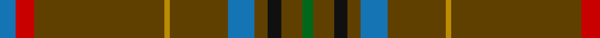

This page is one **sett** — a single exact thread-count. It belongs to the [tartan](/tartans/b6r7dy49lo2dy22b10dy5k5dy8g4/)
(the same proportion at any scale), whose colour order is pattern [BRGYGBGKGG](/stripes/brgygbgkgg/).

Sourced from tartans-authority.  It is a [10 stripe tartan](/stripes/stripes10/).

Original link http://www.tartansauthority.com/tartan-ferret/display/8639/

## Register references

External register numbers recorded for this tartan.

- Scottish Register of Tartans: [8639](https://www.tartanregister.gov.uk/tartanDetails?ref=8639)
- Scottish Tartans Authority (ITI): 8639

## Thread count
B/12 R14 T98 DY4 T44 B20 T10 K10 T16 G/8

## Palette

Palette: <strong>Tartan Register</strong>
<table><thead><tr><th>Colour</th><th>Threads</th><th>Shade</th><th>Base</th><th>OKLCh</th></tr></thead><tbody><tr><td>B/</td><td style="text-align:right;font-variant-numeric:tabular-nums">12</td><td><code style="background-color:#1474B4;">#1474B4</code> <small style="color:#888">#1474B4</small></td><td>B <code style="background-color:#2A418A;">#2A418A</code></td><td><small style="color:#888">oklch(54.0% 0.129 245.1)</small></td></tr><tr><td>R</td><td style="text-align:right;font-variant-numeric:tabular-nums">14</td><td><code style="background-color:#C80000;">#C80000</code> <small style="color:#888">#C80000</small></td><td>R <code style="background-color:#CC0000;">#CC0000</code></td><td><small style="color:#888">oklch(52.3% 0.215 29.2)</small></td></tr><tr><td>T</td><td style="text-align:right;font-variant-numeric:tabular-nums">98</td><td><code style="background-color:#604000;">#604000</code> <small style="color:#888">#604000</small></td><td>G <code style="background-color:#006100;">#006100</code></td><td><small style="color:#888">oklch(39.8% 0.083 76.8)</small></td></tr><tr><td>DY</td><td style="text-align:right;font-variant-numeric:tabular-nums">4</td><td><code style="background-color:#BC8C00;">#BC8C00</code> <small style="color:#888">#BC8C00</small></td><td>Y <code style="background-color:#F2BF00;">#F2BF00</code></td><td><small style="color:#888">oklch(66.8% 0.137 84.1)</small></td></tr><tr><td>T</td><td style="text-align:right;font-variant-numeric:tabular-nums">44</td><td><code style="background-color:#604000;">#604000</code> <small style="color:#888">#604000</small></td><td>G <code style="background-color:#006100;">#006100</code></td><td><small style="color:#888">oklch(39.8% 0.083 76.8)</small></td></tr><tr><td>B</td><td style="text-align:right;font-variant-numeric:tabular-nums">20</td><td><code style="background-color:#1474B4;">#1474B4</code> <small style="color:#888">#1474B4</small></td><td>B <code style="background-color:#2A418A;">#2A418A</code></td><td><small style="color:#888">oklch(54.0% 0.129 245.1)</small></td></tr><tr><td>T</td><td style="text-align:right;font-variant-numeric:tabular-nums">10</td><td><code style="background-color:#604000;">#604000</code> <small style="color:#888">#604000</small></td><td>G <code style="background-color:#006100;">#006100</code></td><td><small style="color:#888">oklch(39.8% 0.083 76.8)</small></td></tr><tr><td>K</td><td style="text-align:right;font-variant-numeric:tabular-nums">10</td><td><code style="background-color:#101010;">#101010</code> <small style="color:#888">#101010</small></td><td>K <code style="background-color:#000000;">#000000</code></td><td><small style="color:#888">oklch(17.3% 0.000 89.9)</small></td></tr><tr><td>T</td><td style="text-align:right;font-variant-numeric:tabular-nums">16</td><td><code style="background-color:#604000;">#604000</code> <small style="color:#888">#604000</small></td><td>G <code style="background-color:#006100;">#006100</code></td><td><small style="color:#888">oklch(39.8% 0.083 76.8)</small></td></tr><tr><td>G/</td><td style="text-align:right;font-variant-numeric:tabular-nums">8</td><td><code style="background-color:#006818;">#006818</code> <small style="color:#888">#006818</small></td><td>G <code style="background-color:#006100;">#006100</code></td><td><small style="color:#888">oklch(45.0% 0.142 145.0)</small></td></tr></tbody></table>

## Nearest tartans

The nearest existing variants by ΔTartan distance, with this tartan at the top so the swatches line up against it.

ΔTartan

Tartan

Sett

—

<a href="/ttd/edit/#slug=b6r7dy49lo2dy22b10dy5k5dy8g4~x2">State Seal of Missouri (Fashion)</a> <a class="nn-out" href="/setts/s10/b6r7dy49lo2dy22b10dy5k5dy8g4~x2/" title="open its dictionary page">↗</a>

1.23

<a href="/ttd/edit/#slug=dy44ly2k4dp2dy15m6k3t3ly2~x2">Inches of Perth (District or Clan)</a> <a class="nn-out" href="/setts/s9/dy44ly2k4dp2dy15m6k3t3ly2~x2/" title="open its dictionary page">↗</a>

1.47

<a href="/ttd/edit/#slug=dy45k5dy28k5r5w2do6~x2">Leiato of American Samoa (Personal)</a> <a class="nn-out" href="/setts/s7/dy45k5dy28k5r5w2do6~x2/" title="open its dictionary page">↗</a>

1.75

<a href="/ttd/edit/#slug=y40n3y8r2y2w2y10n6do2n2w2~x2">Spencer</a> <a class="nn-out" href="/setts/s11/y40n3y8r2y2w2y10n6do2n2w2~x2/" title="open its dictionary page">↗</a>

1.78

<a href="/ttd/edit/#slug=r4lo40n12o2n12lo30k2lo4k2lo4o2lo3k3~x2">Bartlett (Personal)</a> <a class="nn-out" href="/setts/s13/r4lo40n12o2n12lo30k2lo4k2lo4o2lo3k3~x2/" title="open its dictionary page">↗</a>

1.80

<a href="/ttd/edit/#slug=dg43dp3o3dp2o4r3g2dg13g2o9dg1lo2~x2">Berry Tribute</a> <a class="nn-out" href="/setts/s12/dg43dp3o3dp2o4r3g2dg13g2o9dg1lo2~x2/" title="open its dictionary page">↗</a>

1.82

<a href="/ttd/edit/#slug=n19do2k3o1k1w1k1do6n3k1n6~x4">Glen Clova #1</a> <a class="nn-out" href="/setts/s11/n19do2k3o1k1w1k1do6n3k1n6~x4/" title="open its dictionary page">↗</a>

1.87

<a href="/ttd/edit/#slug=do6o1do40n1do12o12dp6o2r2o4~x2">Lochnagar Dark (Fashion)</a> <a class="nn-out" href="/setts/s10/do6o1do40n1do12o12dp6o2r2o4~x2/" title="open its dictionary page">↗</a>

1.90

<a href="/ttd/edit/#slug=n18w2k1w4g13n40r2~x2">Puxty-Dunne (Personal)</a> <a class="nn-out" href="/setts/s7/n18w2k1w4g13n40r2~x2/" title="open its dictionary page">↗</a>

1.92

<a href="/ttd/edit/#slug=do68k4do18dt20k3lb3k10lr8lo4">Carbon</a> <a class="nn-out" href="/setts/s9/do68k4do18dt20k3lb3k10lr8lo4/" title="open its dictionary page">↗</a>

1.92

<a href="/ttd/edit/#slug=dt18w2k1w4dg13dt40r2~x2">Puxty-Dunne</a> <a class="nn-out" href="/setts/s7/dt18w2k1w4dg13dt40r2~x2/" title="open its dictionary page">↗</a>

## Neighbour map

Every grey dot is one of 14359 variants placed by the first two principal components of the ΔTartan feature space (44% of its variance). Red is this tartan; blue dots are its nearest — click one to open its page.

<svg viewBox="0 0 640 380" role="img" style="max-width:100%;height:auto;border:1px solid #e0e0e0;border-radius:4px;display:block" xmlns="http://www.w3.org/2000/svg"><image href="/nn/cloud.v1.png" width="640" height="380"/><a href="/setts/s9/dy44ly2k4dp2dy15m6k3t3ly2~x2/"><circle cx="478.4" cy="122.7" r="4" fill="#3465a4"><title>Inches of Perth (District or Clan)</title></circle></a><a href="/setts/s7/dy45k5dy28k5r5w2do6~x2/"><circle cx="546.1" cy="188.2" r="4" fill="#3465a4"><title>Leiato of American Samoa (Personal)</title></circle></a><a href="/setts/s11/y40n3y8r2y2w2y10n6do2n2w2~x2/"><circle cx="537.7" cy="140.6" r="4" fill="#3465a4"><title>Spencer</title></circle></a><a href="/setts/s13/r4lo40n12o2n12lo30k2lo4k2lo4o2lo3k3~x2/"><circle cx="453.2" cy="138.9" r="4" fill="#3465a4"><title>Bartlett (Personal)</title></circle></a><a href="/setts/s12/dg43dp3o3dp2o4r3g2dg13g2o9dg1lo2~x2/"><circle cx="466.0" cy="100.9" r="4" fill="#3465a4"><title>Berry Tribute</title></circle></a><a href="/setts/s11/n19do2k3o1k1w1k1do6n3k1n6~x4/"><circle cx="410.1" cy="145.6" r="4" fill="#3465a4"><title>Glen Clova #1</title></circle></a><a href="/setts/s10/do6o1do40n1do12o12dp6o2r2o4~x2/"><circle cx="477.3" cy="125.3" r="4" fill="#3465a4"><title>Lochnagar Dark (Fashion)</title></circle></a><a href="/setts/s7/n18w2k1w4g13n40r2~x2/"><circle cx="507.2" cy="150.1" r="4" fill="#3465a4"><title>Puxty-Dunne (Personal)</title></circle></a><a href="/setts/s9/do68k4do18dt20k3lb3k10lr8lo4/"><circle cx="402.9" cy="143.2" r="4" fill="#3465a4"><title>Carbon</title></circle></a><a href="/setts/s7/dt18w2k1w4dg13dt40r2~x2/"><circle cx="503.3" cy="152.9" r="4" fill="#3465a4"><title>Puxty-Dunne</title></circle></a><circle cx="475.7" cy="145.2" r="5" fill="#c00000"/></svg>

ID: /setts/s10/b6r7dy49lo2dy22b10dy5k5dy8g4~x2/
