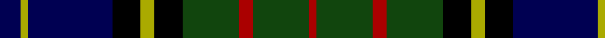

In pattern [BYBKYKGRGR](/patterns/bybkykgrgr/).

This was sourced from weddslist.  It is a [10 stripes tartan](/stripes/stripes10/).

Original link http://www.weddslist.com/cgi-bin/tartans/pg.pl?source=tinsel

## Attestations

This cloth appears in 2 source records; the oldest owns this page.

- undated — MacMillan Hunting (weddslist, [record](http://www.weddslist.com/cgi-bin/tartans/pg.pl?source=tinsel))
- undated — MacMillan Hunting (weddslist, [record](http://www.weddslist.com/cgi-bin/tartans/pg.pl?source=x))

## Thread count
DB/6 LG2 DB24 K8 LG4 K8 DG16 DR4 DG16 DR/2

## Palette
Each colour and its ΔE from the base-6 reference it is a variant of.

| Colour | Shade | Base | ΔE (OKLab) |
|---|---|---|---|
| DB | <code style="background-color:#000052;">#000052</code> `#000052` | B <code style="background-color:#2C4084;">#2C4084</code> | 0.20 |
| DG | <code style="background-color:#11450D;">#11450D</code> `#11450D` | G <code style="background-color:#006400;">#006400</code> | 0.10 |
| DR | <code style="background-color:#AA0000;">#AA0000</code> `#AA0000` | R <code style="background-color:#C80000;">#C80000</code> | 0.06 |
| K | <code style="background-color:#000000;">#000000</code> `#000000` | K <code style="background-color:#000000;">#000000</code> | 0.00 |
| LG | <code style="background-color:#AAAA00;">#AAAA00</code> `#AAAA00` | Y <code style="background-color:#E8C000;">#E8C000</code> | 0.11 |

## Nearest tartans

The nearest existing variants by ΔTartan distance.

1. [MacMillan Hunting](/setts/s10/b6y2b24k8y4k8g16r4g16r2-b000064-g004c00-k000000-rc80000-yc8c800/) — ΔT 0.49
1. [MacDonell of Glengarry](/setts/s11/b16r8b24r2k24g24r6g4r2g8w2-b000064-g004c00-k000000-rc80000-wd0d0d0/) — ΔT 0.62
1. [MacDonell of Glengarry](/setts/s11/b16r8b24r2k24g24r6g4r2g8y2-b000052-g11450d-k000000-raa0000-yaaaaaa/) — ΔT 0.62
1. [Cameron of Erracht](/setts/s11/g16r2g2r6g32k32r2b32r6b16y4-b000052-g11450d-k000000-raa0000-yaaaa00/) — ΔT 0.74
1. [Cameron of Erracht](/setts/s11/g8r1g1r3g16k16r1b16r3b8y2-b000052-g11450d-k000000-raa0000-yaaaa00/) — ΔT 0.74
1. [Cameron of Erracht](/setts/s11/g8r1g1r3g16k16r1b16r3b8y2-b00004c-g004c00-k000000-rc80000-yffc800/) — ΔT 0.75
1. [MacDonald of Clanranald](/setts/s13/b16r2b4r6b24r2k24w2g24r6g4r2g16-b000064-g004c00-k000000-rc80000-wd0d0d0/) — ΔT 0.76
1. [Campbell of Loudon](/setts/s13/y4k1g12k12b12k1b4k1b12k12g12k1ya4-b000052-g11450d-k000000-yaaaa00-yaaaaaaa/) — ΔT 0.80
1. [MacEwan](/setts/s13/r8k2g24k24b24k2b8k2b24k24g24k2y8-b000052-g11450d-k000000-raa0000-yaaaa00/) — ΔT 0.81
1. [MacDonald of Clanranald](/setts/s13/b16r2b4r6b24r2k24y2g24r6g4r2g16-b000052-g11450d-k000000-raa0000-yaaaaaa/) — ΔT 0.81

## Neighbour map

Every grey dot is one of 15726 variants placed by the first two principal components of the ΔTartan feature space (44% of its variance). Red is this tartan; blue dots are its nearest — click one to open its page.

<svg viewBox="0 0 640 380" role="img" style="max-width:100%;height:auto;border:1px solid #e0e0e0;border-radius:4px;display:block" xmlns="http://www.w3.org/2000/svg"><image href="/nn/cloud.v1.png" width="640" height="380"/><a href="/setts/s10/b6y2b24k8y4k8g16r4g16r2-b000064-g004c00-k000000-rc80000-yc8c800/"><circle cx="137.1" cy="173.5" r="4" fill="#3465a4"><title>MacMillan Hunting</title></circle></a><a href="/setts/s11/b16r8b24r2k24g24r6g4r2g8w2-b000064-g004c00-k000000-rc80000-wd0d0d0/"><circle cx="134.1" cy="165.3" r="4" fill="#3465a4"><title>MacDonell of Glengarry</title></circle></a><a href="/setts/s11/b16r8b24r2k24g24r6g4r2g8y2-b000052-g11450d-k000000-raa0000-yaaaaaa/"><circle cx="148.9" cy="172.4" r="4" fill="#3465a4"><title>MacDonell of Glengarry</title></circle></a><a href="/setts/s11/g16r2g2r6g32k32r2b32r6b16y4-b000052-g11450d-k000000-raa0000-yaaaa00/"><circle cx="167.2" cy="157.2" r="4" fill="#3465a4"><title>Cameron of Erracht</title></circle></a><a href="/setts/s11/g8r1g1r3g16k16r1b16r3b8y2-b000052-g11450d-k000000-raa0000-yaaaa00/"><circle cx="167.2" cy="157.2" r="4" fill="#3465a4"><title>Cameron of Erracht</title></circle></a><a href="/setts/s11/g8r1g1r3g16k16r1b16r3b8y2-b00004c-g004c00-k000000-rc80000-yffc800/"><circle cx="153.9" cy="150.9" r="4" fill="#3465a4"><title>Cameron of Erracht</title></circle></a><a href="/setts/s13/b16r2b4r6b24r2k24w2g24r6g4r2g16-b000064-g004c00-k000000-rc80000-wd0d0d0/"><circle cx="140.6" cy="155.2" r="4" fill="#3465a4"><title>MacDonald of Clanranald</title></circle></a><a href="/setts/s13/y4k1g12k12b12k1b4k1b12k12g12k1ya4-b000052-g11450d-k000000-yaaaa00-yaaaaaaa/"><circle cx="125.7" cy="172.8" r="4" fill="#3465a4"><title>Campbell of Loudon</title></circle></a><a href="/setts/s13/r8k2g24k24b24k2b8k2b24k24g24k2y8-b000052-g11450d-k000000-raa0000-yaaaa00/"><circle cx="135.5" cy="176.1" r="4" fill="#3465a4"><title>MacEwan</title></circle></a><a href="/setts/s13/b16r2b4r6b24r2k24y2g24r6g4r2g16-b000052-g11450d-k000000-raa0000-yaaaaaa/"><circle cx="155.8" cy="162.4" r="4" fill="#3465a4"><title>MacDonald of Clanranald</title></circle></a><circle cx="151.1" cy="179.7" r="5" fill="#c00000"/></svg>

ID: /setts/s10/b6y2b24k8y4k8g16r4g16r2-b000052-g11450d-k000000-raa0000-yaaaa00/
