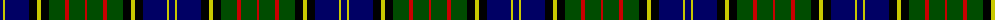

In pattern [BYBKYKGRGR](/patterns/bybkykgrgr/).

This was sourced from weddslist.  It is a [10 stripes tartan](/stripes/stripes10/).

Original link http://www.weddslist.com/cgi-bin/tartans/pg.pl?source=rb

## Thread count
DB/6 Y2 DB24 K8 Y4 K8 G16 R4 G16 R/2

## Palette
Each colour and its ΔE from the base-6 reference it is a variant of.

| Colour | Shade | Base | ΔE (OKLab) |
|---|---|---|---|
| DB | <code style="background-color:#000064;">#000064</code> `#000064` | B <code style="background-color:#2A418A;">#2A418A</code> | 0.18 |
| G | <code style="background-color:#004C00;">#004C00</code> `#004C00` | G <code style="background-color:#006100;">#006100</code> | 0.07 |
| K | <code style="background-color:#000000;">#000000</code> `#000000` | K <code style="background-color:#000000;">#000000</code> | 0.00 |
| R | <code style="background-color:#C80000;">#C80000</code> `#C80000` | R <code style="background-color:#CC0000;">#CC0000</code> | 0.01 |
| Y | <code style="background-color:#C8C800;">#C8C800</code> `#C8C800` | Y <code style="background-color:#F2BF00;">#F2BF00</code> | 0.07 |

## Nearest tartans

The nearest existing variants by ΔTartan distance.

1. [MacMillan Hunting](/setts/s10/b6y2b24k8y4k8g16r4g16r2-b000052-g11450d-k000000-raa0000-yaaaa00/) — ΔT 0.49
1. [Biskup (Personal)](/setts/s10/b24r8b36r4k38g36r8g6y4g16-b00008c-g007800-k000000-r8c0000-yc88c00/) — ΔT 0.55
1. [MacDonell of Glengarry](/setts/s11/b16r8b24r2k24g24r6g4r2g8w2-b000064-g004c00-k000000-rc80000-wd0d0d0/) — ΔT 0.67
1. [Robertson, hunting](/setts/s10/b36k20g18k4r4k4g18k20b18w4-b304080-g008000-k000000-rc00000-we0e0e0/) — ΔT 0.71
1. [Spar (UK) Ltd](/setts/s12/b8k4b40k36g36r4g8w4g36k36b40k8-b304080-g008000-k000000-rc00000-we0e0e0/) — ΔT 0.72
1. [MacLaren](/setts/s11/b44k8b8k8b8k44g44r12g12k4y6-b304080-g008000-k000000-rc00000-yf0c000/) — ΔT 0.76
1. [MacEwen / MacEwan](/setts/s13/r4k2g24k24b24k2b4k2b24k24g24k2y4-b304080-g008000-k000000-rc00000-yf0c000/) — ΔT 0.77
1. [Offally](/setts/s10/r14b4g10b36g20b4k48b4g20y6-b304080-g008000-k000000-r900030-yf0c000/) — ΔT 0.79
1. [Cameron of Erracht](/setts/s11/g8r1g1r3g16k16r1b16r3b8y2-b00004c-g004c00-k000000-rc80000-yffc800/) — ΔT 0.81
1. [Colgan (Personal)](/setts/s9/r14b4g10k48b4g20b56g20w6-b00008c-g007800-k000000-r8c0000-wc8c8c8/) — ΔT 0.82

## Neighbour map

Every grey dot is one of 15726 variants placed by the first two principal components of the ΔTartan feature space (44% of its variance). Red is this tartan; blue dots are its nearest — click one to open its page.

<svg viewBox="0 0 640 380" role="img" style="max-width:100%;height:auto;border:1px solid #e0e0e0;border-radius:4px;display:block" xmlns="http://www.w3.org/2000/svg"><image href="/nn/cloud.v1.png" width="640" height="380"/><a href="/setts/s10/b6y2b24k8y4k8g16r4g16r2-b000052-g11450d-k000000-raa0000-yaaaa00/"><circle cx="151.1" cy="179.7" r="4" fill="#3465a4"><title>MacMillan Hunting</title></circle></a><a href="/setts/s10/b24r8b36r4k38g36r8g6y4g16-b00008c-g007800-k000000-r8c0000-yc88c00/"><circle cx="112.5" cy="181.0" r="4" fill="#3465a4"><title>Biskup (Personal)</title></circle></a><a href="/setts/s11/b16r8b24r2k24g24r6g4r2g8w2-b000064-g004c00-k000000-rc80000-wd0d0d0/"><circle cx="134.1" cy="165.3" r="4" fill="#3465a4"><title>MacDonell of Glengarry</title></circle></a><a href="/setts/s10/b36k20g18k4r4k4g18k20b18w4-b304080-g008000-k000000-rc00000-we0e0e0/"><circle cx="125.6" cy="187.9" r="4" fill="#3465a4"><title>Robertson, hunting</title></circle></a><a href="/setts/s12/b8k4b40k36g36r4g8w4g36k36b40k8-b304080-g008000-k000000-rc00000-we0e0e0/"><circle cx="122.1" cy="173.9" r="4" fill="#3465a4"><title>Spar (UK) Ltd</title></circle></a><a href="/setts/s11/b44k8b8k8b8k44g44r12g12k4y6-b304080-g008000-k000000-rc00000-yf0c000/"><circle cx="122.4" cy="155.6" r="4" fill="#3465a4"><title>MacLaren</title></circle></a><a href="/setts/s13/r4k2g24k24b24k2b4k2b24k24g24k2y4-b304080-g008000-k000000-rc00000-yf0c000/"><circle cx="132.6" cy="153.0" r="4" fill="#3465a4"><title>MacEwen / MacEwan</title></circle></a><a href="/setts/s10/r14b4g10b36g20b4k48b4g20y6-b304080-g008000-k000000-r900030-yf0c000/"><circle cx="113.5" cy="158.8" r="4" fill="#3465a4"><title>Offally</title></circle></a><a href="/setts/s11/g8r1g1r3g16k16r1b16r3b8y2-b00004c-g004c00-k000000-rc80000-yffc800/"><circle cx="153.9" cy="150.9" r="4" fill="#3465a4"><title>Cameron of Erracht</title></circle></a><a href="/setts/s9/r14b4g10k48b4g20b56g20w6-b00008c-g007800-k000000-r8c0000-wc8c8c8/"><circle cx="143.6" cy="159.6" r="4" fill="#3465a4"><title>Colgan (Personal)</title></circle></a><circle cx="137.1" cy="173.5" r="5" fill="#c00000"/></svg>

ID: /setts/s10/b6y2b24k8y4k8g16r4g16r2-b000064-g004c00-k000000-rc80000-yc8c800/
