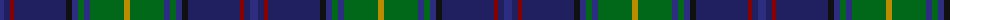

In pattern [BBRBKBGBGY](/patterns/bbrbkbgbgy/).

This was sourced from register-of-tartans.  It is a [10 stripes tartan](/stripes/stripes10/).

Original link https://www.tartanregister.gov.uk/tartanDetails.aspx?ref=327

## Attestations

This cloth appears in 2 source records; the oldest owns this page.

- 01/08/2005 — Boyle (Personal) (register-of-tartans, [record](https://www.tartanregister.gov.uk/tartanDetails.aspx?ref=327))
- 2005 August — Boyle (Personal) (tartans-authority, [record](http://www.tartansauthority.com/tartan-ferret/display/6758/))

## Thread count
DBa/8 DB6 DR4 DB52 K6 DBa6 G6 DBa6 G34 DY/6

## Palette
Each colour and its ΔE from the base-6 reference it is a variant of.

| Colour | Shade | Base | ΔE (OKLab) |
|---|---|---|---|
| DB | <code style="background-color:#202060;">#202060</code> `#202060` | B <code style="background-color:#2A418A;">#2A418A</code> | 0.11 |
| DBa | <code style="background-color:#2C2C80;">#2C2C80</code> `#2C2C80` | B <code style="background-color:#2A418A;">#2A418A</code> | 0.06 |
| DR | <code style="background-color:#880000;">#880000</code> `#880000` | R <code style="background-color:#CC0000;">#CC0000</code> | 0.15 |
| DY | <code style="background-color:#BC8C00;">#BC8C00</code> `#BC8C00` | Y <code style="background-color:#F2BF00;">#F2BF00</code> | 0.16 |
| G | <code style="background-color:#006818;">#006818</code> `#006818` | G <code style="background-color:#006100;">#006100</code> | 0.02 |
| K | <code style="background-color:#101010;">#101010</code> `#101010` | K <code style="background-color:#000000;">#000000</code> | 0.17 |

## Nearest tartans

The nearest existing variants by ΔTartan distance.

1. [State Seal of North Dakota (Fashion)](/setts/s11/g74b10g10b24ba20bb10ba10bb80ga8bb8y8-b440044-ba1474b4-bb2c2c80-g006818-ga604000-ybc8c00/) — ΔT 0.82
1. [Suzugamine (Corporate)](/setts/s9/b8g10ga38ba10g10k10g10b72y6-b2c2c80-ba780078-g384020-ga006818-k000000-yd8d898/) — ΔT 0.84
1. [Schmidt (2014)](/setts/s10/k6b40ba16b8g40k4g4r4g6y6-b000048-ba202060-g005448-k101010-rc8002c-ye0a126/) — ΔT 0.95
1. [San Diego, The](/setts/s11/r4y4b6g60ba16b6ba4b6ba4b32w4-b141e46-ba5f749c-g003c14-ra00000-wc4c7ca-yfccc00/) — ΔT 0.95
1. [Purves (2014)](/setts/s8/k8w2g24ka6b32r2b2r2-b202060-g003820-k320000-ka101010-rc80000-wfcfcfc/) — ΔT 0.99
1. [Purves (2014)](/setts/s8/b8w2g24k6ba32r2ba2r2-b4c3428-ba141e46-g003c14-k101010-rfa4b00-wffffff/) — ΔT 1.01
1. [Halcrow Howell (Name)](/setts/s9/b8ba6b12k4bb24g4bb4g48w4-b2c2c80-ba2888c4-bb1c1c50-g006818-k101010-w98c8e8/) — ΔT 1.02
1. [Wcwm 1290](/setts/s11/g56w4g6y8g6w4g6k28ya4b56w6-b202060-g003820-k101010-wc0c0c0-yd09800-ya48a4c0/) — ΔT 1.05
1. [Scottish Spirit Fashion Tartan Tartan Number: 10970. Earliest known date: 2013 ACS Clothing. Designed by Lochcarron. Wanted 'Highland Spirit' but that was taken by Ian McLure of T J Matthews. See products available Copyright © Blair Urquhart, Comrie, 2015](/setts/s12/b20r6b64g24k10g4k8g4k34ra8k4y4-b484848-g747474-k101010-r88243c-ra8c708c-ya0a0a0/) — ΔT 1.09
1. [Loch Freuchie District Tartan Tartan Number: 10725. Earliest known date: 25 October 2012 A tartan for the area around Loch Freuchie near Crieff. The tartan is based on the Murray of Atholl and Breadalbane setts, with differences, to relate the tartan to the particular Loch Freuchie area. Mr MacArthur-Fox has created a tartan for anyone to wear without fear of offending another person or group. See products available Copyright © Blair Urquhart, Comrie, 2015](/setts/s10/b6g6r4g40k50ka4ba26k4ba6r6-b4a708b-ba2c4e75-g124d36-k101010-ka000000-rff0000/) — ΔT 1.10

## Neighbour map

Every grey dot is one of 15726 variants placed by the first two principal components of the ΔTartan feature space (44% of its variance). Red is this tartan; blue dots are its nearest — click one to open its page.

<svg viewBox="0 0 640 380" role="img" style="max-width:100%;height:auto;border:1px solid #e0e0e0;border-radius:4px;display:block" xmlns="http://www.w3.org/2000/svg"><image href="/nn/cloud.v1.png" width="640" height="380"/><a href="/setts/s11/g74b10g10b24ba20bb10ba10bb80ga8bb8y8-b440044-ba1474b4-bb2c2c80-g006818-ga604000-ybc8c00/"><circle cx="188.4" cy="155.3" r="4" fill="#3465a4"><title>State Seal of North Dakota (Fashion)</title></circle></a><a href="/setts/s9/b8g10ga38ba10g10k10g10b72y6-b2c2c80-ba780078-g384020-ga006818-k000000-yd8d898/"><circle cx="218.7" cy="151.0" r="4" fill="#3465a4"><title>Suzugamine (Corporate)</title></circle></a><a href="/setts/s10/k6b40ba16b8g40k4g4r4g6y6-b000048-ba202060-g005448-k101010-rc8002c-ye0a126/"><circle cx="186.1" cy="165.1" r="4" fill="#3465a4"><title>Schmidt (2014)</title></circle></a><a href="/setts/s11/r4y4b6g60ba16b6ba4b6ba4b32w4-b141e46-ba5f749c-g003c14-ra00000-wc4c7ca-yfccc00/"><circle cx="226.6" cy="125.6" r="4" fill="#3465a4"><title>San Diego, The</title></circle></a><a href="/setts/s8/k8w2g24ka6b32r2b2r2-b202060-g003820-k320000-ka101010-rc80000-wfcfcfc/"><circle cx="257.6" cy="156.3" r="4" fill="#3465a4"><title>Purves (2014)</title></circle></a><a href="/setts/s8/b8w2g24k6ba32r2ba2r2-b4c3428-ba141e46-g003c14-k101010-rfa4b00-wffffff/"><circle cx="250.3" cy="154.5" r="4" fill="#3465a4"><title>Purves (2014)</title></circle></a><a href="/setts/s9/b8ba6b12k4bb24g4bb4g48w4-b2c2c80-ba2888c4-bb1c1c50-g006818-k101010-w98c8e8/"><circle cx="222.6" cy="153.8" r="4" fill="#3465a4"><title>Halcrow Howell (Name)</title></circle></a><a href="/setts/s11/g56w4g6y8g6w4g6k28ya4b56w6-b202060-g003820-k101010-wc0c0c0-yd09800-ya48a4c0/"><circle cx="198.0" cy="130.3" r="4" fill="#3465a4"><title>Wcwm 1290</title></circle></a><a href="/setts/s12/b20r6b64g24k10g4k8g4k34ra8k4y4-b484848-g747474-k101010-r88243c-ra8c708c-ya0a0a0/"><circle cx="254.3" cy="136.5" r="4" fill="#3465a4"><title>Scottish Spirit Fashion Tartan Tartan Number: 10970. Earliest known date: 2013 ACS Clothing. Designed by Lochcarron. Wanted 'Highland Spirit' but that was taken by Ian McLure of T J Matthews. See products available Copyright © Blair Urquhart, Comrie, 2015</title></circle></a><a href="/setts/s10/b6g6r4g40k50ka4ba26k4ba6r6-b4a708b-ba2c4e75-g124d36-k101010-ka000000-rff0000/"><circle cx="187.8" cy="150.6" r="4" fill="#3465a4"><title>Loch Freuchie District Tartan Tartan Number: 10725. Earliest known date: 25 October 2012 A tartan for the area around Loch Freuchie near Crieff. The tartan is based on the Murray of Atholl and Breadalbane setts, with differences, to relate the tartan to the particular Loch Freuchie area. Mr MacArthur-Fox has created a tartan for anyone to wear without fear of offending another person or group. See products available Copyright © Blair Urquhart, Comrie, 2015</title></circle></a><circle cx="237.6" cy="149.8" r="5" fill="#c00000"/></svg>

ID: /setts/s10/b8ba6r4ba52k6b6g6b6g34y6-b2c2c80-ba202060-g006818-k101010-r880000-ybc8c00/
