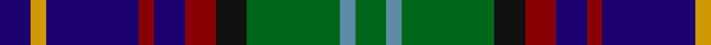

In pattern [BYBRBRKGBG](/patterns/bybrbrkgbg/).

This was sourced from register-of-tartans.  It is a [10 stripes tartan](/stripes/stripes10/).

Original link https://www.tartanregister.gov.uk/tartanDetails.aspx?ref=3091

## Attestations

This cloth appears in 2 source records; the oldest owns this page.

- 01/01/1998 — Nance (1998) (register-of-tartans, [record](https://www.tartanregister.gov.uk/tartanDetails.aspx?ref=3091))
- 1998 — Nance (Name) (tartans-authority, [record](http://www.tartansauthority.com/tartan-ferret/display/5634/))

## Thread count
DB/8 DY4 DB24 DR4 DB8 DR8 K8 G24 B4 G/8

## Palette
Each colour and its ΔE from the base-6 reference it is a variant of.

| Colour | Shade | Base | ΔE (OKLab) |
|---|---|---|---|
| B | <code style="background-color:#5C8CA8;">#5C8CA8</code> `#5C8CA8` | B <code style="background-color:#2C4084;">#2C4084</code> | 0.23 |
| DB | <code style="background-color:#1C0070;">#1C0070</code> `#1C0070` | B <code style="background-color:#2C4084;">#2C4084</code> | 0.14 |
| DR | <code style="background-color:#880000;">#880000</code> `#880000` | R <code style="background-color:#C80000;">#C80000</code> | 0.14 |
| DY | <code style="background-color:#D09800;">#D09800</code> `#D09800` | Y <code style="background-color:#E8C000;">#E8C000</code> | 0.11 |
| G | <code style="background-color:#006818;">#006818</code> `#006818` | G <code style="background-color:#006400;">#006400</code> | 0.02 |
| K | <code style="background-color:#101010;">#101010</code> `#101010` | K <code style="background-color:#000000;">#000000</code> | 0.17 |

## Nearest tartans

The nearest existing variants by ΔTartan distance.

1. [Malcolm](/setts/s14/b4k4g24k24ba24r4ba4r4ba24k24g24k4y4k4-b2474e8-ba2c2c80-g006818-k101010-rc80000-ye8c000/) — ΔT 0.94
1. [Malcolm Clan Tartan Tartan Number: 1976. Earliest known date: 1850 (1847) There is an error in D.C.Stewarts, 'The Setts..' (1950 1st Edition) corrected in the 2nd edition (1974). The name Malcolm was established, as distinct from MacCallum, in 1770 when the 9th Chief of Poltalloch changed the family name to Malcolm. This may well be the sett on which the MacCallum was based "from the recollection of old people in Argyllshire" and which D.W. Stewart illustrated in silk in his book, 'Old and Rare..'. Wilson's of Bannockburn produced a symetrical version of the Malcolm tartan which was recorded in their 1847 pattern book. The Gold and Azure of the additional stripes can be found in the armourial bearings of the Malcolm family. See products available Copyright © Blair Urquhart, Comrie, 2015](/setts/s14/b4k4g24k24ba24r4ba4r4ba24k24g24k4y4k4-b5c8ca8-ba2c2c80-g006818-k101010-rc80000-ye8c000/) — ΔT 0.96
1. [MacCraig (Clan)](/setts/s9/b16w8g56r8k56g8ba56r8g16-b4c0000-ba1c0070-g006818-k101010-r880000-wa8ace8/) — ΔT 0.97
1. [State Seal of Arizona (Fashion)](/setts/s10/g8b42y20b10y8r8ba20g12ba60w8-b441800-ba2c2c80-g006818-r880000-we8ccb8-ya08858/) — ΔT 0.99
1. [Elgin-Landshut](/setts/s14/r8b48g8k8g8k8g48k8ba8k8b24k24g24w8-b1c0070-ba2888c4-g006818-k101010-rc80000-wf8f8f8/) — ΔT 1.00
1. [Royal Highland Corporate Tartan Tartan Number: 2054. Earliest known date: March 1992 In 1808 the Highland Society of Scotland used the Universal or Black Watch tartan. This has been incorporated in the new design along with colours to represent the agricultural heritage and interests of the Society. This design includes changes that were made when the first version proved an exact match to the 'Wellington' tartan. The white is 'Barley white'. See products available Copyright © Blair Urquhart, Comrie, 2015](/setts/s8/y8g33k21b6k6b33r6b6-b2c2c80-g006818-k101010-rc80000-yb8b8b8/) — ΔT 1.01
1. [MacCallum of Berwick](/setts/s9/b20r14b62k50g46k16b14k16y10-b2c2c80-g285800-k101010-rc80000-ye8c000/) — ΔT 1.02
1. [Smithers](/setts/s11/b6ba26g4ba8w4ba16k26ga20k4ga16b6-b800080-ba304080-g808080-ga008000-k000000-we0e0e0/) — ΔT 1.02
1. [Yates (Personal)](/setts/s8/k58r6b48ba12k16w8ba16ra12-b003c64-ba5c5c5c-k101010-rc80000-ra888888-we0e0e0/) — ΔT 1.02
1. [Nairn (Edinburgh Woollen Mill)](/setts/s11/r4g20b20k10ba4k10g20k20ba4k20y4-b1c0070-ba3850c8-g006818-k101010-r880000-yd09800/) — ΔT 1.05

## Neighbour map

Every grey dot is one of 15726 variants placed by the first two principal components of the ΔTartan feature space (44% of its variance). Red is this tartan; blue dots are its nearest — click one to open its page.

<svg viewBox="0 0 640 380" role="img" style="max-width:100%;height:auto;border:1px solid #e0e0e0;border-radius:4px;display:block" xmlns="http://www.w3.org/2000/svg"><image href="/nn/cloud.v1.png" width="640" height="380"/><a href="/setts/s14/b4k4g24k24ba24r4ba4r4ba24k24g24k4y4k4-b2474e8-ba2c2c80-g006818-k101010-rc80000-ye8c000/"><circle cx="112.8" cy="175.6" r="4" fill="#3465a4"><title>Malcolm</title></circle></a><a href="/setts/s14/b4k4g24k24ba24r4ba4r4ba24k24g24k4y4k4-b5c8ca8-ba2c2c80-g006818-k101010-rc80000-ye8c000/"><circle cx="113.3" cy="175.6" r="4" fill="#3465a4"><title>Malcolm Clan Tartan Tartan Number: 1976. Earliest known date: 1850 (1847) There is an error in D.C.Stewarts, 'The Setts..' (1950 1st Edition) corrected in the 2nd edition (1974). The name Malcolm was established, as distinct from MacCallum, in 1770 when the 9th Chief of Poltalloch changed the family name to Malcolm. This may well be the sett on which the MacCallum was based &quot;from the recollection of old people in Argyllshire&quot; and which D.W. Stewart illustrated in silk in his book, 'Old and Rare..'. Wilson's of Bannockburn produced a symetrical version of the Malcolm tartan which was recorded in their 1847 pattern book. The Gold and Azure of the additional stripes can be found in the armourial bearings of the Malcolm family. See products available Copyright © Blair Urquhart, Comrie, 2015</title></circle></a><a href="/setts/s9/b16w8g56r8k56g8ba56r8g16-b4c0000-ba1c0070-g006818-k101010-r880000-wa8ace8/"><circle cx="122.0" cy="183.9" r="4" fill="#3465a4"><title>MacCraig (Clan)</title></circle></a><a href="/setts/s10/g8b42y20b10y8r8ba20g12ba60w8-b441800-ba2c2c80-g006818-r880000-we8ccb8-ya08858/"><circle cx="155.2" cy="168.8" r="4" fill="#3465a4"><title>State Seal of Arizona (Fashion)</title></circle></a><a href="/setts/s14/r8b48g8k8g8k8g48k8ba8k8b24k24g24w8-b1c0070-ba2888c4-g006818-k101010-rc80000-wf8f8f8/"><circle cx="106.4" cy="166.2" r="4" fill="#3465a4"><title>Elgin-Landshut</title></circle></a><a href="/setts/s8/y8g33k21b6k6b33r6b6-b2c2c80-g006818-k101010-rc80000-yb8b8b8/"><circle cx="142.6" cy="214.5" r="4" fill="#3465a4"><title>Royal Highland Corporate Tartan Tartan Number: 2054. Earliest known date: March 1992 In 1808 the Highland Society of Scotland used the Universal or Black Watch tartan. This has been incorporated in the new design along with colours to represent the agricultural heritage and interests of the Society. This design includes changes that were made when the first version proved an exact match to the 'Wellington' tartan. The white is 'Barley white'. See products available Copyright © Blair Urquhart, Comrie, 2015</title></circle></a><a href="/setts/s9/b20r14b62k50g46k16b14k16y10-b2c2c80-g285800-k101010-rc80000-ye8c000/"><circle cx="155.8" cy="220.2" r="4" fill="#3465a4"><title>MacCallum of Berwick</title></circle></a><a href="/setts/s11/b6ba26g4ba8w4ba16k26ga20k4ga16b6-b800080-ba304080-g808080-ga008000-k000000-we0e0e0/"><circle cx="79.8" cy="178.2" r="4" fill="#3465a4"><title>Smithers</title></circle></a><a href="/setts/s8/k58r6b48ba12k16w8ba16ra12-b003c64-ba5c5c5c-k101010-rc80000-ra888888-we0e0e0/"><circle cx="170.0" cy="175.0" r="4" fill="#3465a4"><title>Yates (Personal)</title></circle></a><a href="/setts/s11/r4g20b20k10ba4k10g20k20ba4k20y4-b1c0070-ba3850c8-g006818-k101010-r880000-yd09800/"><circle cx="137.1" cy="215.9" r="4" fill="#3465a4"><title>Nairn (Edinburgh Woollen Mill)</title></circle></a><circle cx="129.9" cy="191.9" r="5" fill="#c00000"/></svg>

ID: /setts/s10/b8y4b24r4b8r8k8g24ba4g8-b1c0070-ba5c8ca8-g006818-k101010-r880000-yd09800/
