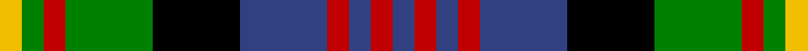

This page is one **sett** — a single exact thread-count. It belongs to the [tartan](/tartans/y1g1r1g4k4b4r1b1r1b1/)
(the same proportion at any scale), whose colour order is pattern [BRBRBKGRGY](/stripes/brbrbkgrgy/).

Sourced from weddslist.  It is a [10 stripe tartan](/stripes/stripes10/).

Original link http://www.weddslist.com/cgi-bin/tartans/pg.pl?source=sts

## Thread count
Y/4 G4 R4 G16 K16 B16 R4 B4 R4 B/4

## Palette
Each colour and the base-6 reference it is a variant of.

| Colour | Shade | Base |
|---|---|---|
| B | <code style="background-color:#304080;">#304080</code> `oklch(39.4% 0.109 270.2)` <small>#304080</small> | B <code style="background-color:#2A418A;">#2A418A</code> |
| G | <code style="background-color:#008000;">#008000</code> `oklch(52.0% 0.177 142.5)` <small>#008000</small> | G <code style="background-color:#006100;">#006100</code> |
| K | <code style="background-color:#000000;">#000000</code> `oklch(0.0% 0.000 0.0)` <small>#000000</small> | K <code style="background-color:#000000;">#000000</code> |
| R | <code style="background-color:#C00000;">#C00000</code> `oklch(50.7% 0.208 29.2)` <small>#C00000</small> | R <code style="background-color:#CC0000;">#CC0000</code> |
| Y | <code style="background-color:#F0C000;">#F0C000</code> `oklch(82.7% 0.169 90.5)` <small>#F0C000</small> | Y <code style="background-color:#F2BF00;">#F2BF00</code> |

## Nearest tartans

The nearest existing variants by ΔTartan distance, with this tartan at the top so the swatches line up against it.

ΔTartan

Tartan

Sett

—

<a href="/ttd/edit/#slug=db1r1db1r1db4k4g4r1g1ly1~x4">Logan, or MacLennan</a> <a class="nn-out" href="/setts/s10/db1r1db1r1db4k4g4r1g1ly1~x4/" title="open its dictionary page">↗</a>

0.88

<a href="/ttd/edit/#slug=db3r1db1r2db6r1k6g6r2g1r1g2ly1~x2">Carnegie</a> <a class="nn-out" href="/setts/s13/db3r1db1r2db6r1k6g6r2g1r1g2ly1~x2/" title="open its dictionary page">↗</a>

1.00

<a href="/ttd/edit/#slug=m4g14o2g4o2k6g3k6db14m2db4m4~x2">Kinloch Anderson, hunting</a> <a class="nn-out" href="/setts/s12/m4g14o2g4o2k6g3k6db14m2db4m4~x2/" title="open its dictionary page">↗</a>

1.03

<a href="/ttd/edit/#slug=db17r3db4r5db20r3k20g20r5g4r3k3ly11~x2">MacSporran</a> <a class="nn-out" href="/setts/s13/db17r3db4r5db20r3k20g20r5g4r3k3ly11~x2/" title="open its dictionary page">↗</a>

1.05

<a href="/ttd/edit/#slug=db10p2db3r4db14r2k14g14r4g3p2g10~x2">Denovan, The Lairdship of..</a> <a class="nn-out" href="/setts/s12/db10p2db3r4db14r2k14g14r4g3p2g10~x2/" title="open its dictionary page">↗</a>

1.12

<a href="/ttd/edit/#slug=k6b2db12g8r5k2g3~x4">Cooke</a> <a class="nn-out" href="/setts/s7/k6b2db12g8r5k2g3~x4/" title="open its dictionary page">↗</a>

1.13

<a href="/ttd/edit/#slug=r3dg2n2dg3k6db2o10db2~x2">Burnfoot Check</a> <a class="nn-out" href="/setts/s8/r3dg2n2dg3k6db2o10db2~x2/" title="open its dictionary page">↗</a>

1.14

<a href="/ttd/edit/#slug=r1k2g4k1g1k2db3k1w1~x6">MacKean Dress (Personal)</a> <a class="nn-out" href="/setts/s9/r1k2g4k1g1k2db3k1w1~x6/" title="open its dictionary page">↗</a>

1.14

<a href="/ttd/edit/#slug=m3db14g14db2m14db2m14db2g14db2ly3~x2">Clare</a> <a class="nn-out" href="/setts/s11/m3db14g14db2m14db2m14db2g14db2ly3~x2/" title="open its dictionary page">↗</a>

1.15

<a href="/ttd/edit/#slug=db8r2db2r4db10r2k11g10r4g2r2g8~x2">MacDonald 2</a> <a class="nn-out" href="/setts/s12/db8r2db2r4db10r2k11g10r4g2r2g8~x2/" title="open its dictionary page">↗</a>

1.15

<a href="/setts/s10/k3r1g5k3w1dp3~x2/">Wilson's No.194</a>

## Neighbour map

Every grey dot is one of 14299 variants placed by the first two principal components of the ΔTartan feature space (44% of its variance). Red is this tartan; blue dots are its nearest — click one to open its page.

<svg viewBox="0 0 640 380" role="img" style="max-width:100%;height:auto;border:1px solid #e0e0e0;border-radius:4px;display:block" xmlns="http://www.w3.org/2000/svg"><image href="/nn/cloud.v1.png" width="640" height="380"/><a href="/setts/s13/db3r1db1r2db6r1k6g6r2g1r1g2ly1~x2/"><circle cx="79.8" cy="173.3" r="4" fill="#3465a4"><title>Carnegie</title></circle></a><a href="/setts/s12/m4g14o2g4o2k6g3k6db14m2db4m4~x2/"><circle cx="92.4" cy="180.2" r="4" fill="#3465a4"><title>Kinloch Anderson, hunting</title></circle></a><a href="/setts/s13/db17r3db4r5db20r3k20g20r5g4r3k3ly11~x2/"><circle cx="87.3" cy="165.7" r="4" fill="#3465a4"><title>MacSporran</title></circle></a><a href="/setts/s12/db10p2db3r4db14r2k14g14r4g3p2g10~x2/"><circle cx="100.9" cy="184.3" r="4" fill="#3465a4"><title>Denovan, The Lairdship of..</title></circle></a><a href="/setts/s7/k6b2db12g8r5k2g3~x4/"><circle cx="81.8" cy="219.3" r="4" fill="#3465a4"><title>Cooke</title></circle></a><a href="/setts/s8/r3dg2n2dg3k6db2o10db2~x2/"><circle cx="60.9" cy="192.3" r="4" fill="#3465a4"><title>Burnfoot Check</title></circle></a><a href="/setts/s9/r1k2g4k1g1k2db3k1w1~x6/"><circle cx="100.2" cy="236.6" r="4" fill="#3465a4"><title>MacKean Dress (Personal)</title></circle></a><a href="/setts/s11/m3db14g14db2m14db2m14db2g14db2ly3~x2/"><circle cx="122.1" cy="181.4" r="4" fill="#3465a4"><title>Clare</title></circle></a><a href="/setts/s12/db8r2db2r4db10r2k11g10r4g2r2g8~x2/"><circle cx="95.8" cy="211.3" r="4" fill="#3465a4"><title>MacDonald 2</title></circle></a><a href="/setts/s10/k3r1g5k3w1dp3~x2/"><circle cx="109.1" cy="220.6" r="4" fill="#3465a4"><title>Wilson's No.194</title></circle></a><circle cx="62.7" cy="203.4" r="5" fill="#c00000"/></svg>

ID: /setts/s10/db1r1db1r1db4k4g4r1g1ly1~x4/
