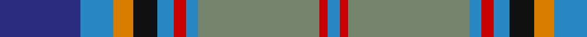

In pattern [BBYKBRBGRB](/stripes/bbykbrbgrb/).

This was sourced from register-of-tartans.  It is a [10 stripe tartan](/stripes/stripes10/).

Original link https://www.tartanregister.gov.uk/tartanDetails.aspx?ref=5563

## Also known as

This cloth is also recorded under:

- Thousand Islands )

## Attestations

This cloth appears in 3 source records; the oldest owns this page.

- undated — Thousand Islands (register-of-tartans, [record](https://www.tartanregister.gov.uk/tartanDetails.aspx?ref=5563))
- 1970s — Thousand Islands (District, USA)) (tartans-authority, [record](http://www.tartansauthority.com/tartan-ferret/display/7526/))
- undated — Thousand Islands District Tartan Tartan Number: 7526. Earliest known date: 1970s According to the folks at the 1000 Islands Inn, it was designed by a local person, possibly in the 1970s, and manufactured by a Scottish company that is now unfortunately out of business. Further research states: It was a Grindstone summer resident, Emily Post, who was a weaver who designed the plaid known as the Thousand Island Tartan. Grindstone is one of the 'Thousand Islands' just across the water from Clayton. This is not thought to be the famous etiquette author Emily Post who died in 1960. Light blue is for the skies and grey granite of the islands, dark blue for the rivers, green for the trees and orange for the beautiful rainbows visible from the islands. Infromation from John Fitzpatrick's 2008 review of Canadian tartans and some US border tartans. Colours are as specified in CIDD but the graphic shown here is estimated from a small computer graphic. JF's estimated count from a CIDD drawing is: B/40 LB6 O6 K6 LB6 RUST2 LB6 G32 RUST2 B/6. See products available Copyright © Blair Urquhart, Comrie, 2015 (house-of-tartan, [record](http://www.house-of-tartan.scotland.net/house/TartanViewjs.asp?colr=Def&tnam=7526))

## Register references

External register numbers recorded for this tartan.

- Scottish Register of Tartans: [5563](https://www.tartanregister.gov.uk/tartanDetails.aspx?ref=5563)
- Scottish Tartans Authority (ITI): 7526

## Thread count
DB/40 B16 O10 K12 B8 R6 B6 N60 R4 B/6

## Palette
Each colour and its ΔE from the base-6 reference it is a variant of.

| Colour | Shade | Base | ΔE (OKLab) |
|---|---|---|---|
| B | <code style="background-color:#2888C4;">#2888C4</code> `#2888C4` | B <code style="background-color:#2A418A;">#2A418A</code> | 0.21 |
| DB | <code style="background-color:#2C2C80;">#2C2C80</code> `#2C2C80` | B <code style="background-color:#2A418A;">#2A418A</code> | 0.06 |
| K | <code style="background-color:#101010;">#101010</code> `#101010` | K <code style="background-color:#000000;">#000000</code> | 0.17 |
| N | <code style="background-color:#74846C;">#74846C</code> `#74846C` | G <code style="background-color:#006100;">#006100</code> | 0.20 |
| O | <code style="background-color:#D87C00;">#D87C00</code> `#D87C00` | Y <code style="background-color:#F2BF00;">#F2BF00</code> | 0.17 |
| R | <code style="background-color:#C80000;">#C80000</code> `#C80000` | R <code style="background-color:#CC0000;">#CC0000</code> | 0.01 |

## Nearest tartans

The nearest existing variants by ΔTartan distance.

1. [Hek Family (Sunningdale, Berwick on Tweed)](/setts/s9/ly1lt2n15k2lt2k2g12w2lt1~x2/) — ΔT 0.88
1. [Brighton & Hove](/setts/s11/db16t8lo1t1w1t1t6g3t1g3w1~x4/) — ΔT 0.98
1. [Buffalo (Fashion)](/setts/s12/db6o3k4ly3k3o3k3g14t28o3t3k2~x2/) — ΔT 0.99
1. [McMeeken (Name)](/setts/s10/r7g20ly2g4k5b4k2b20k3w1~x2/) — ΔT 1.05
1. [Connecticut](/setts/s10/db20y2w1y5dg8ly1dg2r1dg8y16~x4/) — ΔT 1.06
1. [Edinburgh District](/setts/s9/w3b25m3r3m3r5g10m3k2~x2/) — ΔT 1.10
1. [Glen Lyon (Fashion)](/setts/s7/o3db1o11w1k5n14lo3~x4/) — ΔT 1.12
1. [Ayrton (amended)](/setts/s11/r4k2dg25k2t10k2dg4k2db25k2ly4~x2/) — ΔT 1.14
1. [State Seal of Nebraska (Fashion)](/setts/s10/lo7g11db4t31db4g11dy4db14lb3db4~x2/) — ΔT 1.14
1. [O'Reilly (Estimated threadcount)](/setts/s9/r4b3lr2k2lr12k2db10t25w2~x2/) — ΔT 1.15

## Neighbour map

Every grey dot is one of 14299 variants placed by the first two principal components of the ΔTartan feature space (44% of its variance). Red is this tartan; blue dots are its nearest — click one to open its page.

<svg viewBox="0 0 640 380" role="img" style="max-width:100%;height:auto;border:1px solid #e0e0e0;border-radius:4px;display:block" xmlns="http://www.w3.org/2000/svg"><image href="/nn/cloud.v1.png" width="640" height="380"/><a href="/setts/s9/ly1lt2n15k2lt2k2g12w2lt1~x2/"><circle cx="182.4" cy="123.9" r="4" fill="#3465a4"><title>Hek Family (Sunningdale, Berwick on Tweed)</title></circle></a><a href="/setts/s11/db16t8lo1t1w1t1t6g3t1g3w1~x4/"><circle cx="175.6" cy="116.9" r="4" fill="#3465a4"><title>Brighton &amp; Hove</title></circle></a><a href="/setts/s12/db6o3k4ly3k3o3k3g14t28o3t3k2~x2/"><circle cx="184.0" cy="121.4" r="4" fill="#3465a4"><title>Buffalo (Fashion)</title></circle></a><a href="/setts/s10/r7g20ly2g4k5b4k2b20k3w1~x2/"><circle cx="190.4" cy="134.0" r="4" fill="#3465a4"><title>McMeeken (Name)</title></circle></a><a href="/setts/s10/db20y2w1y5dg8ly1dg2r1dg8y16~x4/"><circle cx="217.9" cy="139.8" r="4" fill="#3465a4"><title>Connecticut</title></circle></a><a href="/setts/s9/w3b25m3r3m3r5g10m3k2~x2/"><circle cx="192.6" cy="129.6" r="4" fill="#3465a4"><title>Edinburgh District</title></circle></a><a href="/setts/s7/o3db1o11w1k5n14lo3~x4/"><circle cx="181.5" cy="164.0" r="4" fill="#3465a4"><title>Glen Lyon (Fashion)</title></circle></a><a href="/setts/s11/r4k2dg25k2t10k2dg4k2db25k2ly4~x2/"><circle cx="172.8" cy="138.1" r="4" fill="#3465a4"><title>Ayrton (amended)</title></circle></a><a href="/setts/s10/lo7g11db4t31db4g11dy4db14lb3db4~x2/"><circle cx="137.9" cy="165.0" r="4" fill="#3465a4"><title>State Seal of Nebraska (Fashion)</title></circle></a><a href="/setts/s9/r4b3lr2k2lr12k2db10t25w2~x2/"><circle cx="161.5" cy="122.5" r="4" fill="#3465a4"><title>O'Reilly (Estimated threadcount)</title></circle></a><circle cx="172.1" cy="134.1" r="5" fill="#c00000"/></svg>

ID: /setts/s10/db20t8lo5k6t4r3t3y30r2t3~x2/
