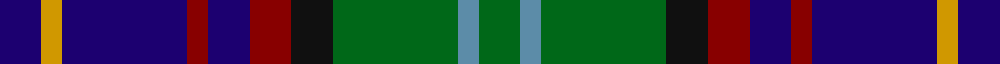

In pattern [BYBRBRKGBG](/stripes/bybrbrkgbg/).

This was sourced from register-of-tartans.  It is a [10 stripe tartan](/stripes/stripes10/).

Original link https://www.tartanregister.gov.uk/tartanDetails.aspx?ref=3091

## Attestations

This cloth appears in 2 source records; the oldest owns this page.

- 01/01/1998 — Nance (1998) (register-of-tartans, [record](https://www.tartanregister.gov.uk/tartanDetails.aspx?ref=3091))
- 1998 — Nance (Name) (tartans-authority, [record](http://www.tartansauthority.com/tartan-ferret/display/5634/))

## Register references

External register numbers recorded for this tartan.

- Scottish Register of Tartans: [3091](https://www.tartanregister.gov.uk/tartanDetails.aspx?ref=3091)
- Scottish Tartans Authority (ITI): 5634

## Thread count
DB/8 DY4 DB24 DR4 DB8 DR8 K8 G24 B4 G/8

## Palette
Each colour and the base-6 reference it is a variant of.

| Colour | Shade | Base |
|---|---|---|
| B | <code style="background-color:#5C8CA8;">#5C8CA8</code> `oklch(61.7% 0.067 235.0)` <small>#5C8CA8</small> | B <code style="background-color:#2A418A;">#2A418A</code> |
| DB | <code style="background-color:#1C0070;">#1C0070</code> `oklch(26.3% 0.162 277.1)` <small>#1C0070</small> | B <code style="background-color:#2A418A;">#2A418A</code> |
| DR | <code style="background-color:#880000;">#880000</code> `oklch(39.4% 0.162 29.2)` <small>#880000</small> | R <code style="background-color:#CC0000;">#CC0000</code> |
| DY | <code style="background-color:#D09800;">#D09800</code> `oklch(71.4% 0.147 82.1)` <small>#D09800</small> | Y <code style="background-color:#F2BF00;">#F2BF00</code> |
| G | <code style="background-color:#006818;">#006818</code> `oklch(45.0% 0.142 145.0)` <small>#006818</small> | G <code style="background-color:#006100;">#006100</code> |
| K | <code style="background-color:#101010;">#101010</code> `oklch(17.3% 0.000 89.9)` <small>#101010</small> | K <code style="background-color:#000000;">#000000</code> |

## Nearest tartans

The nearest existing variants by ΔTartan distance.

1. [Malcolm](/setts/s14/k1ly1k1g6k6db6r1db1r1db6k6g6k1b1~x4/) — ΔT 0.94
1. [State Seal of Arizona (Fashion)](/setts/s10/g4do21lo10do5lo4r4db10g6db30lb4~x2/) — ΔT 0.99
1. [Elgin-Landshut](/setts/s14/r1db6g1k1g1k1g6k1t1k1db3k3g3w1~x8/) — ΔT 1.00
1. [Royal Highland Corporate Tartan Tartan Number: 2054. Earliest known date: March 1992 In 1808 the Highland Society of Scotland used the Universal or Black Watch tartan. This has been incorporated in the new design along with colours to represent the agricultural heritage and interests of the Society. This design includes changes that were made when the first version proved an exact match to the 'Wellington' tartan. The white is 'Barley white'. See products available Copyright © Blair Urquhart, Comrie, 2015](/setts/s8/lr8g33k21db6k6db33r6db6/) — ΔT 1.01
1. [Yates (Personal)](/setts/s8/k29r3dt24n6k8w4n8o6~x2/) — ΔT 1.02
1. [MacCallum of Berwick](/setts/s9/db10r7db31k25dg23k8db7k8ly5~x2/) — ΔT 1.03
1. [Smithers](/setts/s11/p3db13y2db4w2db8k13g10k2g8p3~x2/) — ΔT 1.03
1. [Nairn (Edinburgh Woollen Mill)](/setts/s11/r2g10db10k5b2k5g10k10b2k10lo2~x2/) — ΔT 1.05
1. [Kinloch Anderson Hunting](/setts/s12/dp4g14y2g4y2k6g3k6db13r2db4r4~x2/) — ΔT 1.06
1. [Smithers (Name)](/setts/s11/dp2b6n1b3lb1b4k6g5k1g5dp2~x4/) — ΔT 1.08

## Neighbour map

Every grey dot is one of 14299 variants placed by the first two principal components of the ΔTartan feature space (44% of its variance). Red is this tartan; blue dots are its nearest — click one to open its page.

<svg viewBox="0 0 640 380" role="img" style="max-width:100%;height:auto;border:1px solid #e0e0e0;border-radius:4px;display:block" xmlns="http://www.w3.org/2000/svg"><image href="/nn/cloud.v1.png" width="640" height="380"/><a href="/setts/s14/k1ly1k1g6k6db6r1db1r1db6k6g6k1b1~x4/"><circle cx="118.3" cy="179.9" r="4" fill="#3465a4"><title>Malcolm</title></circle></a><a href="/setts/s10/g4do21lo10do5lo4r4db10g6db30lb4~x2/"><circle cx="159.6" cy="172.1" r="4" fill="#3465a4"><title>State Seal of Arizona (Fashion)</title></circle></a><a href="/setts/s14/r1db6g1k1g1k1g6k1t1k1db3k3g3w1~x8/"><circle cx="112.1" cy="169.5" r="4" fill="#3465a4"><title>Elgin-Landshut</title></circle></a><a href="/setts/s8/lr8g33k21db6k6db33r6db6/"><circle cx="146.7" cy="217.7" r="4" fill="#3465a4"><title>Royal Highland Corporate Tartan Tartan Number: 2054. Earliest known date: March 1992 In 1808 the Highland Society of Scotland used the Universal or Black Watch tartan. This has been incorporated in the new design along with colours to represent the agricultural heritage and interests of the Society. This design includes changes that were made when the first version proved an exact match to the 'Wellington' tartan. The white is 'Barley white'. See products available Copyright © Blair Urquhart, Comrie, 2015</title></circle></a><a href="/setts/s8/k29r3dt24n6k8w4n8o6~x2/"><circle cx="174.7" cy="178.6" r="4" fill="#3465a4"><title>Yates (Personal)</title></circle></a><a href="/setts/s9/db10r7db31k25dg23k8db7k8ly5~x2/"><circle cx="159.6" cy="223.9" r="4" fill="#3465a4"><title>MacCallum of Berwick</title></circle></a><a href="/setts/s11/p3db13y2db4w2db8k13g10k2g8p3~x2/"><circle cx="84.7" cy="179.8" r="4" fill="#3465a4"><title>Smithers</title></circle></a><a href="/setts/s11/r2g10db10k5b2k5g10k10b2k10lo2~x2/"><circle cx="141.2" cy="220.0" r="4" fill="#3465a4"><title>Nairn (Edinburgh Woollen Mill)</title></circle></a><a href="/setts/s12/dp4g14y2g4y2k6g3k6db13r2db4r4~x2/"><circle cx="105.9" cy="186.4" r="4" fill="#3465a4"><title>Kinloch Anderson Hunting</title></circle></a><a href="/setts/s11/dp2b6n1b3lb1b4k6g5k1g5dp2~x4/"><circle cx="96.4" cy="206.9" r="4" fill="#3465a4"><title>Smithers (Name)</title></circle></a><circle cx="134.5" cy="195.4" r="5" fill="#c00000"/></svg>

ID: /setts/s10/db2lo1db6r1db2r2k2g6t1g2~x4/
