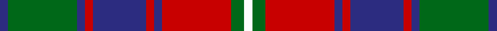

**Bands:** [BGBRBRBRGW](/stripes/bgbrbrbrgw/) · **Stripes:** [DB G DB R DB R DB R G W](/stripes/stripes10/) DB G DB R DB R DB R G W

This was sourced from register-of-tartans.  It is a [10 band tartan](/bands/bands10/).

Original link https://www.tartanregister.gov.uk/tartanDetails.aspx?ref=3583

## Also known as

This cloth is also recorded under:

- Roxburgh, Red

## Attestations

This cloth appears in 2 source records; the oldest owns this page.

- 01/01/1840 — Roxburgh Red (register-of-tartans, [record](https://www.tartanregister.gov.uk/tartanDetails.aspx?ref=3583))
- 1840 — Roxburgh, Red (District) (tartans-authority, [record](http://www.tartansauthority.com/tartan-ferret/display/140/))

## Register references

External register numbers recorded for this tartan.

- Scottish Register of Tartans: [3583](https://www.tartanregister.gov.uk/tartanDetails.aspx?ref=3583)
- Scottish Tartans Authority (ITI): 140
- Scottish Tartans World Register: 140

## Thread count
DB/6 G52 DB6 R6 DB40 R6 DB6 R52 G10 W/6

## Palette
Each colour and its ΔE from the base-6 reference it is a variant of.

| Colour | Shade | Base | ΔE (OKLab) |
|---|---|---|---|
| DB | <code style="background-color:#2C2C80;">#2C2C80</code> `#2C2C80` | B <code style="background-color:#2A418A;">#2A418A</code> | 0.06 |
| G | <code style="background-color:#006818;">#006818</code> `#006818` | G <code style="background-color:#006100;">#006100</code> | 0.02 |
| N | <code style="background-color:#C0C0C0;">#C0C0C0</code> `#C0C0C0` | W <code style="background-color:#F7F7F7;">#F7F7F7</code> | 0.17 |
| R | <code style="background-color:#C80000;">#C80000</code> `#C80000` | R <code style="background-color:#CC0000;">#CC0000</code> | 0.01 |
| W | <code style="background-color:#FCFCFC;">#FCFCFC</code> `#FCFCFC` | W <code style="background-color:#F7F7F7;">#F7F7F7</code> | 0.01 |

## Nearest tartans

The nearest existing variants by ΔTartan distance.

1. [Roxburgh, Red](/setts/s10/db3dg26db3r3db20r3db3r26dg5w3~x2/) — ΔT 0.54
1. [MacPherson Htg](/setts/s9/b1r1k8r1b1r1o8r1b1~x4/) — ΔT 0.73
1. [MacPherson Hunting Clan Tartan Tartan Number: 547. Earliest known date: 1850 This version also appears in Grants 'Tartans of the Clans of Scotland' (1886). D.W.Stewart said (in 1893) "it was the earliest known to have been worn by the clan, and is reputed to have been worn in two forms; as a clan tartan with a white ground and as a hunting tartan with a grey ground". It appeared first in Smiths work of 1850, 'Authenticated Tartans of the Clans and Families of Scotland'. Originally recorded in the Urquhart Register as MacPherson of Pitmain. See products available Copyright © Blair Urquhart, Comrie, 2015](/setts/s9/db1r1k8r1db1r1o8r1db1~x4/) — ΔT 0.81
1. [Famous Grouse, The](/setts/s10/dp3m4g26k3dp4k16dp4k3m26g2~x2/) — ΔT 0.88
1. [North Berwick (Dance)](/setts/s11/dt10r2dt10r10dg2r2dg2r2dg10r1w2~x4/) — ΔT 0.91
1. [Unidentified, specimen](/setts/s10/db1g4db1r1db1ly1db5r6db1ly1~x2/) — ΔT 0.96
1. [Fraser of Lovat](/setts/s12/db16r2db2r2g14r13w2r13g14db14r2db2~x2/) — ΔT 0.98
1. [Stevenson Family Tartan Tartan Number: 1558. Earliest known date: 1980 Charles Stevenson of Glasgow emigrated to America in 1861. The Monitoring Committee of the Scottish Tartans Society operated until 1984 when the present system of accreditation was introduced for the 'Register of All Publicly Known Tartans'. The original count has been proportionately increased from the 1980 recording. See products available Copyright © Blair Urquhart, Comrie, 2015](/setts/s9/r1g8ly1r2ly1r2ly1db8ly1~x4/) — ΔT 0.98
1. [Unidentified Specimen #3](/setts/s10/db1dg4db1r1db1ly1db5r6db1ly1~x2/) — ΔT 1.01
1. [MacIntyre of Glenorchy Clan Tartan Tartan Number: 402. Earliest known date: 1850 Smiths' version is also known as MacIntyre of Whitehouse. Though different from the sett recorded by Lord Lyon it is the one most often available in modern times. Before moving to Badenoch to take protection for Clan Chattan, the MacIntyres were listed as followers of Stewart of Appin. See products available Copyright © Blair Urquhart, Comrie, 2015](/setts/s15/t1r1db1r2g8r1db1r2g1r1db8r2g1r1t1~x4/) — ΔT 1.04

## Neighbour map

Every grey dot is one of 14299 variants placed by the first two principal components of the ΔTartan feature space (44% of its variance). Red is this tartan; blue dots are its nearest — click one to open its page.

<svg viewBox="0 0 640 380" role="img" style="max-width:100%;height:auto;border:1px solid #e0e0e0;border-radius:4px;display:block" xmlns="http://www.w3.org/2000/svg"><image href="/nn/cloud.v1.png" width="640" height="380"/><a href="/setts/s10/db3dg26db3r3db20r3db3r26dg5w3~x2/"><circle cx="202.5" cy="179.8" r="4" fill="#3465a4"><title>Roxburgh, Red</title></circle></a><a href="/setts/s9/b1r1k8r1b1r1o8r1b1~x4/"><circle cx="185.2" cy="170.1" r="4" fill="#3465a4"><title>MacPherson Htg</title></circle></a><a href="/setts/s9/db1r1k8r1db1r1o8r1db1~x4/"><circle cx="187.0" cy="170.4" r="4" fill="#3465a4"><title>MacPherson Hunting Clan Tartan Tartan Number: 547. Earliest known date: 1850 This version also appears in Grants 'Tartans of the Clans of Scotland' (1886). D.W.Stewart said (in 1893) &quot;it was the earliest known to have been worn by the clan, and is reputed to have been worn in two forms; as a clan tartan with a white ground and as a hunting tartan with a grey ground&quot;. It appeared first in Smiths work of 1850, 'Authenticated Tartans of the Clans and Families of Scotland'. Originally recorded in the Urquhart Register as MacPherson of Pitmain. See products available Copyright © Blair Urquhart, Comrie, 2015</title></circle></a><a href="/setts/s10/dp3m4g26k3dp4k16dp4k3m26g2~x2/"><circle cx="188.5" cy="154.7" r="4" fill="#3465a4"><title>Famous Grouse, The</title></circle></a><a href="/setts/s11/dt10r2dt10r10dg2r2dg2r2dg10r1w2~x4/"><circle cx="200.5" cy="186.6" r="4" fill="#3465a4"><title>North Berwick (Dance)</title></circle></a><a href="/setts/s10/db1g4db1r1db1ly1db5r6db1ly1~x2/"><circle cx="188.7" cy="196.1" r="4" fill="#3465a4"><title>Unidentified, specimen</title></circle></a><a href="/setts/s12/db16r2db2r2g14r13w2r13g14db14r2db2~x2/"><circle cx="178.6" cy="192.2" r="4" fill="#3465a4"><title>Fraser of Lovat</title></circle></a><a href="/setts/s9/r1g8ly1r2ly1r2ly1db8ly1~x4/"><circle cx="158.0" cy="176.1" r="4" fill="#3465a4"><title>Stevenson Family Tartan Tartan Number: 1558. Earliest known date: 1980 Charles Stevenson of Glasgow emigrated to America in 1861. The Monitoring Committee of the Scottish Tartans Society operated until 1984 when the present system of accreditation was introduced for the 'Register of All Publicly Known Tartans'. The original count has been proportionately increased from the 1980 recording. See products available Copyright © Blair Urquhart, Comrie, 2015</title></circle></a><a href="/setts/s10/db1dg4db1r1db1ly1db5r6db1ly1~x2/"><circle cx="187.5" cy="193.9" r="4" fill="#3465a4"><title>Unidentified Specimen #3</title></circle></a><a href="/setts/s15/t1r1db1r2g8r1db1r2g1r1db8r2g1r1t1~x4/"><circle cx="185.6" cy="162.3" r="4" fill="#3465a4"><title>MacIntyre of Glenorchy Clan Tartan Tartan Number: 402. Earliest known date: 1850 Smiths' version is also known as MacIntyre of Whitehouse. Though different from the sett recorded by Lord Lyon it is the one most often available in modern times. Before moving to Badenoch to take protection for Clan Chattan, the MacIntyres were listed as followers of Stewart of Appin. See products available Copyright © Blair Urquhart, Comrie, 2015</title></circle></a><circle cx="192.7" cy="173.8" r="5" fill="#c00000"/></svg>

ID: /setts/s10/db3g26db3r3db20r3db3r26g5w3~x2/
