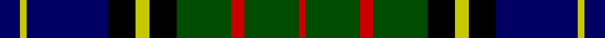

This page is one **sett** — a single exact thread-count. It belongs to the [tartan](/tartans/db3ly1db12k4ly2k4dg8r2dg8r1/)
(the same proportion at any scale), whose colour order is pattern [BYBKYKGRGR](/stripes/bybkykgrgr/).

Sourced from weddslist.  It is a [10 stripe tartan](/stripes/stripes10/).

Original link http://www.weddslist.com/cgi-bin/tartans/pg.pl?source=rb

## Also known as

This cloth is also recorded under:

- MacMillan Htg
- MacMillan Hunting #2

3 attestations — the source records this cloth was collapsed from (oldest owns this page)

<ul>
<li>undated — MacMillan Hunting (weddslist, <a href="http://www.weddslist.com/cgi-bin/tartans/pg.pl?source=rb">record</a>)</li>
<li>undated — MacMillan Hunting (weddslist, <a href="http://www.weddslist.com/cgi-bin/tartans/pg.pl?source=tinsel">record</a>)</li>
<li>undated — MacMillan Hunting (weddslist, <a href="http://www.weddslist.com/cgi-bin/tartans/pg.pl?source=x">record</a>)</li>
</ul>

## Thread count
DB/6 Y2 DB24 K8 Y4 K8 G16 R4 G16 R/2

## Palette

Palette: <strong>Tartan Register</strong> <small style="color:#888">(4 of 5 colours)</small>
<table><thead><tr><th>Colour</th><th>Threads</th><th>Shade</th><th>Base</th><th>OKLCh</th></tr></thead><tbody><tr><td>DB/</td><td style="text-align:right;font-variant-numeric:tabular-nums">6</td><td><code style="background-color:#000064;">#000064</code> <small style="color:#888">#000064</small></td><td>B <code style="background-color:#2A418A;">#2A418A</code></td><td><small style="color:#888">oklch(22.7% 0.158 264.1)</small></td></tr><tr><td>Y</td><td style="text-align:right;font-variant-numeric:tabular-nums">2</td><td><code style="background-color:#C8C800;">#C8C800</code> <small style="color:#888">#C8C800</small></td><td>Y <code style="background-color:#F2BF00;">#F2BF00</code></td><td><small style="color:#888">oklch(80.6% 0.176 109.8)</small></td></tr><tr><td>DB</td><td style="text-align:right;font-variant-numeric:tabular-nums">24</td><td><code style="background-color:#000064;">#000064</code> <small style="color:#888">#000064</small></td><td>B <code style="background-color:#2A418A;">#2A418A</code></td><td><small style="color:#888">oklch(22.7% 0.158 264.1)</small></td></tr><tr><td>K</td><td style="text-align:right;font-variant-numeric:tabular-nums">8</td><td><code style="background-color:#000000;">#000000</code> <small style="color:#888">#000000</small></td><td>K <code style="background-color:#000000;">#000000</code></td><td><small style="color:#888">oklch(0.0% 0.000 0.0)</small></td></tr><tr><td>Y</td><td style="text-align:right;font-variant-numeric:tabular-nums">4</td><td><code style="background-color:#C8C800;">#C8C800</code> <small style="color:#888">#C8C800</small></td><td>Y <code style="background-color:#F2BF00;">#F2BF00</code></td><td><small style="color:#888">oklch(80.6% 0.176 109.8)</small></td></tr><tr><td>K</td><td style="text-align:right;font-variant-numeric:tabular-nums">8</td><td><code style="background-color:#000000;">#000000</code> <small style="color:#888">#000000</small></td><td>K <code style="background-color:#000000;">#000000</code></td><td><small style="color:#888">oklch(0.0% 0.000 0.0)</small></td></tr><tr><td>G</td><td style="text-align:right;font-variant-numeric:tabular-nums">16</td><td><code style="background-color:#004C00;">#004C00</code> <small style="color:#888">#004C00</small></td><td>G <code style="background-color:#006100;">#006100</code></td><td><small style="color:#888">oklch(36.1% 0.123 142.5)</small></td></tr><tr><td>R</td><td style="text-align:right;font-variant-numeric:tabular-nums">4</td><td><code style="background-color:#C80000;">#C80000</code> <small style="color:#888">#C80000</small></td><td>R <code style="background-color:#CC0000;">#CC0000</code></td><td><small style="color:#888">oklch(52.3% 0.215 29.2)</small></td></tr><tr><td>G</td><td style="text-align:right;font-variant-numeric:tabular-nums">16</td><td><code style="background-color:#004C00;">#004C00</code> <small style="color:#888">#004C00</small></td><td>G <code style="background-color:#006100;">#006100</code></td><td><small style="color:#888">oklch(36.1% 0.123 142.5)</small></td></tr><tr><td>R/</td><td style="text-align:right;font-variant-numeric:tabular-nums">2</td><td><code style="background-color:#C80000;">#C80000</code> <small style="color:#888">#C80000</small></td><td>R <code style="background-color:#CC0000;">#CC0000</code></td><td><small style="color:#888">oklch(52.3% 0.215 29.2)</small></td></tr></tbody></table>

## Nearest tartans

The nearest existing variants by ΔTartan distance, with this tartan at the top so the swatches line up against it.

ΔTartan

Tartan

Sett

—

<a href="/ttd/edit/#slug=db3ly1db12k4ly2k4dg8r2dg8r1~x2">MacMillan Hunting</a> <a class="nn-out" href="/setts/s10/db3ly1db12k4ly2k4dg8r2dg8r1~x2/" title="open its dictionary page">↗</a>

0.55

<a href="/ttd/edit/#slug=db12r4db18r2k19g18r4g3lo2g8~x2">Biskup (Personal)</a> <a class="nn-out" href="/setts/s10/db12r4db18r2k19g18r4g3lo2g8~x2/" title="open its dictionary page">↗</a>

0.67

<a href="/ttd/edit/#slug=db8r4db12r1k12dg12r3dg2r1dg4lb1~x2">MacDonell of Glengarry</a> <a class="nn-out" href="/setts/s11/db8r4db12r1k12dg12r3dg2r1dg4lb1~x2/" title="open its dictionary page">↗</a>

0.72

<a href="/ttd/edit/#slug=db18k10g9k2r2k2g9k10db9w2~x2">Robertson, hunting</a> <a class="nn-out" href="/setts/s10/db18k10g9k2r2k2g9k10db9w2~x2/" title="open its dictionary page">↗</a>

0.72

<a href="/ttd/edit/#slug=k2db10k9g9w1g2r1g9k9db10k1db2~x4">Spar (UK) Ltd</a> <a class="nn-out" href="/setts/s12/k2db10k9g9w1g2r1g9k9db10k1db2~x4/" title="open its dictionary page">↗</a>

0.77

<a href="/ttd/edit/#slug=db22k4db4k4db4k22g22r6g6k2ly3~x2">MacLaren</a> <a class="nn-out" href="/setts/s11/db22k4db4k4db4k22g22r6g6k2ly3~x2/" title="open its dictionary page">↗</a>

0.77

<a href="/ttd/edit/#slug=r2k1g12k12db12k1db2k1db12k12g12k1ly2~x2">MacEwen / MacEwan</a> <a class="nn-out" href="/setts/s13/r2k1g12k12db12k1db2k1db12k12g12k1ly2~x2/" title="open its dictionary page">↗</a>

0.79

<a href="/ttd/edit/#slug=r7db2g5db18g10db2k24db2g10ly3~x2">Offally</a> <a class="nn-out" href="/setts/s10/r7db2g5db18g10db2k24db2g10ly3~x2/" title="open its dictionary page">↗</a>

0.82

<a href="/ttd/edit/#slug=dg8r1dg1r3dg16k16r1db16r3db8ly2">Cameron of Erracht</a> <a class="nn-out" href="/setts/s11/dg8r1dg1r3dg16k16r1db16r3db8ly2/" title="open its dictionary page">↗</a>

0.82

<a href="/ttd/edit/#slug=r7db2g5k24db2g10db28g10lb3~x2">Colgan (Personal)</a> <a class="nn-out" href="/setts/s9/r7db2g5k24db2g10db28g10lb3~x2/" title="open its dictionary page">↗</a>

0.83

<a href="/ttd/edit/#slug=dg8r1dg2r3dg12lb1k12r1db12r3db2r1db8~x2">MacDonald of Clanranald</a> <a class="nn-out" href="/setts/s13/dg8r1dg2r3dg12lb1k12r1db12r3db2r1db8~x2/" title="open its dictionary page">↗</a>

## Neighbour map

Every grey dot is one of 14299 variants placed by the first two principal components of the ΔTartan feature space (44% of its variance). Red is this tartan; blue dots are its nearest — click one to open its page.

<svg viewBox="0 0 640 380" role="img" style="max-width:100%;height:auto;border:1px solid #e0e0e0;border-radius:4px;display:block" xmlns="http://www.w3.org/2000/svg"><image href="/nn/cloud.v1.png" width="640" height="380"/><a href="/setts/s10/db12r4db18r2k19g18r4g3lo2g8~x2/"><circle cx="117.8" cy="183.2" r="4" fill="#3465a4"><title>Biskup (Personal)</title></circle></a><a href="/setts/s11/db8r4db12r1k12dg12r3dg2r1dg4lb1~x2/"><circle cx="139.4" cy="168.0" r="4" fill="#3465a4"><title>MacDonell of Glengarry</title></circle></a><a href="/setts/s10/db18k10g9k2r2k2g9k10db9w2~x2/"><circle cx="130.2" cy="189.3" r="4" fill="#3465a4"><title>Robertson, hunting</title></circle></a><a href="/setts/s12/k2db10k9g9w1g2r1g9k9db10k1db2~x4/"><circle cx="127.2" cy="175.7" r="4" fill="#3465a4"><title>Spar (UK) Ltd</title></circle></a><a href="/setts/s11/db22k4db4k4db4k22g22r6g6k2ly3~x2/"><circle cx="127.7" cy="157.0" r="4" fill="#3465a4"><title>MacLaren</title></circle></a><a href="/setts/s13/r2k1g12k12db12k1db2k1db12k12g12k1ly2~x2/"><circle cx="138.1" cy="154.8" r="4" fill="#3465a4"><title>MacEwen / MacEwan</title></circle></a><a href="/setts/s10/r7db2g5db18g10db2k24db2g10ly3~x2/"><circle cx="118.8" cy="160.3" r="4" fill="#3465a4"><title>Offally</title></circle></a><a href="/setts/s11/dg8r1dg1r3dg16k16r1db16r3db8ly2/"><circle cx="159.7" cy="153.9" r="4" fill="#3465a4"><title>Cameron of Erracht</title></circle></a><a href="/setts/s9/r7db2g5k24db2g10db28g10lb3~x2/"><circle cx="149.4" cy="161.9" r="4" fill="#3465a4"><title>Colgan (Personal)</title></circle></a><a href="/setts/s13/dg8r1dg2r3dg12lb1k12r1db12r3db2r1db8~x2/"><circle cx="146.3" cy="158.3" r="4" fill="#3465a4"><title>MacDonald of Clanranald</title></circle></a><circle cx="142.3" cy="176.0" r="5" fill="#c00000"/></svg>

ID: /setts/s10/db3ly1db12k4ly2k4dg8r2dg8r1~x2/
