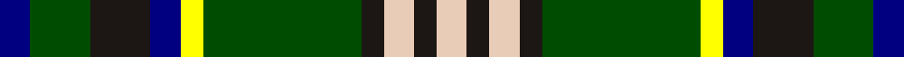

This page is one **sett** — a single exact thread-count. It belongs to the [tartan](/tartans/db4g8k8db4y3g21k3lr4k3lr4/)
(the same proportion at any scale), whose colour order is pattern [BGKBYGKWKW](/stripes/bgkbygkwkw/).

Sourced from register-of-tartans.  It is a [10 stripe tartan](/stripes/stripes10/).

Original link https://www.tartanregister.gov.uk/tartanDetails.aspx?ref=11410

## Register references

External register numbers recorded for this tartan.

- Scottish Register of Tartans: [11410](https://www.tartanregister.gov.uk/tartanDetails.aspx?ref=11410)

## Thread count
DB/8 G16 K16 DB8 Y6 G42 K6 LR8 K6 LR/8

## Palette
Each colour and the base-6 reference it is a variant of.

| Colour | Shade | Base |
|---|---|---|
| DB | <code style="background-color:#000080;">#000080</code> `oklch(27.1% 0.188 264.1)` <small>#000080</small> | B <code style="background-color:#2A418A;">#2A418A</code> |
| G | <code style="background-color:#004C00;">#004C00</code> `oklch(36.1% 0.123 142.5)` <small>#004C00</small> | G <code style="background-color:#006100;">#006100</code> |
| K | <code style="background-color:#1C1714;">#1C1714</code> `oklch(20.9% 0.010 52.9)` <small>#1C1714</small> | K <code style="background-color:#000000;">#000000</code> |
| LR | <code style="background-color:#E8CCB8;">#E8CCB8</code> `oklch(86.3% 0.042 57.7)` <small>#E8CCB8</small> | W <code style="background-color:#F7F7F7;">#F7F7F7</code> |
| Y | <code style="background-color:#FFFF00;">#FFFF00</code> `oklch(96.8% 0.211 109.8)` <small>#FFFF00</small> | Y <code style="background-color:#F2BF00;">#F2BF00</code> |

## Nearest tartans

The nearest existing variants by ΔTartan distance, with this tartan at the top so the swatches line up against it.

ΔTartan

Tartan

Sett

—

<a href="/ttd/edit/#slug=db4dg8k8db4ly3dg21k3lb4k3lb4~x2">Wellecomme, Bernard (Personal)</a> <a class="nn-out" href="/setts/s10/db4dg8k8db4ly3dg21k3lb4k3lb4~x2/" title="open its dictionary page">↗</a>

0.54

<a href="/ttd/edit/#slug=g8w1g1r1g4k4db8k1db1k1~x2">Allon/Allan</a> <a class="nn-out" href="/setts/s10/g8w1g1r1g4k4db8k1db1k1~x2/" title="open its dictionary page">↗</a>

0.72

<a href="/ttd/edit/#slug=k6ly2g18w3g13k3ly4k3db18w3~x2">Corstorphine Trial A</a> <a class="nn-out" href="/setts/s10/k6ly2g18w3g13k3ly4k3db18w3~x2/" title="open its dictionary page">↗</a>

0.75

<a href="/ttd/edit/#slug=k4db24k4r3k4g24k4lo3k4g24r3k4~x2">Skene</a> <a class="nn-out" href="/setts/s12/k4db24k4r3k4g24k4lo3k4g24r3k4~x2/" title="open its dictionary page">↗</a>

0.89

<a href="/ttd/edit/#slug=g7p3w1lg2g1k2p1~x8">Lindley-Highfield Name Tartan Tartan Number: 10002. Earliest known date: 13 February 2009 'Lindley-Highfield of Ballumbie Castle' is a tartan of the family of the Lindley-Highfields of Ballumbie Castle, sometime Barons of Cartsburn. The colours of this particular tartan are taken from the armorial bearings of the Head of the Family of Lindley-Highfield of Ballumbie Castle. See products available Copyright © Blair Urquhart, Comrie, 2015</a> <a class="nn-out" href="/setts/s7/g7p3w1lg2g1k2p1~x8/" title="open its dictionary page">↗</a>

0.94

<a href="/ttd/edit/#slug=g24k4g6r4g6k19db22w5~x2">MacRae, Ancient hunting</a> <a class="nn-out" href="/setts/s8/g24k4g6r4g6k19db22w5~x2/" title="open its dictionary page">↗</a>

0.97

<a href="/ttd/edit/#slug=dg14w2db3lg7dg2lg7db3w2dg14t2~x4">Manx Ellan Vannin</a> <a class="nn-out" href="/setts/s10/dg14w2db3lg7dg2lg7db3w2dg14t2~x4/" title="open its dictionary page">↗</a>

1.05

<a href="/ttd/edit/#slug=k15ly2k2lb2k2dg10o6k3lb2~x2">Hebrides</a> <a class="nn-out" href="/setts/s9/k15ly2k2lb2k2dg10o6k3lb2~x2/" title="open its dictionary page">↗</a>

1.05

<a href="/ttd/edit/#slug=g16g2p13t2k6ly2g16t2k12~x2">Wilson's, No 225</a> <a class="nn-out" href="/setts/s9/g16g2p13t2k6ly2g16t2k12~x2/" title="open its dictionary page">↗</a>

1.08

<a href="/ttd/edit/#slug=r2db8k1g2k1g4k1g2k1db8ly2~x2">MacCainsh</a> <a class="nn-out" href="/setts/s11/r2db8k1g2k1g4k1g2k1db8ly2~x2/" title="open its dictionary page">↗</a>

1.10

<a href="/ttd/edit/#slug=g23r3k9r3db18r3k9r3g23ly3~x2">Royal College of Physicians Corporate Tartan Tartan Number: 2350. Earliest known date: September 1996 Full name is Royal College of Physicians, Edinburgh. Designed for the Royal College of Physicians (founded in 1681 for post graduate students), by Donald Fraser Weavers as a corporate tartan. Woven by Lochcarron, May 1997. Silk sample in STA Johnston Collection. See products available Copyright © Blair Urquhart, Comrie, 2015</a> <a class="nn-out" href="/setts/s10/g23r3k9r3db18r3k9r3g23ly3~x2/" title="open its dictionary page">↗</a>

## Neighbour map

Every grey dot is one of 14299 variants placed by the first two principal components of the ΔTartan feature space (44% of its variance). Red is this tartan; blue dots are its nearest — click one to open its page.

<svg viewBox="0 0 640 380" role="img" style="max-width:100%;height:auto;border:1px solid #e0e0e0;border-radius:4px;display:block" xmlns="http://www.w3.org/2000/svg"><image href="/nn/cloud.v1.png" width="640" height="380"/><a href="/setts/s10/g8w1g1r1g4k4db8k1db1k1~x2/"><circle cx="168.3" cy="172.3" r="4" fill="#3465a4"><title>Allon/Allan</title></circle></a><a href="/setts/s10/k6ly2g18w3g13k3ly4k3db18w3~x2/"><circle cx="147.9" cy="168.4" r="4" fill="#3465a4"><title>Corstorphine Trial A</title></circle></a><a href="/setts/s12/k4db24k4r3k4g24k4lo3k4g24r3k4~x2/"><circle cx="178.3" cy="157.4" r="4" fill="#3465a4"><title>Skene</title></circle></a><a href="/setts/s7/g7p3w1lg2g1k2p1~x8/"><circle cx="163.1" cy="189.2" r="4" fill="#3465a4"><title>Lindley-Highfield Name Tartan Tartan Number: 10002. Earliest known date: 13 February 2009 'Lindley-Highfield of Ballumbie Castle' is a tartan of the family of the Lindley-Highfields of Ballumbie Castle, sometime Barons of Cartsburn. The colours of this particular tartan are taken from the armorial bearings of the Head of the Family of Lindley-Highfield of Ballumbie Castle. See products available Copyright © Blair Urquhart, Comrie, 2015</title></circle></a><a href="/setts/s8/g24k4g6r4g6k19db22w5~x2/"><circle cx="118.8" cy="203.0" r="4" fill="#3465a4"><title>MacRae, Ancient hunting</title></circle></a><a href="/setts/s10/dg14w2db3lg7dg2lg7db3w2dg14t2~x4/"><circle cx="210.1" cy="184.4" r="4" fill="#3465a4"><title>Manx Ellan Vannin</title></circle></a><a href="/setts/s9/k15ly2k2lb2k2dg10o6k3lb2~x2/"><circle cx="203.3" cy="179.9" r="4" fill="#3465a4"><title>Hebrides</title></circle></a><a href="/setts/s9/g16g2p13t2k6ly2g16t2k12~x2/"><circle cx="135.0" cy="168.8" r="4" fill="#3465a4"><title>Wilson's, No 225</title></circle></a><a href="/setts/s11/r2db8k1g2k1g4k1g2k1db8ly2~x2/"><circle cx="199.6" cy="171.9" r="4" fill="#3465a4"><title>MacCainsh</title></circle></a><a href="/setts/s10/g23r3k9r3db18r3k9r3g23ly3~x2/"><circle cx="201.2" cy="191.0" r="4" fill="#3465a4"><title>Royal College of Physicians Corporate Tartan Tartan Number: 2350. Earliest known date: September 1996 Full name is Royal College of Physicians, Edinburgh. Designed for the Royal College of Physicians (founded in 1681 for post graduate students), by Donald Fraser Weavers as a corporate tartan. Woven by Lochcarron, May 1997. Silk sample in STA Johnston Collection. See products available Copyright © Blair Urquhart, Comrie, 2015</title></circle></a><circle cx="163.2" cy="179.9" r="5" fill="#c00000"/></svg>

ID: /setts/s10/db4dg8k8db4ly3dg21k3lb4k3lb4~x2/
