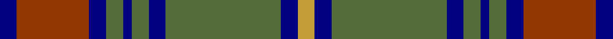

In pattern [BRBGBGBGBY](/stripes/brbgbgbgby/).

This was sourced from register-of-tartans.  It is a [10 stripe tartan](/stripes/stripes10/).

Original link https://www.tartanregister.gov.uk/tartanDetails.aspx?ref=10629

## Register references

External register numbers recorded for this tartan.

- Scottish Register of Tartans: [10629](https://www.tartanregister.gov.uk/tartanDetails.aspx?ref=10629)

## Thread count
DB/8 R34 DB8 G8 DB4 G8 DB8 G54 DB8 O/8

## Palette
Each colour and the base-6 reference it is a variant of.

| Colour | Shade | Base |
|---|---|---|
| DB | <code style="background-color:#000080;">#000080</code> `oklch(27.1% 0.188 264.1)` <small>#000080</small> | B <code style="background-color:#2A418A;">#2A418A</code> |
| G | <code style="background-color:#546C3A;">#546C3A</code> `oklch(49.9% 0.079 129.8)` <small>#546C3A</small> | G <code style="background-color:#006100;">#006100</code> |
| O | <code style="background-color:#C49D38;">#C49D38</code> `oklch(71.4% 0.125 87.1)` <small>#C49D38</small> | Y <code style="background-color:#F2BF00;">#F2BF00</code> |
| R | <code style="background-color:#943602;">#943602</code> `oklch(46.1% 0.137 42.2)` <small>#943602</small> | R <code style="background-color:#CC0000;">#CC0000</code> |

## Nearest tartans

The nearest existing variants by ΔTartan distance, with this tartan at the top so the swatches line up against it.

ΔTartan

Tartan

Sett

—

<a href="/ttd/edit/#slug=db4o17db4y4db2y4db4y27db4ly4~x2">Cape Breton University Chemistry Society</a> <a class="nn-out" href="/setts/s10/db4o17db4y4db2y4db4y27db4ly4~x2/" title="open its dictionary page">↗</a>

0.66

<a href="/ttd/edit/#slug=g28r12g4db20lo2db3lo2db3g7~x2">Cork Irish County Tartan Tartan Number: 2253. Earliest known date: 1996 One of a series of Irish District tartans designed by Polly Wittering of the House of Edgar, with colours reminiscent of the Country with soft warm colours dominating. See products available Copyright © Blair Urquhart, Comrie, 2015</a> <a class="nn-out" href="/setts/s9/g28r12g4db20lo2db3lo2db3g7~x2/" title="open its dictionary page">↗</a>

0.79

<a href="/ttd/edit/#slug=n32k3n3k3o5k8o21k4~x2">Speyside Grey (Fashion)</a> <a class="nn-out" href="/setts/s8/n32k3n3k3o5k8o21k4~x2/" title="open its dictionary page">↗</a>

0.82

<a href="/ttd/edit/#slug=n32k3n3k3b5k8o21k4~x2">Speyside Blue (Fashion)</a> <a class="nn-out" href="/setts/s8/n32k3n3k3b5k8o21k4~x2/" title="open its dictionary page">↗</a>

0.89

<a href="/ttd/edit/#slug=r4t3r32db30r4dg32r3dg32r3dg3~x2">Unidentified Plaid #15</a> <a class="nn-out" href="/setts/s10/r4t3r32db30r4dg32r3dg32r3dg3~x2/" title="open its dictionary page">↗</a>

0.92

<a href="/ttd/edit/#slug=db12r1db1r1db1r4g12ly1g2~x4">Durie (Clan)</a> <a class="nn-out" href="/setts/s9/db12r1db1r1db1r4g12ly1g2~x4/" title="open its dictionary page">↗</a>

0.96

<a href="/ttd/edit/#slug=dt44y8dt8y22lr4y4lr11y2w2~x2">Titanium</a> <a class="nn-out" href="/setts/s9/dt44y8dt8y22lr4y4lr11y2w2~x2/" title="open its dictionary page">↗</a>

1.00

<a href="/ttd/edit/#slug=k2db2g24r2g2r12g3k12db11k3db11g2r2g24db2~x2">MacInroy Hunting</a> <a class="nn-out" href="/setts/s15/k2db2g24r2g2r12g3k12db11k3db11g2r2g24db2~x2/" title="open its dictionary page">↗</a>

1.02

<a href="/ttd/edit/#slug=g11r4g4r7g41db11t4db41r4db8">Stewart of Appin 2</a> <a class="nn-out" href="/setts/s10/g11r4g4r7g41db11t4db41r4db8/" title="open its dictionary page">↗</a>

1.02

<a href="/ttd/edit/#slug=g8r3g3r5g26db7t3db28r3db6~x2">Stewart of Appin Htg (error)</a> <a class="nn-out" href="/setts/s10/g8r3g3r5g26db7t3db28r3db6~x2/" title="open its dictionary page">↗</a>

1.02

<a href="/ttd/edit/#slug=y5dt2y18lo2dt5lo2o5dt17y2lo4~x2">Antrim, County</a> <a class="nn-out" href="/setts/s10/y5dt2y18lo2dt5lo2o5dt17y2lo4~x2/" title="open its dictionary page">↗</a>

## Neighbour map

Every grey dot is one of 14299 variants placed by the first two principal components of the ΔTartan feature space (44% of its variance). Red is this tartan; blue dots are its nearest — click one to open its page.

<svg viewBox="0 0 640 380" role="img" style="max-width:100%;height:auto;border:1px solid #e0e0e0;border-radius:4px;display:block" xmlns="http://www.w3.org/2000/svg"><image href="/nn/cloud.v1.png" width="640" height="380"/><a href="/setts/s9/g28r12g4db20lo2db3lo2db3g7~x2/"><circle cx="303.8" cy="192.7" r="4" fill="#3465a4"><title>Cork Irish County Tartan Tartan Number: 2253. Earliest known date: 1996 One of a series of Irish District tartans designed by Polly Wittering of the House of Edgar, with colours reminiscent of the Country with soft warm colours dominating. See products available Copyright © Blair Urquhart, Comrie, 2015</title></circle></a><a href="/setts/s8/n32k3n3k3o5k8o21k4~x2/"><circle cx="270.3" cy="197.1" r="4" fill="#3465a4"><title>Speyside Grey (Fashion)</title></circle></a><a href="/setts/s8/n32k3n3k3b5k8o21k4~x2/"><circle cx="267.1" cy="197.7" r="4" fill="#3465a4"><title>Speyside Blue (Fashion)</title></circle></a><a href="/setts/s10/r4t3r32db30r4dg32r3dg32r3dg3~x2/"><circle cx="266.1" cy="183.6" r="4" fill="#3465a4"><title>Unidentified Plaid #15</title></circle></a><a href="/setts/s9/db12r1db1r1db1r4g12ly1g2~x4/"><circle cx="267.4" cy="182.6" r="4" fill="#3465a4"><title>Durie (Clan)</title></circle></a><a href="/setts/s9/dt44y8dt8y22lr4y4lr11y2w2~x2/"><circle cx="326.7" cy="158.2" r="4" fill="#3465a4"><title>Titanium</title></circle></a><a href="/setts/s15/k2db2g24r2g2r12g3k12db11k3db11g2r2g24db2~x2/"><circle cx="253.2" cy="159.9" r="4" fill="#3465a4"><title>MacInroy Hunting</title></circle></a><a href="/setts/s10/g11r4g4r7g41db11t4db41r4db8/"><circle cx="278.1" cy="191.4" r="4" fill="#3465a4"><title>Stewart of Appin 2</title></circle></a><a href="/setts/s10/g8r3g3r5g26db7t3db28r3db6~x2/"><circle cx="271.5" cy="198.4" r="4" fill="#3465a4"><title>Stewart of Appin Htg (error)</title></circle></a><a href="/setts/s10/y5dt2y18lo2dt5lo2o5dt17y2lo4~x2/"><circle cx="249.3" cy="206.2" r="4" fill="#3465a4"><title>Antrim, County</title></circle></a><circle cx="280.9" cy="175.4" r="5" fill="#c00000"/></svg>

ID: /setts/s10/db4o17db4y4db2y4db4y27db4ly4~x2/
