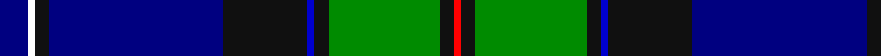

This page is one **sett** — a single exact thread-count. It belongs to the [tartan](/tartans/db4w1k2db25k12b1k2g16k2r1/)
(the same proportion at any scale), whose colour order is pattern [BWKBKBKGKR](/stripes/bwkbkbkgkr/).

Sourced from register-of-tartans.  It is a [10 stripe tartan](/stripes/stripes10/).

Original link https://www.tartanregister.gov.uk/tartanDetails.aspx?ref=10558

## Register references

External register numbers recorded for this tartan.

- Scottish Register of Tartans: [10558](https://www.tartanregister.gov.uk/tartanDetails.aspx?ref=10558)

## Thread count
DB/8 W2 K4 DB50 K24 B2 K4 G32 K4 R/2

## Palette
Each colour and the base-6 reference it is a variant of.

| Colour | Shade | Base |
|---|---|---|
| B | <code style="background-color:#0000CD;">#0000CD</code> `oklch(38.3% 0.266 264.1)` <small>#0000CD</small> | B <code style="background-color:#2A418A;">#2A418A</code> |
| DB | <code style="background-color:#000080;">#000080</code> `oklch(27.1% 0.188 264.1)` <small>#000080</small> | B <code style="background-color:#2A418A;">#2A418A</code> |
| G | <code style="background-color:#008B00;">#008B00</code> `oklch(55.2% 0.188 142.5)` <small>#008B00</small> | G <code style="background-color:#006100;">#006100</code> |
| K | <code style="background-color:#101010;">#101010</code> `oklch(17.3% 0.000 89.9)` <small>#101010</small> | K <code style="background-color:#000000;">#000000</code> |
| R | <code style="background-color:#FF0000;">#FF0000</code> `oklch(62.8% 0.258 29.2)` <small>#FF0000</small> | R <code style="background-color:#CC0000;">#CC0000</code> |
| W | <code style="background-color:#FFFFFF;">#FFFFFF</code> `oklch(100.0% 0.000 89.9)` <small>#FFFFFF</small> | W <code style="background-color:#F7F7F7;">#F7F7F7</code> |

## Nearest tartans

The nearest existing variants by ΔTartan distance, with this tartan at the top so the swatches line up against it.

ΔTartan

Tartan

Sett

—

<a href="/ttd/edit/#slug=db4w1k2db25k12db1k2g16k2r1~x2">Sidey Family (Dundee) (Personal)</a> <a class="nn-out" href="/setts/s10/db4w1k2db25k12db1k2g16k2r1~x2/" title="open its dictionary page">↗</a>

0.94

<a href="/ttd/edit/#slug=r2k1db30k6g12ly1db2ly1g12k3w1~x2">Hororata</a> <a class="nn-out" href="/setts/s11/r2k1db30k6g12ly1db2ly1g12k3w1~x2/" title="open its dictionary page">↗</a>

0.95

<a href="/ttd/edit/#slug=r2db24lb6k6g6k4g2k2g2k1~x2">Crookdake-Cheng (Personal)</a> <a class="nn-out" href="/setts/s10/r2db24lb6k6g6k4g2k2g2k1~x2/" title="open its dictionary page">↗</a>

1.03

<a href="/ttd/edit/#slug=db10g6o4r2o4k10db6k4db28g55w4">1314 (Corporate)</a> <a class="nn-out" href="/setts/s11/db10g6o4r2o4k10db6k4db28g55w4/" title="open its dictionary page">↗</a>

1.13

<a href="/ttd/edit/#slug=db4k3db28lb2dp6g28n2g4dp4~x2">Canmore</a> <a class="nn-out" href="/setts/s9/db4k3db28lb2dp6g28n2g4dp4~x2/" title="open its dictionary page">↗</a>

1.15

<a href="/ttd/edit/#slug=dp4db40k15g10dp2g10dp2g10w4~x2">Ebdon-Muir (Personal)</a> <a class="nn-out" href="/setts/s9/dp4db40k15g10dp2g10dp2g10w4~x2/" title="open its dictionary page">↗</a>

1.16

<a href="/ttd/edit/#slug=r2dg32ly2dg2k3db2ly2db28w2db2w2~x2">Pringle Personal Tartan Tartan Number: 5447. Earliest known date: c.1998 Dalgleish of Selkirk designed and wove this circa 1998 as a personal tartan for someone of the name, Pringle. See products available Copyright © Blair Urquhart, Comrie, 2015</a> <a class="nn-out" href="/setts/s11/r2dg32ly2dg2k3db2ly2db28w2db2w2~x2/" title="open its dictionary page">↗</a>

1.25

<a href="/ttd/edit/#slug=dp3g3w1k25db25k2db2g1r3w2~x2">Heart of Oak</a> <a class="nn-out" href="/setts/s10/dp3g3w1k25db25k2db2g1r3w2~x2/" title="open its dictionary page">↗</a>

1.26

<a href="/ttd/edit/#slug=db5r2lo7r2db42g28k5db10k15g5w3r3">Heritage Sequane</a> <a class="nn-out" href="/setts/s12/db5r2lo7r2db42g28k5db10k15g5w3r3/" title="open its dictionary page">↗</a>

1.28

<a href="/ttd/edit/#slug=db64r3k3lb2db3r28dg26db3r3k3ly2db3dg16~x2">Wcwm 1571</a> <a class="nn-out" href="/setts/s13/db64r3k3lb2db3r28dg26db3r3k3ly2db3dg16~x2/" title="open its dictionary page">↗</a>

1.29

<a href="/ttd/edit/#slug=w2db20dg2dg2dg2dg5dg8ly2r1~x2">Unidentified (ex Tony Murray)</a> <a class="nn-out" href="/setts/s9/w2db20dg2dg2dg2dg5dg8ly2r1~x2/" title="open its dictionary page">↗</a>

## Neighbour map

Every grey dot is one of 14299 variants placed by the first two principal components of the ΔTartan feature space (44% of its variance). Red is this tartan; blue dots are its nearest — click one to open its page.

<svg viewBox="0 0 640 380" role="img" style="max-width:100%;height:auto;border:1px solid #e0e0e0;border-radius:4px;display:block" xmlns="http://www.w3.org/2000/svg"><image href="/nn/cloud.v1.png" width="640" height="380"/><a href="/setts/s11/r2k1db30k6g12ly1db2ly1g12k3w1~x2/"><circle cx="233.3" cy="84.5" r="4" fill="#3465a4"><title>Hororata</title></circle></a><a href="/setts/s10/r2db24lb6k6g6k4g2k2g2k1~x2/"><circle cx="184.9" cy="100.1" r="4" fill="#3465a4"><title>Crookdake-Cheng (Personal)</title></circle></a><a href="/setts/s11/db10g6o4r2o4k10db6k4db28g55w4/"><circle cx="253.7" cy="100.0" r="4" fill="#3465a4"><title>1314 (Corporate)</title></circle></a><a href="/setts/s9/db4k3db28lb2dp6g28n2g4dp4~x2/"><circle cx="206.5" cy="142.0" r="4" fill="#3465a4"><title>Canmore</title></circle></a><a href="/setts/s9/dp4db40k15g10dp2g10dp2g10w4~x2/"><circle cx="213.9" cy="147.0" r="4" fill="#3465a4"><title>Ebdon-Muir (Personal)</title></circle></a><a href="/setts/s11/r2dg32ly2dg2k3db2ly2db28w2db2w2~x2/"><circle cx="239.2" cy="103.6" r="4" fill="#3465a4"><title>Pringle Personal Tartan Tartan Number: 5447. Earliest known date: c.1998 Dalgleish of Selkirk designed and wove this circa 1998 as a personal tartan for someone of the name, Pringle. See products available Copyright © Blair Urquhart, Comrie, 2015</title></circle></a><a href="/setts/s10/dp3g3w1k25db25k2db2g1r3w2~x2/"><circle cx="248.8" cy="106.3" r="4" fill="#3465a4"><title>Heart of Oak</title></circle></a><a href="/setts/s12/db5r2lo7r2db42g28k5db10k15g5w3r3/"><circle cx="224.0" cy="111.0" r="4" fill="#3465a4"><title>Heritage Sequane</title></circle></a><a href="/setts/s13/db64r3k3lb2db3r28dg26db3r3k3ly2db3dg16~x2/"><circle cx="272.9" cy="81.6" r="4" fill="#3465a4"><title>Wcwm 1571</title></circle></a><a href="/setts/s9/w2db20dg2dg2dg2dg5dg8ly2r1~x2/"><circle cx="237.6" cy="123.7" r="4" fill="#3465a4"><title>Unidentified (ex Tony Murray)</title></circle></a><circle cx="229.7" cy="110.2" r="5" fill="#c00000"/></svg>

ID: /setts/s10/db4w1k2db25k12db1k2g16k2r1~x2/
